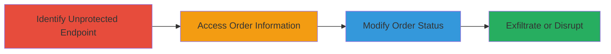

---

# Broken Access Control in Order API Leading to Information Disclosure and Unauthorized Status Changes

Multi-stage attack chain demonstrating exploitation of an unprotected API endpoint in a web application to access and manipulate sensitive order data.

## Chain Metrics Dashboard

| Metric | Value |
|--------|-------|
| Chain Status | Unverified |
| Total Steps | 3 |
| Execution Time | ~5 minutes |
| Skill Level | Beginner |
| Complexity | Low |
| Impact Level | High |

## Attack Flow Visualization



## Prerequisites & Requirements

### Required Tools

- [[commands/curl-get-orders]]
- [[commands/curl-patch-order-status]]

### Target Environment

- Web platform with exposed API endpoints (e.g., e-commerce application like Azbuka Vkusa)
- No authentication required for the target endpoint
- Network access to the application's domain

### Initial Access Requirements

- Publicly accessible web application
- Knowledge of the API endpoint path (e.g., /api/orders)
- No prior credentials needed due to lack of access controls

## Detailed Attack Procedures

### Step 1: Identify Unprotected Endpoint

procedure: [[procedures/Identify-Unprotected-Order-Endpoint]]

**Objective**: Discover the API endpoint lacking authentication or authorization checks to confirm vulnerability.

**Instructions**: During application testing, inspect network traffic or API documentation to identify endpoints handling orders. Use browser developer tools or a proxy like Burp Suite to monitor requests. Assume the endpoint is /api/v1/orders based on common e-commerce patterns.

**Expected Output**: Confirmation of endpoint accessibility without auth headers.

**Success Indicators**:
- Endpoint responds to unauthenticated requests
- No 401/403 errors on access

### Step 2: Access Order Information

procedure: [[procedures/Access-Order-Information-via-Unprotected-Endpoint]]

**Objective**: Retrieve sensitive order details belonging to other users without authorization.

**Instructions**: Use [[commands/curl-get-orders]] to fetch order data by specifying an order ID (e.g., obtained from enumeration or guessing):

```bash
curl -X GET "https://target-app.com/api/v1/orders/12345" -H "Content-Type: application/json"
```

Parse the response for user details, items, and payment info.

**Expected Output**: JSON response containing order details like user ID, items, addresses, and totals.

**Success Indicators**:
- Order data returned for non-owned orders
- Sensitive PII (e.g., addresses, emails) exposed

### Step 3: Modify Order Status

procedure: [[procedures/Modify-Order-Status-via-Unprotected-Endpoint]]

**Objective**: Alter order statuses to disrupt business logic, such as canceling or shipping unauthorized orders.

**Instructions**: Use [[commands/curl-patch-order-status]] to update the status of a targeted order:

```bash
curl -X PATCH "https://target-app.com/api/v1/orders/12345" -H "Content-Type: application/json" -d '{"status": "cancelled"}'
```

Verify the change by re-querying the order.

**Expected Output**: 200 OK response confirming status update.

**Success Indicators**:
- Order status changed without ownership
- Business impact like fraudulent cancellations

## Attack Chain Summary

### Key Achievements

1. Unauthorized disclosure of customer order details, violating privacy.
2. Ability to manipulate order statuses, enabling fraud or disruptions.
3. Demonstration of critical broken access control in the API.

## Technique & Tactic Coverage

### MITRE ATT&CK Techniques

- [[Exploit Public-Facing Application]]
- [[Data from Information Repositories]]

### MITRE ATT&CK Tactics

- [[Initial Access]]
- [[Collection]]
- [[Impact]]

---

*Last updated: 2023-10-01T12:00:00Z*
