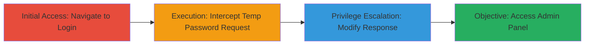

# Broken Access Control in UPS Password Reset Leading to Unauthorized Admin Access

Multi-stage attack chain demonstrating a complete attack workflow exploiting broken access control in the UPS support site.

## Chain Metrics Dashboard

| Metric | Value |
|--------|-------|
| Chain Status | Unverified |
| Total Steps | 4 |
| Execution Time | ~5 minutes |
| Skill Level | Intermediate |
| Complexity | Medium |
| Impact Level | High |

## Attack Flow Visualization



## Prerequisites & Requirements

### Required Tools

- [[tools/Burp-Suite]]

### Target Environment

- Web platform (UPS support site)
- Required services/ports: HTTPS on port 443
- Network access requirements: Direct internet access to https://█████████

### Initial Access Requirements

- No credentials required
- External network position (no prior access needed)

## Detailed Attack Procedures

### Step 1: Initial Access
procedure: [[procedures/Navigate-to-UPS-Login-Page]]

**Objective**: Access the main login or account page to initiate the password reset flow.

**Instructions**: Open a web browser and navigate to the UPS support site's account or login page at https://█████████. This positions the attacker to trigger the temporary password request without authentication.

**Expected Output**: The login page loads, displaying fields for username/email and a 'Forgot Password' or similar option.

**Success Indicators**:
- Page loads successfully without errors
- Password reset option is visible

### Step 2: Execution
procedure: [[procedures/Initiate-and-Intercept-Temp-Password-Request]]

**Objective**: Send a temporary password request for an arbitrary (non-existent) user and intercept the response using a proxy.

**Instructions**: Use Burp Suite to intercept traffic. Enter an arbitrary username/email (e.g., test@example.com) and submit the temporary password request. The request is a POST to /api/Account/SendTempPassword/?userName=█████████████ with empty body and standard headers.

Execute the request using [[commands/send-temp-password-request]]:

```bash
# Simulated via curl for documentation; use Burp for interception
curl -X POST "https://█████████/api/Account/SendTempPassword/?userName=test@example.com" -H "Host: ██████████" -H "Cookie: ████████" -H "Content-Length: 0" --http2
```

**Expected Output**: Intercepted request visible in Burp Suite proxy.

**Success Indicators**:
- Request intercepted successfully
- Response shows status: false for non-existent user

### Step 3: Privilege Escalation
procedure: [[procedures/Modify-Response-to-Bypass-Status-Check]]

**Objective**: Manipulate the intercepted response to set the 'status' field to true, bypassing client-side JavaScript checks.

**Instructions**: In Burp Suite Repeater or Proxy, edit the JSON response body from {"status":false,"errorMessage":"Username does not exist. Please enter correct Username."} to {"status":true,"errorMessage":"Username does not exist. Please enter correct Username."}. Forward the modified response.

**Expected Output**: Client-side Angular app accepts the response, allowing progression to the reset password UI.

**Success Indicators**:
- Modified response forwarded without errors
- JavaScript checks bypassed (no error alerts)

### Step 4: Objective
procedure: [[procedures/Access-Reset-Password-and-Admin-Panel]]

**Objective**: Navigate to the reset password endpoint and access admin sections for unauthorized data manipulation.

**Instructions**: With the bypass in place, the browser redirects to /resetPassword. From there, navigate to 'user' or 'report' management sections to view and modify all reports.

**Expected Output**: Full access to admin panel, including lists of users and reports editable without authentication.

**Success Indicators**:
- /resetPassword loads without errors
- Admin sections (user/report) accessible and functional

## Attack Chain Summary

### Key Achievements

1. Bypassed client-side authentication checks via response manipulation
2. Gained unauthorized access to sensitive admin functions
3. Enabled viewing and modification of all user reports and data

## Technique & Tactic Coverage

### MITRE ATT&CK Techniques

- [[Exploit Public-Facing Application]]
- [[Valid Accounts]]

### MITRE ATT&CK Tactics

- [[Initial Access]]

---

*Last updated: 2023-10-01T00:00:00Z*
