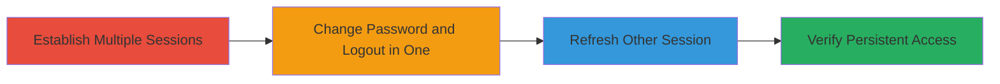

---
tags:
  - broken-authentication
  - session-management
  - persistence
  - web-vulnerability
type: attack_chain
tools: []
tactics:
  - '[[Persistence]]'
verified: false
platforms:
  - Web
submitted: true
complexity: low
created_at: '2023-10-01T00:00:00Z'
procedures:
  - '[[procedures/Establish-Multiple-Browser-Sessions]]'
  - '[[procedures/Change-Password-and-Logout-in-One-Session]]'
  - '[[procedures/Refresh-Secondary-Session]]'
  - '[[procedures/Verify-Persistent-Access-and-Execute-Actions]]'
step_count: 4
techniques:
  - '[[Valid Accounts]]'
updated_at: '2025-12-14T17:31:42.818Z'
description: >-
  Demonstrates a vulnerability where password changes or logouts in one browser
  session fail to invalidate active sessions in other browsers, enabling
  unauthorized persistence and account actions.
skill_level: novice
impact_level: high
id: 8e2317e6-2785-47b2-a61f-58a766ece39d
validated: true
mitre_tactics:
  - '[[Persistence]]'
mitre_techniques:
  - '[[Valid Accounts]]'
---
# Broken Authentication and Session Management Allowing Persistent Access After Password Change and Logout

Multi-stage attack chain demonstrating a complete attack workflow for exploiting flawed session invalidation in web applications.

## Chain Metrics Dashboard

| Metric | Value |
|--------|-------|
| Chain Status | Unverified |
| Total Steps | 4 |
| Execution Time | ~2 minutes |
| Skill Level | Novice |
| Complexity | Low |
| Impact Level | High |

## Attack Flow Visualization

## Prerequisites & Requirements

### Required Tools

- Standard web browsers (e.g., Chrome, Firefox, Incognito mode)

### Target Environment

- Web application with user authentication
- Valid account credentials
- Multiple browser instances for session isolation

### Initial Access Requirements

- Valid username and password for the target account
- Direct access to the web application's login page
- No prior network compromise needed; assumes legitimate initial login

## Detailed Attack Procedures

### Step 1: Establish Multiple Sessions
procedure: [[procedures/Establish-Multiple-Browser-Sessions]]

**Objective**: Create independent active sessions for the same account across different browsers to test session isolation.

**Instructions**: Open two separate browsers, such as regular Chrome and Firefox (or use Incognito mode in the same browser for isolation). Navigate to the target's login page in both. Enter the same valid credentials to log in, ensuring both sessions are authenticated and active.

**Expected Output**: Both browser windows display the logged-in account dashboard or profile page.

**Success Indicators**:
- Successful login in both browsers without errors
- Access to account features (e.g., profile view) in each session

### Step 2: Change Password and Logout in One Session
procedure: [[procedures/Change-Password-and-Logout-in-One-Session]]

**Objective**: Trigger session invalidation mechanisms by altering credentials and ending the session in the primary browser.

**Instructions**: In the first browser (e.g., Chrome), navigate to the account settings or password change page. Enter a new password to update it, confirm the change, then immediately log out from that session by selecting the logout option.

**Expected Output**: Password change confirmation message, followed by redirection to the login page in the first browser.

**Success Indicators**:
- Password updated successfully in the first session
- First browser session ends, requiring re-login

### Step 3: Refresh Secondary Session
procedure: [[procedures/Refresh-Secondary-Session]]

**Objective**: Check if the authentication change propagates to invalidate the isolated session.

**Instructions**: Switch to the second browser (e.g., Firefox) without closing it. Refresh the current page (e.g., account profile or dashboard) using Ctrl+R or the browser's refresh button.

**Expected Output**: The page reloads and remains in the logged-in state, showing account details.

**Success Indicators**:
- No automatic logout or redirect to login page
- Session cookies or tokens remain valid post-refresh

### Step 4: Verify Persistent Access and Execute Actions
procedure: [[procedures/Verify-Persistent-Access-and-Execute-Actions]]

**Objective**: Confirm the vulnerability by performing unauthorized actions in the persistent session.

**Instructions**: In the second browser, attempt sensitive actions such as editing the account profile, viewing restricted data, or making changes that require authentication. Observe if these succeed despite the password change in the other session.

**Expected Output**: Successful execution of account actions, e.g., profile updates saved without re-authentication.

**Success Indicators**:
- Ability to edit or view account information
- No session expiration or auth challenges triggered

## Attack Chain Summary

### Key Achievements

1. Established multiple independent sessions for the target account
2. Invalidated one session via password change and logout
3. Confirmed persistence of the secondary session
4. Demonstrated unauthorized access potential, such as profile manipulation

## Technique & Tactic Coverage

### MITRE ATT&CK Techniques

- [[Valid Accounts]]

### MITRE ATT&CK Tactics

- [[Persistence]]

---
*Last updated: 2023-10-01T00:00:00Z*
