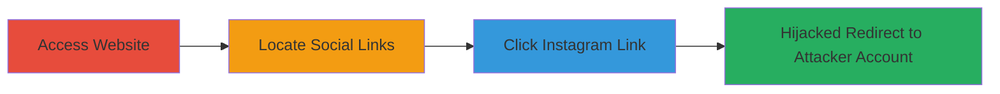

---
tags:
  - broken-link-hijacking
  - social-media-impersonation
  - phishing
  - brand-impersonation
type: attack_chain
tools: []
tactics:
  - '[[Initial Access]]'
verified: false
platforms:
  - Web
submitted: true
complexity: low
created_at: '2024-10-01T00:00:00Z'
procedures:
  - '[[procedures/Navigate-to-Target-Website-and-Identify-Social-Media-Section]]'
  - '[[procedures/Test-Instagram-Link-for-Hijacking]]'
step_count: 2
techniques:
  - '[[Exploit Public-Facing Application]]'
updated_at: '2025-12-14T17:33:12.474Z'
description: >-
  Demonstrates a broken link hijacking vulnerability where the Instagram social
  media link on the simfy.africa website redirects to an attacker-controlled
  account due to lost ownership of the handle, enabling impersonation, phishing,
  and reputation damage.
skill_level: novice
impact_level: high
id: 4082f932-f070-4b97-9c30-333f5f278d27
validated: true
mitre_tactics:
  - '[[Initial Access]]'
mitre_techniques:
  - '[[Exploit Public-Facing Application]]'
---
# Broken Instagram Link Hijacking Leading to Brand Impersonation on Simfy Africa

Multi-stage attack chain demonstrating a complete attack workflow for exploiting a broken social media link to hijack user traffic and impersonate the brand.

## Chain Metrics Dashboard

| Metric | Value |
|--------|-------|
| Chain Status | Unverified |
| Total Steps | 2 |
| Execution Time | ~1 minute |
| Skill Level | Novice |
| Complexity | Low |
| Impact Level | High |

## Attack Flow Visualization

## Prerequisites & Requirements

### Required Tools

- Web browser (e.g., Chrome, Firefox)

### Target Environment

- Publicly accessible website (https://simfy.africa/)
- No special services or ports required
- Internet access

### Initial Access Requirements

- No credentials needed
- Direct public access to the website
- No prior access required

## Detailed Attack Procedures

### Step 1: Access Website and Locate Social Media Section
procedure: [[procedures/Navigate-to-Target-Website-and-Identify-Social-Media-Section]]

**Objective**: Gain access to the target website and identify the social media links to prepare for testing the vulnerability.

**Instructions**: Open a web browser and navigate to the target URL. Scroll to the footer or social media section to locate the Instagram link.

**Expected Output**: Visible social media icons or links at the bottom of the page, including the Instagram icon.

**Success Indicators**:
- Website loads successfully
- Social media section is visible

### Step 2: Test Instagram Link for Hijacking
procedure: [[procedures/Test-Instagram-Link-for-Hijacking]]

**Objective**: Verify the broken link by clicking the Instagram link and confirming it redirects to an unauthorized attacker-controlled account.

**Instructions**: Click the Instagram link or icon. Observe the redirect behavior and check if it leads to the official company profile or an unauthorized one.

**Expected Output**: Redirect to an Instagram profile that is not controlled by the company, potentially displaying attacker content or impersonation.

**Success Indicators**:
- Redirect occurs to a non-official Instagram handle
- Profile shows signs of unauthorized control (e.g., different content, no company verification)

## Attack Chain Summary

### Key Achievements

1. Identified a misconfigured social media link pointing to an abandoned handle now controlled by an external party.
2. Demonstrated immediate redirect to attacker-controlled resource upon user interaction.
3. Highlighted risks including phishing, misinformation, and brand damage through eroded trust.

## Technique & Tactic Coverage

### MITRE ATT&CK Techniques

- [[Exploit Public-Facing Application]]

### MITRE ATT&CK Tactics

- [[Initial Access]]

---
*Last updated: 2024-10-01T00:00:00Z*
