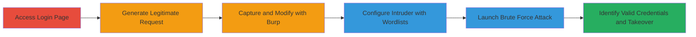

---
tags:
  - brute-force
  - rate-limiting-bypass
  - account-takeover
  - web-vulnerability
type: attack_chain
tools:
  - '[[tools/Burp-Suite]]'
tactics:
  - '[[Initial Access]]'
verified: false
platforms:
  - Web
submitted: true
complexity: medium
created_at: '2023-10-01T00:00:00Z'
procedures:
  - '[[procedures/Access-Lichess-Login-Page]]'
  - '[[procedures/Generate-Legitimate-Login-Request]]'
  - '[[procedures/Capture-and-Modify-Login-Request-with-Burp]]'
  - '[[procedures/Configure-Burp-Intruder-for-Brute-Force]]'
  - '[[procedures/Launch-Brute-Force-Attack-and-Identify-Valid-Credentials]]'
step_count: 6
techniques:
  - '[[Brute Force]]'
updated_at: '2025-12-14T17:26:49.078Z'
description: >-
  Multi-stage brute force attack exploiting weak rate limiting on Lichess login
  endpoint, using varied usernames to evade per-username restrictions and
  achieve account takeover.
skill_level: intermediate
impact_level: high
id: 73b13327-f66a-41c6-bf19-1640e9e20276
validated: true
mitre_tactics:
  - '[[Initial Access]]'
mitre_techniques:
  - '[[Brute Force]]'
---
# Brute Force Account Takeover on Lichess Login via Username Variation Bypassing Per-Username Rate Limits

Multi-stage attack chain demonstrating a brute force workflow against the Lichess login page, exploiting weak rate limiting that only applies per username, allowing attackers to use varied username wordlists to bypass restrictions without triggering global or IP-based limits quickly. This leads to account takeover by identifying valid credentials through 200 OK responses, with potential for DoS and data theft, though mitigated somewhat by IP trustworthiness checks and banned common passwords.

## Chain Metrics Dashboard

| Metric | Value |
|--------|-------|
| Chain Status | Unverified |
| Total Steps | 6 |
| Execution Time | ~30-60 minutes |
| Skill Level | Intermediate |
| Complexity | Medium |
| Impact Level | High |

## Attack Flow Visualization



## Prerequisites & Requirements

### Required Tools

- [[tools/Burp-Suite]]

### Target Environment

- Web platform
- Services: HTTP/HTTPS on port 443
- Tech stack: Scala backend with nginx

### Initial Access Requirements

- Network access to https://lichess.org
- No prior credentials needed, but valid test credentials helpful for initial request generation
- Burp Suite proxy configured in browser

## Detailed Attack Procedures

### Step 1: Access Login Page
procedure: [[procedures/Access-Lichess-Login-Page]]

**Objective**: Navigate to the target login endpoint to prepare for request capture.

**Instructions**: Open a web browser and directly access the Lichess login page at https://lichess.org/login. Ensure Burp Suite is running as a proxy to intercept traffic.

**Expected Output**: Login form loaded in the browser.

**Success Indicators**:
- Page loads without errors
- URL confirms https://lichess.org/login

### Step 2: Generate Legitimate Login Request
procedure: [[procedures/Generate-Legitimate-Login-Request]]

**Objective**: Submit a valid login to create a baseline request for modification.

**Instructions**: Enter any known valid username and password on the login form and submit. This generates a legitimate POST request that can be captured.

**Expected Output**: Successful login or error response, but the request is intercepted in Burp.

**Success Indicators**:
- POST /login request appears in Burp Proxy history
- Request includes CSRF token and session cookies

### Step 3: Capture and Modify Login Request
procedure: [[procedures/Capture-and-Modify-Login-Request-with-Burp]]

**Objective**: Intercept the login request and strip protective elements to prepare for brute force.

**Instructions**: In Burp Suite, intercept the POST /login request from the proxy. Forward it once to complete the login, then copy the request to Repeater. Modify by removing CSRF token and cookies, change Content-Type to multipart/form-data with a boundary, and add payload positions §username§ and §password§. Use the [[commands/lichess-login-brute-force-request]] template:

```http
POST /login HTTP/2
Host: lichess.org
Content-Type: multipart/form-data; boundary=----WebKitFormBoundaryc5GZocBapliqt011

------WebKitFormBoundaryc5GZocBapliqt011
Content-Disposition: form-data; name="username"

§username§
------WebKitFormBoundaryc5GZocBapliqt011
Content-Disposition: form-data; name="password"

§password§
------WebKitFormBoundaryc5GZocBapliqt011
Content-Disposition: form-data; name="remember"

true
------WebKitFormBoundaryc5GZocBapliqt011--
```

**Expected Output**: Modified request ready in Burp Repeater, testable with sample values returning 401 for invalid creds.

**Success Indicators**:
- Request modifications complete without syntax errors
- Test submission yields expected 401 response for invalid login

### Step 4: Configure Burp Intruder for Brute Force
procedure: [[procedures/Configure-Burp-Intruder-for-Brute-Force]]

**Objective**: Set up automated payload injection using wordlists to simulate varied username attacks.

**Instructions**: Send the modified request from Repeater to Intruder. Select cluster bomb payload type, set positions at §username§ (payload set 1) and §password§ (payload set 2). Load large, realistic wordlists (e.g., common usernames and passwords) to avoid per-username rate limits. Disable auto URL-encoding to keep payloads plaintext. Configure throttling if needed to mimic distributed attacks.

**Expected Output**: Intruder interface shows configured payloads and positions.

**Success Indicators**:
- Wordlists loaded successfully
- Payload positions highlighted correctly
- No encoding applied to credentials

### Step 5: Launch Brute Force Attack
procedure: [[procedures/Launch-Brute-Force-Attack-and-Identify-Valid-Credentials]]

**Objective**: Execute the attack and monitor responses for successful logins.

**Instructions**: Start the Intruder attack. Monitor the results table for response codes: 200 OK indicates valid credentials (successful takeover), while 401 is for invalid. The weak global limiting allows continuation without quick 429 errors.

**Expected Output**: Stream of requests with varying response lengths and codes; 200 OK for hits.

**Success Indicators**:
- Multiple requests sent without rate limit blocks
- 200 OK responses identified with corresponding username/password pairs

### Step 6: Validate and Exploit Takeover
procedure: [[procedures/Launch-Brute-Force-Attack-and-Identify-Valid-Credentials]]

**Objective**: Confirm account access and assess impact.

**Instructions**: For any 200 OK hits, copy the credentials and manually log in at https://lichess.org/login to verify access. Check for sensitive data exposure or further escalation.

**Expected Output**: Successful dashboard access post-login.

**Success Indicators**:
- Account dashboard loads
- User data accessible, confirming takeover

## Attack Chain Summary

### Key Achievements

1. Bypassed per-username rate limits using varied wordlists
2. Achieved account takeover via automated brute force
3. Demonstrated potential for DoS through resource exhaustion

## Technique & Tactic Coverage

### MITRE ATT&CK Techniques

- [[Brute Force]] Brute Force

### MITRE ATT&CK Tactics

- [[Initial Access]] Initial Access

---
*Last updated: 2023-10-01T00:00:00Z*
