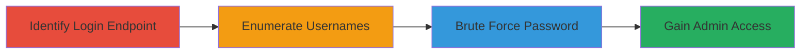

# Brute Force Attack on WordPress Admin Login via Username Enumeration

Multi-stage attack chain demonstrating a complete attack workflow exploiting WordPress admin login vulnerabilities on a public-facing site like Nextcloud's WordPress instance.

## Chain Metrics Dashboard

| Metric | Value |
|--------|-------|
| Chain Status | Unverified |
| Total Steps | 3 |
| Execution Time | ~10 minutes |
| Skill Level | Intermediate |
| Complexity | Medium |
| Impact Level | High |

## Attack Flow Visualization

## Prerequisites & Requirements

### Required Tools

- Web browser (e.g., Firefox or Chrome for manual testing)

### Target Environment

- WordPress-based website with admin panel exposed
- No rate-limiting on /wp-login.php
- Accessible lost password feature

### Initial Access Requirements

- Public internet access to the target URL
- No prior credentials needed

## Detailed Attack Procedures

### Step 1: Identify Admin Login Endpoint

procedure: [[procedures/Identify-WordPress-Admin-Endpoint]]

**Objective**: Locate the WordPress admin login page and confirm lack of rate-limiting.

**Instructions**: Navigate to the suspected admin URL using a web browser. For example, access https://nextcloud.com/wp-login.php and attempt multiple login failures to verify no lockout or CAPTCHA is triggered.

**Expected Output**: Login form loads without restrictions on repeated attempts.

**Success Indicators**:
- Page allows unlimited login submissions
- No error messages about rate limits

### Step 2: Enumerate Valid Usernames

procedure: [[procedures/Enumerate-WordPress-Admin-Usernames]]

**Objective**: Identify valid admin usernames to target for brute force.

**Instructions**: Use the lost password feature at https://nextcloud.com/wp-login.php?action=lostpassword. Enter potential usernames; invalid ones show 'Wrong username', valid ones indicate a confirmation email would be sent. Alternatively, scan for common WordPress usernames like 'admin' or use tools to identify 'frank' as the admin.

**Expected Output**: Confirmation of valid username (e.g., 'frank').

**Success Indicators**:
- Distinct error messages for valid vs. invalid usernames
- Identified admin username

### Step 3: Perform Brute Force on Password

procedure: [[procedures/Perform-Manual-Brute-Force-on-Admin-Login]]

**Objective**: Guess the admin password by exploiting unlimited attempts.

**Instructions**: With the username 'frank', repeatedly submit password guesses on the login form at https://nextcloud.com/wp-login.php. Try common passwords like 'password', 'admin123', etc., until success.

**Expected Output**: Successful login redirect to WordPress dashboard.

**Success Indicators**:
- Access to /wp-admin/ dashboard
- Administrative privileges gained

## Attack Chain Summary

### Key Achievements

1. Discovered exposed WordPress admin without protections
2. Enumerated admin username 'frank' via error differentiation
3. Brute-forced password to achieve unauthorized access

## Technique & Tactic Coverage

### MITRE ATT&CK Techniques

- [[Account Discovery]] Account Discovery
- [[Brute Force]] Brute Force

### MITRE ATT&CK Tactics

- [[Discovery]] Discovery
- [[Credential Access]] Credential Access

---
*Last updated: 2023-10-01T00:00:00Z*
