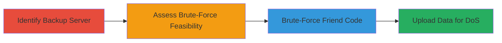

---
tags:
  - dos
  - brute-force
  - crashplan
  - backup
  - rate-limiting-bypass
type: attack_chain
tools: []
tactics:
  - '[[Impact]]'
  - '[[Initial Access]]'
commands: []
platforms:
  - Web
complexity: medium
procedures:
  - '[[procedures/Identify-CrashPlan-Backup-Server]]'
  - '[[procedures/Assess-Friend-Code-Brute-Force-Feasibility]]'
  - '[[procedures/Brute-Force-CrashPlan-Friend-Code]]'
  - '[[procedures/Upload-Malicious-Data-to-CrashPlan-for-DoS]]'
step_count: 4
techniques:
  - '[[Brute Force]]'
  - '[[Network Denial of Service]]'
  - '[[Exploit Public-Facing Application]]'
description: >-
  Multi-stage attack exploiting lack of rate limiting on CrashPlan friend code
  validation to brute-force Uber's backup code and perform a storage-exhausting
  DoS.
skill_level: intermediate
impact_level: high
id: b8e8964d-40c1-4b68-a112-9387ecf9693e
created_at: '2025-12-14T17:26:30.469Z'
updated_at: '2025-12-14T17:26:30.469Z'
verified: false
validated: true
submitted: true
mitre_tactics:
  - '[[Impact]]'
  - '[[Initial Access]]'
mitre_techniques:
  - '[[Brute Force]]'
  - '[[Network Denial of Service]]'
  - '[[Exploit Public-Facing Application]]'
---
# Brute-Force CrashPlan Friend Code for DoS on Uber Backup Server

## Overview

This attack chain targets Uber's CrashPlan backup server at backup.uber.com:443, which uses a weak 6-digit alphanumeric friend code for authorizing inbound backups without rate limiting on the validation endpoint. By brute-forcing the 36^6 (approximately 2.17 billion) possible codes, an attacker can discover Uber's specific code and upload arbitrary large files to exhaust the server's storage, resulting in a denial-of-service that prevents Uber employees from performing legitimate backups. The attack requires no authentication beyond the code and leverages the public-facing nature of the service.

## Chain Metrics Dashboard

| Metric | Value |
|--------|-------|
| Chain Status | Unverified |
| Total Steps | 4 |
| Execution Time | ~Several hours to days (depending on brute-force speed) |
| Skill Level | Intermediate |
| Complexity | Medium |
| Impact Level | High |

## Attack Flow Visualization

## Prerequisites & Requirements

### Required Tools

- Custom scripting tool for HTTP requests (e.g., Python with requests library)
- High-bandwidth connection for data uploads

### Target Environment

- Web platform
- CrashPlan service on port 443
- Publicly accessible HTTPS endpoint

### Initial Access Requirements

- Internet access to backup.uber.com:443
- No credentials required
- Ability to send repeated HTTP requests without IP blocking

## Detailed Attack Procedures

### Step 1: Identify Backup Server
procedure: [[procedures/Identify-CrashPlan-Backup-Server]]

**Objective**: Locate and confirm the target CrashPlan backup server hosted by Uber.

**Instructions**: Perform reconnaissance on Uber's infrastructure to identify backup.uber.com. Use browser or curl to access https://backup.uber.com:443 and observe the CrashPlan interface, confirming it accepts inbound backups via friend codes.

**Expected Output**: Confirmation of CrashPlan server running on port 443, with friend code input visible.

**Success Indicators**:
- Server responds with CrashPlan login or code entry page
- No immediate access restrictions observed

### Step 2: Assess Brute-Force Feasibility
procedure: [[procedures/Assess-Friend-Code-Brute-Force-Feasibility]]

**Objective**: Evaluate the keyspace and security controls to determine if brute-forcing the friend code is viable.

**Instructions**: Analyze the friend code format (6 alphanumeric characters, 36 possibilities per digit: 0-9, a-z). Calculate total combinations: 36^6 = 2,176,782,336. Test the validation endpoint (e.g., via POST requests to /auth/friendcode or similar) for rate limiting by sending multiple invalid codes rapidly.

**Expected Output**: No rate limiting detected; each request responds quickly without delays or blocks.

**Success Indicators**:
- Keyspace confirmed as brute-forceable within reasonable time (e.g., at 1000 req/sec, ~24 days max)
- Endpoint accepts unlimited validation attempts

### Step 3: Brute-Force Friend Code
procedure: [[procedures/Brute-Force-CrashPlan-Friend-Code]]

**Objective**: Systematically guess the valid friend code to gain unauthorized backup authorization.

**Instructions**: Develop a script to iterate through all possible 6-digit codes (e.g., using nested loops or itertools in Python). Send HTTP POST requests to the validation endpoint with each code. Monitor responses for success indicators like "valid code" or access grant.

**Expected Output**: Discovery of the exact 6-digit code that authorizes backups to Uber's server.

**Success Indicators**:
- Valid response received for a specific code
- Ability to proceed to backup initiation

### Step 4: Upload Data for DoS
procedure: [[procedures/Upload-Malicious-Data-to-CrashPlan-for-DoS]]

**Objective**: Use the discovered code to upload excessive data, filling storage and denying service to legitimate users.

**Instructions**: Configure a CrashPlan client with the valid friend code to connect to backup.uber.com:443. Initiate multiple backup sessions from external machines, uploading large dummy files (e.g., generated videos or archives) continuously until storage quotas are exceeded.

**Expected Output**: Server accepts uploads, leading to storage exhaustion; legitimate backups fail due to space issues.

**Success Indicators**:
- Uploads succeed without errors
- Monitoring shows increased storage usage on the server
- Uber employees report backup failures

## Attack Chain Summary

### Key Achievements

1. Identified weak authentication in Uber's public backup server
2. Exploited absent rate limiting to brute-force access
3. Performed resource exhaustion DoS via unauthorized uploads

## Technique & Tactic Coverage

### MITRE ATT&CK Techniques

- [[Brute Force]] Brute Force
- [[Network Denial of Service]] Network Denial of Service
- [[Exploit Public-Facing Application]] Exploit Public-Facing Application

### MITRE ATT&CK Tactics

- [[Impact]] Impact
- [[Initial Access]] Initial Access

---
*Last updated: 2023-10-01*
