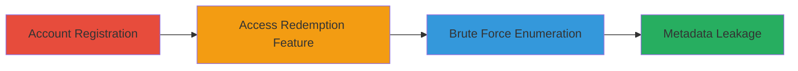

---
tags:
  - brute-force
  - enumeration
  - api
  - mobile
  - uber
  - rate-limiting-bypass
  - promo-codes
type: attack_chain
tools: []
tactics:
  - '[[Discovery]]'
verified: false
platforms:
  - iOS
  - Mobile
submitted: true
complexity: medium
created_at: '2023-10-01T00:00:00Z'
procedures:
  - '[[procedures/Register-New-Account-in-Uber-iOS-App]]'
  - '[[procedures/Access-Promotion-Code-Redemption-Feature-in-Uber-App]]'
  - '[[procedures/Brute-Force-and-Enumerate-Valid-Promo-Codes-via-Uber-API]]'
step_count: 3
techniques:
  - '[[Account Discovery]]'
  - '[[Brute Force]]'
updated_at: '2025-12-14T17:24:42.854Z'
description: >-
  Multi-stage attack exploiting lack of rate limiting on Uber's promo code
  redemption endpoint to enumerate valid codes and leak user metadata.
skill_level: intermediate
impact_level: high
id: ce7e6191-025c-4dcd-bb33-b4b8d1df4464
validated: true
mitre_tactics:
  - '[[Discovery]]'
mitre_techniques:
  - '[[Account Discovery]]'
  - '[[Brute Force]]'
---
# Brute Force Enumeration of Valid Promo Codes in Uber iOS App

Multi-stage attack chain demonstrating a complete attack workflow exploiting the absence of rate limiting on the Uber iOS app's promo code redemption endpoint. This allows attackers to brute force and enumerate valid promotion codes, resulting in the leakage of sensitive user metadata such as country, inviter's name, and profile picture from API responses.

## Chain Metrics Dashboard

| Metric | Value |
|--------|-------|
| Chain Status | Unverified |
| Total Steps | 3 |
| Execution Time | ~10 minutes |
| Skill Level | Intermediate |
| Complexity | Medium |
| Impact Level | High |

## Attack Flow Visualization

## Prerequisites & Requirements

### Required Tools

- Uber iOS app installed on a device or simulator
- List of potential promo codes for testing (e.g., generated or common patterns)

### Target Environment

- iOS platform
- Uber backend API services
- No specific ports required; app handles API communication

### Initial Access Requirements

- No prior credentials needed; new account registration is part of the attack
- Internet access for app functionality
- No elevated privileges required

## Detailed Attack Procedures

### Step 1: Account Registration
procedure: [[procedures/Register-New-Account-in-Uber-iOS-App]]

**Objective**: Create a new Uber account to gain access to the promo code redemption functionality without triggering any existing account restrictions.

**Instructions**: Open the Uber iOS app and navigate to the registration screen. Provide a valid email, phone number, and other required details to complete signup. Verify the account via email or SMS if prompted.

**Expected Output**: Successful account creation with login to the app dashboard.

**Success Indicators**:
- New account dashboard loads
- No errors during registration

### Step 2: Access Redemption Feature
procedure: [[procedures/Access-Promotion-Code-Redemption-Feature-in-Uber-App]]

**Objective**: Immediately navigate to the promo code application section post-registration to prepare for redemption attempts.

**Instructions**: From the app's main menu or payments section, locate and select the "Add Promo Code" or "Apply Promotion" option. The interface should allow input of a promo code without prior ride history.

**Expected Output**: Promo code input field appears, ready for submissions.

**Success Indicators**:
- Redemption UI is accessible
- No prompts requiring prior activity

### Step 3: Brute Force Enumeration
procedure: [[procedures/Brute-Force-and-Enumerate-Valid-Promo-Codes-via-Uber-API]]

**Objective**: Exploit the lack of rate limiting by submitting multiple promo code attempts to identify valid ones and extract leaked metadata.

**Instructions**: In the promo code input field, systematically enter test codes (e.g., common patterns like UBERNEW1, UBER2023, or generated lists). Submit each one rapidly. Monitor API responses via app behavior or network inspection tools like Proxyman or Charles Proxy to capture details on valid codes, including associated user country, inviter's name, and profile picture.

**Expected Output**: For valid codes, success message with applied discount; API response includes metadata like {"country": "US", "inviter_name": "John Doe", "profile_picture": "url"}.

**Success Indicators**:
- Valid codes identified without throttling
- Metadata leaked in responses for successful redemptions

## Attack Chain Summary

### Key Achievements

1. Successful new account registration enabling fresh access to vulnerable endpoint
2. Unrestricted access to promo code redemption immediately after signup
3. Enumeration of multiple valid promo codes with associated user metadata leakage

## Technique & Tactic Coverage

### MITRE ATT&CK Techniques

- [[Account Discovery]] Account Discovery
- [[Brute Force]] Brute Force

### MITRE ATT&CK Tactics

- [[Discovery]] Discovery

---
*Last updated: 2023-10-01T00:00:00Z*
