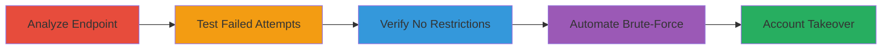

# Brute-Force LinkedIn Account Takeover via Missing Rate Limiting on Login Endpoint

Multi-stage attack chain demonstrating exploitation of LinkedIn's login endpoint vulnerability, where the lack of rate limiting or account lockout allows unlimited authentication attempts, enabling brute-force password guessing and unauthorized account access.

## Chain Metrics Dashboard

| Metric | Value |
|--------|-------|
| Chain Status | Unverified |
| Total Steps | 4 |
| Execution Time | ~10 minutes |
| Skill Level | Intermediate |
| Complexity | Medium |
| Impact Level | High |

## Attack Flow Visualization

## Prerequisites & Requirements

### Required Tools

- [[tools/Burp-Suite]]

### Target Environment

- Web platform
- LinkedIn login endpoint (POST /login or similar)
- No specific ports required beyond standard HTTPS (443)

### Initial Access Requirements

- Network access to LinkedIn's public login endpoint
- Valid target username (for testing)
- Optional: Valid credentials for verification step

## Detailed Attack Procedures

### Step 1: Analyze Login Endpoint
procedure: [[procedures/Analyze-Login-Endpoint-Parameters]]

**Objective**: Identify the login endpoint and confirm direct parameter handling without security checks.

**Instructions**: Inspect the server-side code or network requests to observe how username and password are retrieved. For example, examine Java code snippets showing: `String username = request.getParameter('username'); String password = request.getParameter('password'); int authResult = authenticateUser(username, password);`. Use browser developer tools or a proxy to capture requests.

**Expected Output**: Confirmation of unprotected parameter retrieval.

**Success Indicators**:
- Endpoint identified as POST with username/password params
- No visible rate limiting in code or responses

### Step 2: Test Failed Authentication Attempts
procedure: [[procedures/Test-Failed-Authentication-Attempts]]

**Objective**: Verify that multiple invalid login attempts are not throttled.

**Instructions**: Use [[tools/Burp-Suite]] to intercept and replay POST requests to the login endpoint with invalid credentials. Send 50+ requests rapidly, observing response times and error messages.

**Expected Output**: Consistent error responses without delays or blocks, as in sample invalid response logs.

**Success Indicators**:
- No CAPTCHA or lockout after failures
- Response times remain under 1 second per attempt

### Step 3: Verify Unrestricted Successful Login
procedure: [[procedures/Verify-Unrestricted-Successful-Login]]

**Objective**: Confirm that prior failed attempts do not impact valid logins.

**Instructions**: After Step 2, immediately attempt login with valid credentials using [[tools/Burp-Suite]]. Capture the successful response.

**Expected Output**: Successful authentication and session establishment, as shown in valid login screenshots or XML data.

**Success Indicators**:
- Access granted to account dashboard
- No temporary restrictions applied

### Step 4: Automate Brute-Force Login Attempts
procedure: [[procedures/Automate-Brute-Force-Login-Attempts]]

**Objective**: Demonstrate scalable brute-force attack feasibility.

**Instructions**: Deploy a script to automate attempts against a target username with a password list. Use [[commands/python-brute-force-script]] to send requests, bypassing any tokens if present.

**Expected Output**: Script logs showing rapid attempts without interruption.

**Success Indicators**:
- High volume of attempts (e.g., 1000+ per minute)
- Potential hit on weak password leading to access

## Attack Chain Summary

### Key Achievements

1. Confirmed lack of rate limiting on authentication
2. Validated unlimited failed attempts
3. Proved no impact on successful logins
4. Enabled automated brute-force for account takeover

## Technique & Tactic Coverage

### MITRE ATT&CK Techniques

- [[Brute Force]] Brute Force
- [[Password Guessing]] Password Guessing

### MITRE ATT&CK Tactics

- [[Initial Access]] Initial Access

---
*Last updated: 2023-10-01T00:00:00Z*
