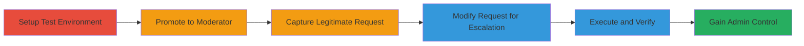

# BuddyPress Group Moderator to Admin Privilege Escalation via REST API Authorization Bypass

Multi-stage attack chain demonstrating a complete privilege escalation workflow in BuddyPress core's REST API for group management, allowing unauthorized promotion from moderator to administrator.

## Chain Metrics Dashboard

| Metric | Value |
|--------|-------|
| Chain Status | Unverified |
| Total Steps | 6 |
| Execution Time | ~15 minutes |
| Skill Level | Intermediate |
| Complexity | Medium |
| Impact Level | High |

## Attack Flow Visualization



## Prerequisites & Requirements

### Required Tools

- [[tools/Browser-Developer-Tools]]

### Target Environment

- WordPress site with BuddyPress plugin enabled
- Access to user registration and group creation features
- No special ports required; operates over standard HTTP/HTTPS

### Initial Access Requirements

- Ability to register new user accounts
- Logged-in access as a group member
- Network access to the WordPress site

## Detailed Attack Procedures

### Step 1: Create Test User Accounts
procedure: [[procedures/Create-Test-User-Accounts-and-Groups]]

**Objective**: Establish two user accounts and initial group setup to simulate the attack scenario.

**Instructions**: Register two separate user accounts (A and B) on the WordPress site. Using account A, create a group named 'abc' and add both users as members. Then, using account B, create a separate group 'def' with only B as a member.

**Expected Output**: Two user accounts created; group 'abc' with A as admin and both as members; group 'def' with B as sole member.

**Success Indicators**:
- User accounts A and B registered successfully
- Groups 'abc' and 'def' visible in BuddyPress interface

### Step 2: Promote User to Moderator
procedure: [[procedures/Promote-User-to-Group-Moderator]]

**Objective**: Elevate account B to moderator role in group 'abc' using legitimate admin privileges.

**Instructions**: Log in as account A, navigate to group 'abc' admin > manage members, select account B, and promote to moderator.

**Expected Output**: Account B now listed as moderator in group 'abc'.

**Success Indicators**:
- Promotion confirmed in group management interface
- Account B can access moderator functions in 'abc'

### Step 3: Capture Legitimate Group Member Edit Request
procedure: [[procedures/Capture-Legitimate-Group-Member-Edit-Request]]

**Objective**: Intercept a valid POST request for editing member roles in the attacker's own group to use as a template.

**Instructions**: Log in as account B, navigate to group 'def' admin > manage members, attempt to edit self (B)'s role using browser developer tools to capture the POST request to the BuddyPress REST API.

**Expected Output**: Captured HTTP POST request details, including headers, URL, and body parameters.

**Success Indicators**:
- Request captured in dev tools network tab
- Request includes group_id for 'def' and user_id for B

### Step 4: Modify and Send API Request for Self-Promotion
procedure: [[procedures/Modify-and-Send-API-Request-for-Self-Promotion]]

**Objective**: Alter the captured request to target group 'abc' and promote self to admin, exploiting the authorization flaw.

**Instructions**: In browser dev tools or a proxy, modify the captured POST request: change group_id to the ID of group 'abc', keep user_id as B's ID, and set body to action=promote&role=admin. Replay the modified request to /wp-json/buddypress/v1/groups/[group_abc_id]/members/[b_user_id]. Use [[commands/buddypress-group-member-promote]] for reference.

```http
POST /wp-json/buddypress/v1/groups/[group_abc_id]/members/[b_user_id] HTTP/1.1
Content-Type: application/x-www-form-urlencoded

action=promote&role=admin
```

**Expected Output**: API response indicating successful role update (e.g., 200 OK with updated member data).

**Success Indicators**:
- No authorization error in response
- Role change reflected in API output

### Step 5: Verify Privilege Escalation Success
procedure: [[procedures/Verify-Privilege-Escalation-Success]]

**Objective**: Confirm the attacker (B) now has administrator privileges in group 'abc'.

**Instructions**: Log in as account B, navigate to group 'abc' admin interface, and attempt admin-only actions like banning users or deleting the group.

**Expected Output**: Full admin access granted; able to perform actions previously restricted to moderators.

**Success Indicators**:
- Admin role visible in group management
- Successful execution of admin actions (e.g., user ban)

### Step 6: Exploit Admin Control

**Objective**: Demonstrate impact by performing destructive or controlling actions on the group.

**Instructions**: As new admin (B), edit roles, remove original admin (A), or delete group 'abc'.

**Expected Output**: Group under full control of attacker; original admin demoted or removed.

**Success Indicators**:
- Original admin (A) loses privileges
- Group deletion or major changes possible

## Attack Chain Summary

### Key Achievements

1. Successful self-promotion from moderator to admin without proper checks
2. Full takeover of group administration, enabling user bans and deletions
3. Exploitation of REST API endpoint for unauthorized role changes

## Technique & Tactic Coverage

### MITRE ATT&CK Techniques

- [[Exploit Public-Facing Application]] Exploit Public-Facing Application
- [[Valid Accounts]] Valid Accounts

### MITRE ATT&CK Tactics

- [[Privilege Escalation]] Privilege Escalation
- [[Initial Access]] Initial Access

---
*Last updated: 2023-10-01T00:00:00Z*
