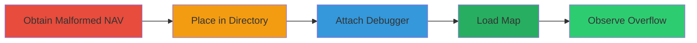

---
tags:
  - buffer-overflow
  - code-execution
  - gaming
  - valve
  - left4dead2
  - bug-bounty
type: attack_chain
tools:
  - "[[tools/Debugger]]"
  - "[[tools/Developer-Console]]"
tactics:
  - "[[Execution]]"
  - "[[Persistence]]"
commands: []
platforms:
  - Windows
  - MacOS
  - Linux
complexity: medium
procedures:
  - "[[procedures/Exploit-Buffer-Overflow-in-Left-4-Dead-2-NAV-Parsing]]"
step_count: 5
techniques:
  - "[[Exploitation for Client Execution]]"
  - "[[Command-Line Interface]]"
description: Exploitation of a buffer overflow vulnerability in Left 4 Dead 2's NAV file parsing to achieve arbitrary code execution
skill_level: advanced
impact_level: high
id: 8cbe7ccf-1139-4a58-8fe3-3cd0702a6dc9
created_at: 2025-12-11T03:46:01.581Z
updated_at: 2025-12-11T03:46:01.581Z
verified: false
validated: true
submitted: true
mitre_tactics:
  - "[[TA0002]]"
  - "[[TA0003]]"
mitre_techniques:
  - "[[T1203]]"
  - "[[T1059]]"
---
# Buffer Overflow in Left 4 Dead 2 via Malformed NAV File for Arbitrary Code Execution

Multi-stage attack chain demonstrating exploitation of a buffer overflow in Left 4 Dead 2's NAV file parsing routines, leading to control of the EIP register and arbitrary code execution. This can be triggered locally or remotely via malicious files or servers.

## Chain Metrics Dashboard

| Metric | Value |
|--------|-------|
| Chain Status | Unverified |
| Total Steps | 5 |
| Execution Time | ~5 minutes |
| Skill Level | Advanced |
| Complexity | Medium |
| Impact Level | High |

## Attack Flow Visualization



## Prerequisites & Requirements

### Required Tools

- [[tools/Debugger]]
- [[tools/Developer-Console]]

### Target Environment

- Windows, MacOS, or Linux
- Left 4 Dead 2 installed with services like Left4Dead2.exe or srcds.exe
- Source Engine tech stack including server.dll and binkw32.dll

### Initial Access Requirements

- Access to the game's maps directory
- Ability to load maps via developer console
- Optional: Remote delivery via Steam Workshop or dedicated servers

## Detailed Attack Procedures

### Step 1: Obtain Malformed NAV File - [[procedures/Exploit-Buffer-Overflow-in-Left-4-Dead-2-NAV-Parsing]]

**Procedure**: [[procedures/Exploit-Buffer-Overflow-in-Left-4-Dead-2-NAV-Parsing]]

**Objective**: Acquire the crafted NAV file that triggers the buffer overflow.

**Expected Output**: Download or create the malformed c1m1_hotel.nav file.

**Success Indicators**:
- File is obtained and verified to contain large amounts of random integers and floats.
- No errors in file handling.

### Step 2: Place NAV File in Maps Directory - [[procedures/Exploit-Buffer-Overflow-in-Left-4-Dead-2-NAV-Parsing]]

**Procedure**: [[procedures/Exploit-Buffer-Overflow-in-Left-4-Dead-2-NAV-Parsing]]

**Objective**: Position the malformed file for loading by the game.

**Expected Output**: File copied to the correct directory.

**Success Indicators**:
- File exists in (steamapps)/Left 4 Dead 2/left4dead2/maps/.
- Directory permissions allow reading.

### Step 3: Start Game and Attach Debugger - [[procedures/Exploit-Buffer-Overflow-in-Left-4-Dead-2-NAV-Parsing]]

**Procedure**: [[procedures/Exploit-Buffer-Overflow-in-Left-4-Dead-2-NAV-Parsing]]

**Objective**: Launch the game and monitor execution with a debugger.

**Expected Output**: Game running with debugger attached.

**Success Indicators**:
- Debugger successfully attaches to Left4Dead2.exe.
- No crashes before loading the map.

### Step 4: Load Map via Developer Console - [[procedures/Exploit-Buffer-Overflow-in-Left-4-Dead-2-NAV-Parsing]]

**Procedure**: [[procedures/Exploit-Buffer-Overflow-in-Left-4-Dead-2-NAV-Parsing]]

**Objective**: Trigger the parsing of the malformed NAV file.

Execute [[commands/l4d2-load-map]] in the developer console:

```bash
map c1m1_hotel
```

**Expected Output**: Game attempts to load the map, triggering the overflow.

**Success Indicators**:
- Command executes without immediate errors.
- Debugger shows activity in parsing routines.

### Step 5: Observe Buffer Overflow - [[procedures/Exploit-Buffer-Overflow-in-Left-4-Dead-2-NAV-Parsing]]

**Procedure**: [[procedures/Exploit-Buffer-Overflow-in-Left-4-Dead-2-NAV-Parsing]]

**Objective**: Confirm control over EIP and code execution.

**Expected Output**: EIP register set to 0x41414102.

**Success Indicators**:
- Debugger confirms EIP control.
- Potential for arbitrary code execution observed.

## Attack Chain Summary

### Key Achievements

1. Control of EIP register via buffer overflow.
2. Arbitrary code execution on the victim's machine.
3. Potential remote exploitation via Steam Workshop or servers.

## Technique & Tactic Coverage

### MITRE ATT&CK Techniques

- [[Exploitation for Client Execution]]
- [[Command-Line Interface]]

### MITRE ATT&CK Tactics

- [[Execution]]
- [[Persistence]]

*Last updated: 2023-10-01*
