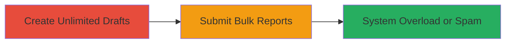

---
tags:
  - misconfiguration
  - dos
  - spam
  - web
type: attack_chain
tools: []
tactics:
  - '[[Initial Access]]'
verified: false
platforms:
  - Web
submitted: true
complexity: low
created_at: '2025-12-14T17:30:26.570Z'
procedures:
  - '[[procedures/Abuse-Unlimited-Drafts-for-Bulk-Submission]]'
step_count: 2
techniques:
  - '[[Exploit Public-Facing Application]]'
updated_at: '2025-12-14T17:30:26.570Z'
description: >-
  Misconfiguration in HackerOne's report submission system allowing unlimited
  draft creation and simultaneous bulk submission, enabling potential system
  spam or overload.
skill_level: novice
impact_level: low
id: d7834e59-b828-4c34-b2b7-ba99df6ed601
validated: true
mitre_tactics:
  - '[[Initial Access]]'
mitre_techniques:
  - '[[Exploit Public-Facing Application]]'
---
---

# Bulk Report Submission via Unlimited Drafts in HackerOne

Multi-stage attack chain demonstrating a complete attack workflow exploiting a misconfiguration in the HackerOne platform's draft report feature.

## Chain Metrics Dashboard

| Metric | Value |
|--------|-------|
| Chain Status | Unverified |
| Total Steps | 2 |
| Execution Time | ~5 minutes |
| Skill Level | Novice |
| Complexity | Low |
| Impact Level | Low |

## Attack Flow Visualization

## Prerequisites & Requirements

### Required Tools

- Web browser (e.g., Chrome or Firefox)

### Target Environment

- HackerOne platform (web-based bug bounty submission interface)
- No specific services or ports required beyond standard HTTPS access

### Initial Access Requirements

- Valid HackerOne user account with report submission privileges
- Network access to hackerone.com
- No prior elevated access needed

## Detailed Attack Procedures

### Step 1: Create Unlimited Draft Reports
procedure: [[procedures/Abuse-Unlimited-Drafts-for-Bulk-Submission]]

**Objective**: Exploit the lack of limits on draft report creation to generate a large number of unsaved reports.

**Instructions**: Access the HackerOne report submission interface and repeatedly initiate new draft reports without saving or submitting them. Use the draft mode feature to create as many as desired (e.g., hundreds) by filling minimal details and leaving them in draft state.

**Expected Output**: Accumulation of multiple draft reports in the user's session or interface, visible in the drafts list.

**Success Indicators**:
- Drafts counter or list shows increasing number without restrictions
- No error messages limiting creation

### Step 2: Submit All Drafts Simultaneously
procedure: [[procedures/Abuse-Unlimited-Drafts-for-Bulk-Submission]]

**Objective**: Submit the accumulated drafts in bulk to bypass rate limits and potentially spam or overload the system.

**Instructions**: From the drafts management interface, select and submit all created drafts at once, triggering simultaneous processing on the backend.

**Expected Output**: Multiple reports queued or processed in rapid succession, potentially causing temporary system load during high-traffic events like celebrations.

**Success Indicators**:
- Confirmation of bulk submissions received by HackerOne
- System response indicating overload or spam detection (if unmitigated)

## Attack Chain Summary

### Key Achievements

1. Bypassed intended rate limits on report creation via unlimited drafts
2. Enabled bulk submission to spam the platform
3. Demonstrated potential for minor denial of service during events

## Technique & Tactic Coverage

### MITRE ATT&CK Techniques

- [[Exploit Public-Facing Application]]

### MITRE ATT&CK Tactics

- [[Initial Access]]

---

*Last updated: *
