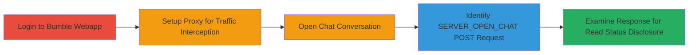

---
tags:
  - information-disclosure
  - api
  - privacy
  - web
  - chat
type: attack_chain
tools:
  - '[[tools/Burp-Suite]]'
tactics:
  - '[[Collection]]'
  - '[[Discovery]]'
commands: []
platforms:
  - Web
complexity: medium
procedures:
  - >-
    [[procedures/Intercept-and-Analyze-Bumble-Chat-API-for-Read-Status-Exposure]]
step_count: 5
techniques:
  - '[[T1213.003]]'
  - '[[Network Sniffing]]'
description: >-
  Demonstrates discovery of an information disclosure vulnerability in Bumble's
  chat API that exposes read status of messages, violating user privacy
  expectations.
skill_level: intermediate
impact_level: high
id: 0f3daeb0-5813-45fb-a484-f602fd98aab7
created_at: '2025-12-14T17:32:39.630Z'
updated_at: '2025-12-14T17:32:39.630Z'
verified: false
validated: true
submitted: true
mitre_tactics:
  - '[[Collection]]'
  - '[[Discovery]]'
mitre_techniques:
  - '[[T1213.003]]'
  - '[[Network Sniffing]]'
---
# Bumble API Information Disclosure of Chat Message Read Status

## Overview

This attack chain outlines the discovery of a privacy vulnerability in Bumble's web application API. By intercepting HTTP traffic during normal chat interactions, an attacker can reveal the 'read' status of messages, which the app's UI intentionally hides to maintain user privacy. The endpoint SERVER_OPEN_CHAT returns JSON responses containing chat messages with a boolean 'read' field, allowing unauthorized access to this sensitive information across all chats. This leads to potential privacy breaches, as users expect only 'delivered' status to be visible.

## Chain Metrics Dashboard

| Metric | Value |
|--------|-------|
| Chain Status | Unverified |
| Total Steps | 5 |
| Execution Time | ~10 minutes |
| Skill Level | Intermediate |
| Complexity | Medium |
| Impact Level | High |

## Attack Flow Visualization

## Prerequisites & Requirements

### Required Tools

- [[tools/Burp-Suite]]

### Target Environment

- Web platform
- Access to Bumble webapp at https://bumble.com
- No specific ports or services beyond standard HTTPS (443)

### Initial Access Requirements

- Valid Bumble user credentials
- Local network access to run proxy tools
- No prior elevated access needed

## Detailed Attack Procedures

### Step 1: Log in to the Bumble Webapp
procedure: [[procedures/Intercept-and-Analyze-Bumble-Chat-API-for-Read-Status-Exposure]]

**Objective**: Gain authenticated access to the Bumble web interface to initiate chat interactions.

**Instructions**: Navigate to the login page and enter credentials to authenticate.

**Expected Output**: Successful login, redirecting to the main dashboard with access to chats.

**Success Indicators**:
- User is logged in and can view matches/chats
- No authentication errors

### Step 2: Setup Intercepting Proxy for Traffic Capture
procedure: [[procedures/Intercept-and-Analyze-Bumble-Chat-API-for-Read-Status-Exposure]]

**Objective**: Configure a proxy to monitor and intercept all HTTP/HTTPS traffic between the browser and Bumble servers.

**Instructions**: Launch Burp Suite and configure the browser to route traffic through the proxy (typically localhost:8080). Enable interception for HTTPS by installing Burp's CA certificate.

**Expected Output**: All webapp requests and responses are visible in Burp's proxy history.

**Success Indicators**:
- Traffic from bumble.com is captured in Burp
- No connection errors due to proxy misconfiguration

### Step 3: Open an Existing Chat
procedure: [[procedures/Intercept-and-Analyze-Bumble-Chat-API-for-Read-Status-Exposure]]

**Objective**: Trigger the chat loading mechanism to generate API requests for message retrieval.

**Instructions**: In the webapp interface, navigate to the chats section and select an existing conversation to open it.

**Expected Output**: Chat messages load in the UI, with proxy capturing the underlying API call.

**Success Indicators**:
- Chat window opens displaying messages
- Corresponding POST request appears in proxy logs

### Step 4: Identify the Outgoing POST Request
procedure: [[procedures/Intercept-and-Analyze-Bumble-Chat-API-for-Read-Status-Exposure]]

**Objective**: Locate the specific API endpoint responsible for fetching chat messages.

**Instructions**: Filter the proxy logs in Burp Suite for POST requests to https://am1.bumble.com/mwebapi.phtml?SERVER_OPEN_CHAT.

**Expected Output**: Identification of the request payload and endpoint details.

**Success Indicators**:
- POST request to SERVER_OPEN_CHAT is isolated
- Request includes chat-specific parameters

### Step 5: Examine the Response for Disclosure
procedure: [[procedures/Intercept-and-Analyze-Bumble-Chat-API-for-Read-Status-Exposure]]

**Objective**: Analyze the API response to uncover the unintended exposure of message read status.

**Instructions**: In Burp Suite, inspect the JSON response body for the chat_messages array. Look for badoo.bma.ChatMessage objects containing a 'read' boolean field.

**Expected Output**: JSON structure revealing 'read': true/false for each message.

**Success Indicators**:
- 'read' field present in message objects
- Status differs from UI-displayed 'delivered' only

## Attack Chain Summary

### Key Achievements

1. Successful interception of authenticated API traffic without disrupting app functionality.
2. Identification of the SERVER_OPEN_CHAT endpoint leaking sensitive read status data.
3. Confirmation of privacy impact, as read receipts are not intended for user visibility.

## Technique & Tactic Coverage

### MITRE ATT&CK Techniques

- [[T1213.003]]
- [[Network Sniffing]]

### MITRE ATT&CK Tactics

- [[Collection]]
- [[Discovery]]

---
*Last updated: 2023-10-01*
