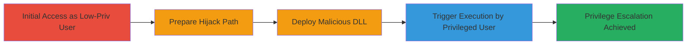

# Burp Suite Privilege Escalation via DLL Hijacking on Windows

Multi-stage attack chain demonstrating a complete attack workflow exploiting a DLL loading vulnerability in Burp Suite on Windows to achieve local privilege escalation.

## Chain Metrics Dashboard

| Metric | Value |
|--------|-------|
| Chain Status | Unverified |
| Total Steps | 4 |
| Execution Time | ~5 minutes |
| Skill Level | Intermediate |
| Complexity | Medium |
| Impact Level | High |

## Attack Flow Visualization

## Prerequisites & Requirements

### Required Tools

- [[tools/Process-Monitor]]
- A malicious DLL compiler (e.g., Visual Studio for sunec.dll)

### Target Environment

- Windows OS (tested on Windows 10/11)
- Burp Suite Professional/Community Edition (Java-based)
- Default Windows permissions allowing directory creation on C:\

### Initial Access Requirements

- Local access as a low-privileged authenticated user
- No administrative rights initially
- Burp Suite installed system-wide

## Detailed Attack Procedures

### Step 1: Initial Access
procedure: [[procedures/Login-as-Low-Privileged-User]]

**Objective**: Gain access to the system as a standard user without elevated privileges to prepare the hijacking environment.

**Instructions**: Log in to the Windows system using low-privileged credentials. Verify privileges by attempting to access protected resources or checking user group membership.

**Expected Output**: Successful login to a non-admin user session.

**Success Indicators**:
- User session active without admin prompts
- Ability to create directories on C:\ confirmed

### Step 2: Prepare Hijack Path
procedure: [[procedures/Create-Malicious-Directory-Structure]]

**Objective**: Create a directory structure mimicking the non-existent path that Burp Suite attempts to load DLLs from, exploiting Windows default permissions.

**Instructions**: Use Windows commands to build the path, such as C:\Program Files\...\amd64, noting the space in 'Program Files' which may cause encoding issues but is writable by standard users.

**Expected Output**: Directory tree created successfully.

**Success Indicators**:
- Directories exist and are writable
- No permission errors during creation

### Step 3: Deploy Malicious Payload
procedure: [[procedures/Place-Malicious-DLL]]

**Objective**: Place a custom malicious DLL (e.g., sunec.dll) into the prepared path to be loaded by Burp Suite.

**Instructions**: Compile or obtain a malicious DLL that executes arbitrary code (e.g., a popup or shell spawn), then copy it to the target subdirectory.

**Expected Output**: Malicious DLL placed in the hijackable location.

**Success Indicators**:
- File copied without errors
- DLL executable and ready for loading

### Step 4: Trigger Escalation
procedure: [[procedures/Trigger-DLL-Load-by-Privileged-User]]

**Objective**: Launch Burp Suite under a privileged user context to trigger the DLL load and execute the malicious code with elevated privileges.

**Instructions**: Switch to or simulate a high-privileged user, then start Burp Suite, observing the load attempt via monitoring tools.

**Expected Output**: Malicious code executes (e.g., popup or command prompt as admin).

**Success Indicators**:
- Elevated code execution confirmed
- Privilege separation broken

## Attack Chain Summary

### Key Achievements

1. Identified vulnerable DLL load path in Burp Suite using Process Monitor
2. Created attacker-controlled directory on writable C:\ path
3. Achieved arbitrary code execution as privileged user
4. Demonstrated full local privilege escalation

## Technique & Tactic Coverage

### MITRE ATT&CK Techniques

- [[DLL Search Order Hijacking]]
- [[Shortcut Modification]]

### MITRE ATT&CK Tactics

- [[Privilege Escalation]]
- [[Execution]]

---

*Last updated: 2023-10-01T00:00:00Z*
