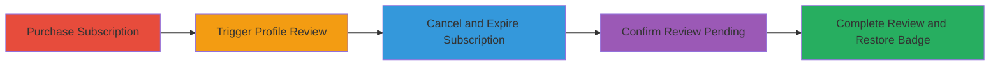

---
tags:
  - business-logic
  - twitter
  - verification-bypass
  - subscription-abuse
type: attack_chain
tools: []
tactics:
  - '[[Persistence]]'
  - '[[Defense Evasion]]'
verified: false
platforms:
  - Web
  - iOS
submitted: true
complexity: medium
created_at: '2023-10-01T00:00:00Z'
procedures:
  - '[[procedures/Purchase-Twitter-Blue-Subscription]]'
  - '[[procedures/Change-Profile-Photo-Before-Expiration]]'
  - '[[procedures/Verify-Profile-Under-Review]]'
  - '[[procedures/Cancel-Twitter-Blue-Subscription]]'
  - '[[procedures/Wait-for-Subscription-Expiration]]'
  - '[[procedures/Confirm-Account-Still-Under-Review]]'
  - '[[procedures/Wait-for-Review-Completion-and-Badge-Restoration]]'
step_count: 7
techniques:
  - '[[Account Manipulation]]'
  - '[[Valid Accounts]]'
updated_at: '2025-12-14T17:30:35.428Z'
description: >-
  Multi-stage business logic abuse in Twitter's verification system allowing
  indefinite retention of the verified badge post-subscription expiration via
  profile review manipulation.
skill_level: intermediate
impact_level: high
id: 60585b9d-3974-4fd4-9beb-3e165e578e03
validated: true
mitre_tactics:
  - '[[Persistence]]'
  - '[[Defense Evasion]]'
mitre_techniques:
  - '[[Account Manipulation]]'
  - '[[Valid Accounts]]'
---
# Business Logic Exploit to Retain Twitter Verified Badge Without Ongoing Subscription

Multi-stage attack chain exploiting a business logic flaw in Twitter's (now X) verification badge system for Twitter Blue subscribers. By timing profile changes and subscription cancellation around the review process, attackers can trick the system into restoring the verified badge after expiration without re-validating the subscription status. This leads to permanent badge retention without payments, causing financial loss to Twitter and complicating malicious actor tracking.

## Chain Metrics Dashboard

| Metric | Value |
|--------|-------|
| Chain Status | Unverified |
| Total Steps | 7 |
| Execution Time | ~3-5 days |
| Skill Level | Intermediate |
| Complexity | Medium |
| Impact Level | High |

## Attack Flow Visualization

## Prerequisites & Requirements

### Required Tools

- None (manual process via Twitter app/website and App Store)

### Target Environment

- Twitter account with initial access
- iOS device for App Store subscription management
- Active internet connection

### Initial Access Requirements

- Valid Twitter account credentials
- Ability to purchase initial Twitter Blue subscription (credit card or payment method)
- No prior elevated privileges needed

## Detailed Attack Procedures

### Step 1: Purchase Subscription
procedure: [[procedures/Purchase-Twitter-Blue-Subscription]]

**Objective**: Establish an active Twitter Blue subscription to gain initial verified badge and set up for timing-based exploitation.

**Instructions**: Subscribe to Twitter Blue via the Twitter app or website to activate the verified badge.

**Expected Output**: Verified blue badge appears on the profile.

**Success Indicators**:
- Subscription active and badge visible
- Expiration date noted (typically 1 month)

### Step 2: Change Profile Photo Before Expiration
procedure: [[procedures/Change-Profile-Photo-Before-Expiration]]

**Objective**: Trigger the profile review process one day before subscription expiration to queue the badge for restoration.

**Instructions**: Edit profile details, such as uploading a new profile picture, through Twitter account settings. This temporarily removes the badge for review.

**Expected Output**: Badge disappears from profile.

**Success Indicators**:
- Badge removed
- Profile changes pending review

### Step 3: Verify Profile Under Review
procedure: [[procedures/Verify-Profile-Under-Review]]

**Objective**: Confirm the review queue is active and monitor for premature badge restoration.

**Instructions**: Periodically check the Twitter profile. If the badge returns early, repeat the profile change before expiration.

**Expected Output**: Profile shows under review status; review takes 1-2 days.

**Success Indicators**:
- No badge restoration yet
- Review process confirmed ongoing

### Step 4: Cancel Twitter Blue Subscription
procedure: [[procedures/Cancel-Twitter-Blue-Subscription]]

**Objective**: Initiate subscription cancellation while the profile is under review to allow expiration without interrupting the queue.

**Instructions**: Go to App Store > Your Account > Subscriptions and cancel Twitter Blue.

**Expected Output**: Cancellation confirmed; subscription set to expire in one day.

**Success Indicators**:
- Cancellation successful
- Profile review unaffected

### Step 5: Wait for Subscription Expiration
procedure: [[procedures/Wait-for-Subscription-Expiration]]

**Objective**: Allow the subscription to fully expire while the review remains pending.

**Instructions**: Monitor the subscription end date and ensure the profile stays under review.

**Expected Output**: Subscription expired; no active payment required.

**Success Indicators**:
- Expiration date passed
- No badge changes yet

### Step 6: Confirm Account Still Under Review
procedure: [[procedures/Confirm-Account-Still-Under-Review]]

**Objective**: Verify the review queue persists post-expiration to ensure the exploit window is open.

**Instructions**: Attempt to edit profile or other details; expect a message indicating the account is under review.

**Expected Output**: Edit attempts blocked with review message.

**Success Indicators**:
- Review status active
- No subscription check triggered

### Step 7: Wait for Review Completion and Badge Restoration
procedure: [[procedures/Wait-for-Review-Completion-and-Badge-Restoration]]

**Objective**: Allow Twitter's review team to approve changes and restore the badge without subscription validation.

**Instructions**: Wait 2-3 days for the review to complete.

**Expected Output**: Verified badge reinstated on profile despite expired subscription.

**Success Indicators**:
- Badge permanently restored
- No further payments needed

## Attack Chain Summary

### Key Achievements

1. Initial subscription purchase to gain legitimate access to verified status.
2. Manipulation of review timing to bypass expiration checks.
3. Permanent retention of verification badge without ongoing costs.

## Technique & Tactic Coverage

### MITRE ATT&CK Techniques

- [[Account Manipulation]] Account Manipulation
- [[Valid Accounts]] Valid Accounts

### MITRE ATT&CK Tactics

- [[Persistence]] Persistence
- [[Defense Evasion]] Defense Evasion

---
*Last updated: 2023-10-01T00:00:00Z*
