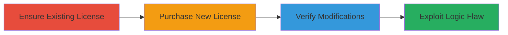

---
tags:
  - business-logic
  - license-management
  - portswigger
  - web-vulnerability
type: attack_chain
tools: []
tactics:
  - '[[Initial Access]]'
  - '[[Impact]]'
verified: false
platforms:
  - Web
submitted: true
complexity: low
created_at: '2023-10-01T00:00:00Z'
procedures:
  - '[[procedures/Activate-Existing-PortSwigger-License]]'
  - '[[procedures/Purchase-New-PortSwigger-License]]'
  - '[[procedures/Verify-License-Modifications]]'
step_count: 3
techniques:
  - '[[Exploit Public-Facing Application]]'
  - '[[Account Manipulation]]'
updated_at: '2025-12-14T17:28:36.295Z'
description: >-
  A multi-step attack exploiting incorrect business logic in PortSwigger's
  license system to potentially extend existing license expiry dates by
  purchasing additional licenses, though it results in user seat downgrades.
skill_level: intermediate
impact_level: medium
id: 5e8dacd5-adb6-4556-bc21-2efece38b52c
validated: true
mitre_tactics:
  - '[[Initial Access]]'
  - '[[Impact]]'
mitre_techniques:
  - '[[Exploit Public-Facing Application]]'
  - '[[Account Manipulation]]'
---
# Business Logic Flaw in PortSwigger License Management for Unauthorized Expiry Extension

Multi-stage attack chain demonstrating exploitation of a business logic error in PortSwigger's web-based license management system, where purchasing an additional license unexpectedly modifies existing licenses, potentially extending expiry dates at the cost of reducing user seats.

## Chain Metrics Dashboard

| Metric | Value |
|--------|-------|
| Chain Status | Unverified |
| Total Steps | 3 |
| Execution Time | ~5 minutes |
| Skill Level | Intermediate |
| Complexity | Low |
| Impact Level | Medium |

## Attack Flow Visualization

## Prerequisites & Requirements

### Required Tools

- Web browser (e.g., Chrome or Firefox)
- Valid payment method for license purchase

### Target Environment

- PortSwigger Web Security platform
- Active user account with existing license
- Access to license management page (https://portswigger.net/support/licensing or similar)

### Initial Access Requirements

- Authenticated PortSwigger account
- Existing multi-user license (e.g., 4-user license)
- No special network access beyond standard internet

## Detailed Attack Procedures

### Step 1: Ensure Existing License
procedure: [[procedures/Activate-Existing-PortSwigger-License]]

**Objective**: Confirm an active existing license to serve as the baseline for modification.

**Instructions**: Log in to your PortSwigger account and navigate to the license management section. Verify that your current license (e.g., 4-user with a specific expiry date) is active and note its details, including user count and expiry.

**Expected Output**: Display of existing license details, such as "4 users, expires on [date]".

**Success Indicators**:
- License is listed as active
- User count and expiry date are visible and noted

### Step 2: Purchase New License
procedure: [[procedures/Purchase-New-PortSwigger-License]]

**Objective**: Acquire a new longer-term license to trigger the business logic flaw during processing.

**Instructions**: From the license purchase page, select a 1-user license with a 5-year term. Proceed to checkout, enter payment details, and complete the transaction. Wait for the confirmation email or page indicating successful purchase.

**Expected Output**: Confirmation of new license purchase, with details for the 1-user 5-year term.

**Success Indicators**:
- Payment processed successfully
- New license details received via email or on-screen

### Step 3: Verify License Modifications
procedure: [[procedures/Verify-License-Modifications]]

**Objective**: Observe the unintended changes to existing and new licenses due to faulty processing logic.

**Instructions**: Return to the license management page after the purchase. Refresh or reload the page to view updated license information. Compare the existing license's user count (should drop to 1) and expiry (extended to match new term) against the original details.

**Expected Output**: Existing license shows reduced users (e.g., 1 instead of 4) but extended expiry; new license may also show anomalies.

**Success Indicators**:
- Existing license user count downgraded
- Expiry dates extended unexpectedly on one or both licenses

## Attack Chain Summary

### Key Achievements

1. Triggered modification of existing license details via new purchase
2. Demonstrated potential for unauthorized expiry extension (though offset by seat reduction)
3. Highlighted double payment processing leading to account inconsistencies

## Technique & Tactic Coverage

### MITRE ATT&CK Techniques

- [[Exploit Public-Facing Application]] Exploit Public-Facing Application
- [[Account Manipulation]] Account Manipulation

### MITRE ATT&CK Tactics

- [[Initial Access]] Initial Access
- [[Impact]] Impact

---

*Last updated: 2023-10-01T00:00:00Z*
