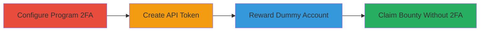

---
tags:
  - 2fa-bypass
  - business-logic
  - auth-bypass
  - hackerone
type: attack_chain
tools: []
tactics:
  - '[[Initial Access]]'
verified: false
platforms:
  - Web
submitted: true
complexity: medium
created_at: '2023-10-01T00:00:00Z'
procedures:
  - '[[procedures/Enable-2FA-Requirement-in-HackerOne-Program]]'
  - '[[procedures/Create-API-Token-with-Reward-Privilege]]'
  - '[[procedures/Reward-Dummy-Account-Without-2FA]]'
  - '[[procedures/Claim-Bounty-Using-Dummy-Account]]'
step_count: 4
techniques:
  - '[[Valid Accounts]]'
updated_at: '2025-12-14T17:24:47.806Z'
description: >-
  A business logic vulnerability in HackerOne allowing bypass of
  program-mandated 2FA during bounty claiming, enabling unauthorized financial
  reward access.
skill_level: intermediate
impact_level: high
id: fa15c0f6-21ca-420e-98c2-1af0143ad5b0
validated: true
mitre_tactics:
  - '[[Initial Access]]'
mitre_techniques:
  - '[[Valid Accounts]]'
---
# Bypass 2FA Requirement in HackerOne Bounty Claiming Process

Multi-stage attack chain demonstrating a business logic error in HackerOne's platform where 2FA requirements for program submissions are not enforced during bounty claiming, allowing unauthorized access to financial rewards.

## Chain Metrics Dashboard

| Metric | Value |
|--------|-------|
| Chain Status | Unverified |
| Total Steps | 4 |
| Execution Time | ~10 minutes |
| Skill Level | Intermediate |
| Complexity | Medium |
| Impact Level | High |

## Attack Flow Visualization

## Prerequisites & Requirements

### Required Tools

- None (uses HackerOne web interface and API)

### Target Environment

- HackerOne platform (web-based bug bounty service)
- Required services/ports: HTTPS (443)
- Network access requirements: Internet access to hackerone.com

### Initial Access Requirements

- Valid HackerOne account with ability to create sandbox programs
- Administrative access to program settings
- No prior network position needed beyond standard user access

## Detailed Attack Procedures

### Step 1: Configure Program 2FA Requirement
procedure: [[procedures/Enable-2FA-Requirement-in-HackerOne-Program]]

**Objective**: Set up a program to mandate 2FA for submissions, establishing the condition for the bypass test.

**Instructions**: Log in to your HackerOne account, navigate to the sandbox program's settings, and enable the 2FA requirement option to simulate a secure program configuration.

Access the program's settings at `https://hackerone.com/{program_handle}/submission_requirements` and toggle the 2FA enforcement for submissions.

**Expected Output**: Confirmation that 2FA is now required for submissions in the program settings.

**Success Indicators**:
- 2FA option enabled in program requirements
- Submission process prompts for 2FA when tested

### Step 2: Generate API Token for Rewards
procedure: [[procedures/Create-API-Token-with-Reward-Privilege]]

**Objective**: Create an API token that allows rewarding bounties, bypassing direct UI restrictions.

**Instructions**: In your HackerOne account settings, generate a new API token. Ensure it includes the 'reward' scope to permit bounty issuance via API calls.

Save the token securely, as it will be used in the next step to interact with the platform programmatically.

**Expected Output**: API token generated and visible in account settings.

**Success Indicators**:
- Token created with 'reward' privilege
- Token can be used for API authentication

### Step 3: Issue Reward to Dummy Account
procedure: [[procedures/Reward-Dummy-Account-Without-2FA]]

**Objective**: Use the API token to reward a test account lacking 2FA, setting up the bypass scenario.

**Instructions**: Create or use an existing dummy HackerOne account without 2FA enabled. Then, utilize the API token to send a reward request to this account for a simulated vulnerability report.

The API endpoint for rewarding would typically be something like POST to `/api/v1/reports/{report_id}/rewards` with the token in the Authorization header, specifying the dummy account as the recipient.

**Expected Output**: Bounty reward successfully issued to the dummy account.

**Success Indicators**:
- Reward transaction completes without errors
- Dummy account shows pending bounty in its dashboard

### Step 4: Claim Reward Without 2FA
procedure: [[procedures/Claim-Bounty-Using-Dummy-Account]]

**Objective**: Demonstrate the bypass by claiming the bounty on the dummy account, which should not prompt for 2FA.

**Instructions**: Log in to the dummy account using only username/password (no 2FA). Navigate to the rewards section and attempt to claim the issued bounty.

The claiming process proceeds directly to payout without enforcing the program's 2FA requirement.

**Expected Output**: Bounty claimed and payout initiated successfully.

**Success Indicators**:
- No 2FA prompt during claim
- Financial reward accessed without multi-factor authentication

## Attack Chain Summary

### Key Achievements

1. Configured program to require 2FA, validating the setup.
2. Created API token to enable reward issuance.
3. Rewarded a non-2FA account, exploiting the logic gap.
4. Claimed bounty without 2FA, confirming unauthorized access to funds.

## Technique & Tactic Coverage

### MITRE ATT&CK Techniques

- [[Valid Accounts]]

### MITRE ATT&CK Tactics

- [[Initial Access]]

---
*Last updated: 2023-10-01T00:00:00Z*
