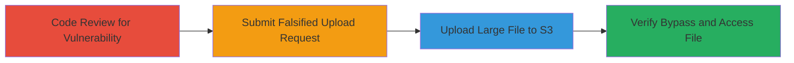

# Bypass ActiveStorage File Size Restriction for Arbitrary S3 Uploads

Multi-stage attack chain exploiting a vulnerability in Ruby on Rails ActiveStorage's direct upload mechanism to S3. The aws-sdk-s3 gem blacklists the content-length header in presigned URLs, allowing attackers to upload files larger than the application's intended limits (e.g., 10MB), up to S3's 5GB limit. This can lead to high storage costs, denial of service via resource exhaustion, or storage of malicious content.

## Chain Metrics Dashboard

| Metric | Value |
|--------|-------|
| Chain Status | Unverified |
| Total Steps | 4 |
| Execution Time | ~10 minutes |
| Skill Level | Intermediate |
| Complexity | Medium |
| Impact Level | High |

## Attack Flow Visualization



## Prerequisites & Requirements

### Required Tools

- [[tools/curl]]
- [[tools/aws-sdk-s3]]
- Ruby on Rails development environment for testing

### Target Environment

- Ruby on Rails application with ActiveStorage configured for direct uploads to AWS S3
- Access to the web application endpoint (e.g., /rails/active_storage/direct_uploads)
- AWS S3 bucket permissions allowing PUT via presigned URLs

### Initial Access Requirements

- Valid session or CSRF token for authenticated upload endpoint (if required)
- Network access to the Rails app and S3
- No prior S3 credentials needed; exploits client-side request manipulation

## Detailed Attack Procedures

### Step 1: Review ActiveStorage S3 Service Code
procedure: [[procedures/Review-ActiveStorage-S3-Service-Code]]

**Objective**: Identify the vulnerability in presigned URL generation where content-length is not signed.

**Instructions**: Examine the source code of s3_service.rb in ActiveStorage to confirm the presigned_url call lacks whitelist_headers for content-length. Use a code editor or git clone of Rails repo.

**Expected Output**: Confirmation that object_for(key).presigned_url :put does not include content_length enforcement via signed headers.

**Success Indicators**:
- Code snippet shows missing whitelist_headers: ['content-length']
- Understanding gained of header blacklisting in aws-sdk-s3

### Step 2: Submit Falsified Direct Upload Request
procedure: [[procedures/Submit-Falsified-Direct-Upload-Request]]

**Objective**: Create a presigned URL by submitting a request with a falsely small byte_size to the Rails DirectUploadsController.

**Instructions**: Use [[commands/curl-create-presigned-url]] to send a POST request to the direct uploads endpoint with modified byte_size (e.g., 10MB instead of actual large size), along with filename, content_type, and checksum.

```bash
curl -X POST https://target-app/rails/active_storage/direct_uploads \
  -H "Content-Type: application/json" \
  -d '{"filename":"test.txt","content_type":"text/plain","byte_size":10485760,"checksum":"MD5_CHECKSUM"}'
```

Parse the JSON response to extract the presigned_url.

**Expected Output**: JSON response containing a presigned S3 URL without signed content-length.

**Success Indicators**:
- Presigned URL received
- URL lacks content-length in signed headers (inspect via curl -v or browser dev tools)

### Step 3: Upload Oversized File to S3 via Presigned URL
procedure: [[procedures/Upload-Oversized-File-to-S3-via-Presigned-URL]]

**Objective**: Perform a PUT request to the presigned URL with a file larger than the falsified byte_size.

**Instructions**: Use [[commands/curl-upload-to-presigned-url]] to upload a large file (e.g., 100MB) to the S3 presigned URL, including content_type and content_md5 headers.

```bash
curl -X PUT -T largefile.txt "https://s3.bucket.s3.amazonaws.com/key?presigned-params" \
  -H "Content-Type: text/plain" \
  -H "Content-MD5: ACTUAL_MD5_BASE64"
```

**Expected Output**: HTTP 200 OK from S3, indicating successful upload.

**Success Indicators**:
- Upload completes without 403 error
- File appears in S3 bucket via AWS console or CLI

### Step 4: Verify File Size Bypass Success
procedure: [[procedures/Verify-File-Size-Bypass-Success]]

**Objective**: Confirm the uploaded file exceeds the application's size limit and is accessible.

**Instructions**: After upload, attempt to download or access the file via the Rails app or directly from S3. Check Rails logs for any post-upload validation failures (none expected due to bypass).

**Expected Output**: File downloadable from S3, size > intended limit (e.g., 100MB vs 10MB).

**Success Indicators**:
- No size validation error in app
- S3 storage costs incurred for large file
- Video or screenshot proof of bypass

## Attack Chain Summary

### Key Achievements

1. Identified header blacklisting in aws-sdk-s3 presigner
2. Bypassed Rails byte_size validation via client-side manipulation
3. Successfully uploaded arbitrary large file to S3
4. Demonstrated potential for cost escalation or DoS

## Technique & Tactic Coverage

### MITRE ATT&CK Techniques

- [[Exploit Public-Facing Application]]

### MITRE ATT&CK Tactics

- [[Initial Access]]

---
*Last updated: 2023-10-01T00:00:00Z*
