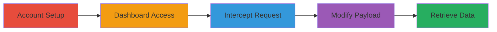

# Bypass Authorization in Shopify Partner Dashboard to Access Financial Data via GraphQL

Multi-stage attack chain demonstrating improper authorization in Shopify's partner dashboard, where a low-privilege team member can access sensitive services financial data via a GraphQL endpoint by intercepting and modifying a legitimate request.

## Chain Metrics Dashboard

| Metric | Value |
|--------|-------|
| Chain Status | Unverified |
| Total Steps | 5 |
| Execution Time | ~10 minutes |
| Skill Level | Intermediate |
| Complexity | Medium |
| Impact Level | High |

## Attack Flow Visualization



## Prerequisites & Requirements

### Required Tools

- Web browser with developer tools (e.g., Chrome DevTools for intercepting requests)
- Network proxy tool like Burp Suite (optional for advanced interception)

### Target Environment

- Web platform
- Access to Shopify Partners dashboard at https://partners.shopify.com/
- No specific ports required; operates over HTTPS

### Initial Access Requirements

- Valid Shopify Partner organization owner credentials
- Ability to invite team members
- Network access to the internet for dashboard login

## Detailed Attack Procedures

### Step 1: Account Setup
procedure: [[procedures/Setup-Shopify-Partner-Account-and-Invite-Low-Priv-User]]

**Objective**: Create a partner account and invite a team member with no permissions to simulate an unauthorized user.

**Instructions**: As the organization owner, log in to the Shopify Partners dashboard and invite a staff member without granting 'View financials' or any permissions.

**Expected Output**: Invitation email sent to the team member.

**Success Indicators**:
- Team member receives invite email
- No permissions assigned during invite process

### Step 2: Dashboard Access
procedure: [[procedures/Access-Shopify-Partner-Dashboard-as-Staff]]

**Objective**: Have the low-privilege team member log in to gain access to the dashboard.

**Instructions**: The invited staff member accepts the email invitation and authenticates into the dashboard.

**Expected Output**: Successful login to https://partners.shopify.com/ as the staff member.

**Success Indicators**:
- Staff member dashboard loads without errors
- No financial data visible in UI due to lack of permissions

### Step 3: Intercept Request
procedure: [[procedures/Intercept-GraphQL-Notification-Request]]

**Objective**: Trigger and intercept a legitimate GraphQL request by interacting with the notification bell.

**Instructions**: In the dashboard, click the notification bell in the upper right corner to initiate a GraphQL request, then use browser dev tools or a proxy to intercept it. The request targets https://partners.shopify.com/:id/api/graphql, where :id is the partner organization ID.

**Expected Output**: Intercepted POST request with original GraphQL payload.

**Success Indicators**:
- GraphQL request captured in dev tools network tab
- Request URL includes the organization ID

### Step 4: Modify Payload
procedure: [[procedures/Modify-GraphQL-Payload-for-Service-Metrics]]

**Objective**: Alter the intercepted request to query unauthorized financial data.

**Instructions**: Update the request body to include a query for serviceMetrics totalEarnings using the [[commands/shopify-graphql-service-metrics-query]] command structure, then forward the modified request.

```json
{ "query":"{ serviceMetrics { totalEarnings { amount } } }" }
```

**Expected Output**: Modified request sent to the GraphQL endpoint.

**Success Indicators**:
- Payload successfully updated and forwarded
- No immediate server rejection

### Step 5: Observe Response
procedure: [[procedures/Observe-Financial-Data-Response]]

**Objective**: Receive and analyze the response containing sensitive financial information.

**Instructions**: Capture the server response after forwarding the modified request.

**Expected Output**: JSON response like { "data":{ "serviceMetrics":{ "totalEarnings":{ "amount":"0.0" } } } }, revealing the earnings amount.

**Success Indicators**:
- Response includes totalEarnings amount
- Data accessible despite no 'View financials' permission

## Attack Chain Summary

### Key Achievements

1. Successful invitation and login of low-privilege user
2. Interception and modification of GraphQL request to bypass authorization
3. Retrieval of sensitive financial data like total earnings

## Technique & Tactic Coverage

### MITRE ATT&CK Techniques

- [[Exploit Public-Facing Application]]

### MITRE ATT&CK Tactics

- [[Initial Access]]

---

*Last updated: 2023-10-01T00:00:00Z*
