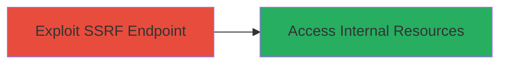

# Bypass Blind SSRF in Infogram via IPv6-Embedded IPv4 Localhost

Multi-stage attack chain demonstrating a complete attack workflow.

## Chain Metrics Dashboard

| Metric | Value |
|--------|-------|
| Chain Status | Unverified |
| Total Steps | 1 |
| Execution Time | ~1 minute |
| Skill Level | Intermediate |
| Complexity | Low |
| Impact Level | High |

## Attack Flow Visualization



## Prerequisites & Requirements

### Required Tools

- [[tools/PayloadsAllTheThings]]

### Target Environment

- Web platform
- Access to Infogram's public API endpoint
- No specific ports required beyond standard HTTPS (443)

### Initial Access Requirements

- Public internet access to Infogram
- No credentials needed for the vulnerable endpoint
- Prior knowledge of previous SSRF reports for context

## Detailed Attack Procedures

### Step 1: Exploit SSRF Endpoint
procedure: [[procedures/Exploit-SSRF-with-IPv6-IPv4-Embedding]]

**Objective**: Bypass URL validation filters by embedding IPv4 localhost (127.0.0.1) within an IPv6 address to force the server to make unauthorized requests to internal resources.

**Instructions**: Reference payloads from [[tools/PayloadsAllTheThings]] for SSRF techniques. Construct a GET request to the vulnerable endpoint using an IPv6-embedded IPv4 address:

```bash
curl "https://infogram.com/api/web_resource/url?q=http://[0:0:0:0:0:ffff:127.0.0.1]/"
```

Monitor the response for signs of internal request processing, such as delays or error patterns indicating localhost access.

**Expected Output**: A response from the Infogram API that may include blind indicators of SSRF success, like processing errors or timing differences, without direct output from the internal resource.

**Success Indicators**:
- Server response time increases due to internal request
- No direct block on localhost access, confirming bypass
- Potential exposure of internal service details in logs or side effects

## Attack Chain Summary

### Key Achievements

1. Successful bypass of previous SSRF mitigations using IPv6 embedding
2. Forced server-side requests to 127.0.0.1, enabling blind SSRF
3. Potential disclosure of internal network resources or services

## Technique & Tactic Coverage

### MITRE ATT&CK Techniques

- [[Exploit Public-Facing Application]]

### MITRE ATT&CK Tactics

- [[Initial Access]]

---
*Last updated: 2023-10-01T00:00:00Z*
