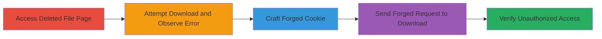

# Bypass CAC Authentication via Forged Download Cookies to Access Deleted Files in DoD System

Multi-stage attack chain demonstrating exploitation of insecure cookie generation in a U.S. Department of Defense file sharing system. The vulnerability allows attackers to forge download cookies using predictable base64-encoded file IDs and SHA512 hashes derived from the file ID and a known password (secret key from email), bypassing Common Access Card (CAC) authentication. This enables unauthorized access to files marked as deleted, locked, or restricted post-download, potentially exposing sensitive historical data if storage-level deletion is not enforced.

## Chain Metrics Dashboard

| Metric | Value |
|--------|-------|
| Chain Status | Unverified |
| Total Steps | 5 |
| Execution Time | ~5 minutes |
| Skill Level | Intermediate |
| Complexity | Medium |
| Impact Level | High |

## Attack Flow Visualization



## Prerequisites & Requirements

### Required Tools

- Web browser or HTTP client like curl
- Base64 and SHA512 hashing tools (e.g., openssl)

### Target Environment

- Web platform using ASP.NET
- Access to DoD file sharing system (e.g., https://███████/██████/pickupfiles.aspx)
- Known file ID (e.g., from email or prior upload) and password/secret key

### Initial Access Requirements

- Public or network access to the file pickup endpoint
- No prior CAC authentication needed due to bypass
- Knowledge of file ID (publicly guessable or leaked)

## Detailed Attack Procedures

### Step 1: Access Deleted File Pickup Page
procedure: [[procedures/Access-Deleted-File-Pickup-Page]]

**Objective**: Navigate to the pickup page for a known deleted file to confirm its status and gather necessary details like the file ID.

**Instructions**: Use a web browser or HTTP client to visit the pickupfiles.aspx endpoint with the deleted file ID.

**Expected Output**: Page loads showing the file details, but download is unavailable due to deletion.

**Success Indicators**:
- File ID confirmed (e.g., 15849581)
- Page accessible without CAC

### Step 2: Attempt Legitimate Download
procedure: [[procedures/Attempt-Legitimate-Download]]

**Objective**: Try downloading the file using the provided password to observe the deletion error, confirming the file's protected status.

**Instructions**: On the pickup page, enter the known password (e.g., █████████) to initiate download.

**Expected Output**: Error message: "The package is no longer available and has been permanently deleted."

**Success Indicators**:
- Error confirms deletion enforcement
- Password validated for later use in cookie crafting

### Step 3: Craft Forged Download Cookie
procedure: [[procedures/Craft-Forged-Download-Cookie]]

**Objective**: Generate a custom 'pickup' cookie using base64-encoded file ID, SHA512 hashes, and the secret key to mimic legitimate authentication.

**Instructions**: Compute components: base64(file ID) + '-' + SHA512(base64(file ID)) base64 + '-' + base64(secret key) + '-' + SHA512(base64(secret key)) base64. Format as: pickup=Subject=&PackageID=<encoded parts>.

**Expected Output**: Forged cookie string, e.g., pickup=Subject=&PackageID=MTU4NDk1ODE=████.

**Success Indicators**:
- Cookie components verifiable via hashing tools
- Format matches observed legitimate cookies

### Step 4: Download File with Forged Cookie
procedure: [[procedures/Download-File-with-Forged-Cookie]]

**Objective**: Send an HTTP GET request to the Download.aspx endpoint using the forged cookie to bypass authentication and deletion checks.

**Instructions**: Execute [[commands/send-forged-download-request]] with the file ID, filename, and forged cookie.

```bash
curl -X GET "https://███████/████████/Download.aspx?PackageID=15849581&FileName=dog.jpg" \
  -H "Host: ███████" \
  -H "Connection: close" \
  -H "Upgrade-Insecure-Requests: 1" \
  -H "User-Agent: Mozilla/5.0 (Macintosh; Intel Mac OS X 10_14_3) AppleWebKit/537.36 (KHTML, like Gecko) Chrome/71.0.3578.98 Safari/537.36" \
  -H "Accept: text/html,application/xhtml+xml,application/xml;q=0.9,image/webp,image/apng,*/*;q=0.8" \
  -H "Referer: https://█████/██████████/pickupfiles.aspx?id=15849581" \
  -H "Accept-Language: en-US,en;q=0.9" \
  -H "Cookie: pickup=Subject=&PackageID=MTU4NDk1ODE=████" \
  --output dog.jpg
```

**Expected Output**: HTTP 200 response with file content (e.g., dog.jpg binary data).

**Success Indicators**:
- File downloaded successfully
- No CAC prompt or deletion error

### Step 5: Verify File Access Bypass
procedure: [[procedures/Verify-File-Access-Bypass]]

**Objective**: Confirm the downloaded file's integrity and that security controls (CAC, deletion, locking) were circumvented.

**Instructions**: Inspect the downloaded file and compare against known originals; test on locked files if applicable.

**Expected Output**: Valid file content matching the original upload.

**Success Indicators**:
- File accessible despite deletion claim
- Bypass works for locked/restricted files

## Attack Chain Summary

### Key Achievements

1. Bypassed CAC authentication without physical card or credentials
2. Accessed and downloaded files marked as permanently deleted
3. Undermined download limits and locking mechanisms via cookie forgery

## Technique & Tactic Coverage

### MITRE ATT&CK Techniques

- [[Valid Accounts]] Valid Accounts (forged cookies act as valid auth tokens)
- [[Unsecured Credentials]] Unsecured Credentials (predictable cookie without server secrets)
- [[Exploit Public-Facing Application]] Exploit Public-Facing Application (web endpoint exploitation)

### MITRE ATT&CK Tactics

- [[Initial Access]] Initial Access (unauthorized entry via bypass)
- [[Persistence]] Persistence (access to historical/deleted data)

---

*Last updated: 2023-10-01T00:00:00Z*
