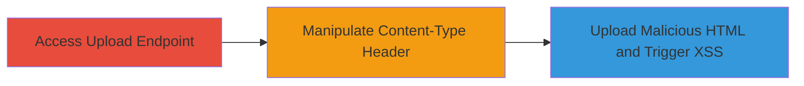

---
tags:
  - xss
  - stored-xss
  - file-upload
  - content-type-bypass
type: attack_chain
tools: []
tactics:
  - '[[Initial Access]]'
  - '[[Execution]]'
  - '[[Collection]]'
verified: false
platforms:
  - Web
submitted: true
complexity: medium
created_at: '2023-10-01T00:00:00Z'
procedures:
  - '[[procedures/Access-Header-Image-Upload-Function]]'
  - '[[procedures/Manipulate-Content-Type-Header-for-Bypass]]'
  - '[[procedures/Upload-Malicious-HTML-and-Trigger-XSS]]'
step_count: 3
techniques:
  - '[[Exploit Public-Facing Application]]'
  - '[[JavaScript]]'
  - '[[Remote File Copy]]'
updated_at: '2025-12-13T23:52:25.274Z'
description: >-
  A multi-stage attack exploiting improper Content-Type validation in the header
  image upload function to upload malicious HTML files, resulting in stored XSS
  execution on the sandboxed domain.
skill_level: intermediate
impact_level: high
id: 3ddef991-e58e-4cb7-a7e5-d8c03dc95633
validated: true
mitre_tactics:
  - '[[Initial Access]]'
  - '[[Execution]]'
  - '[[Collection]]'
mitre_techniques:
  - '[[Exploit Public-Facing Application]]'
  - '[[JavaScript]]'
  - '[[Remote File Copy]]'
---
# Bypass Content-Type Validation for Stored XSS via Malicious File Upload

Multi-stage attack chain demonstrating a complete attack workflow exploiting improper Content-Type header validation in the Booth.pm header image upload to enable stored XSS.

## Chain Metrics Dashboard

| Metric | Value |
|--------|-------|
| Chain Status | Unverified |
| Total Steps | 3 |
| Execution Time | ~5 minutes |
| Skill Level | Intermediate |
| Complexity | Medium |
| Impact Level | High |

## Attack Flow Visualization

## Prerequisites & Requirements

### Required Tools

- Browser developer tools or [[tools/curl]] for header manipulation

### Target Environment

- Web application at https://manage.booth.pm
- Authenticated access to design edit page

### Initial Access Requirements

- Valid user credentials for Booth.pm account
- Network access to the target domain
- No prior access needed beyond authentication

## Detailed Attack Procedures

### Step 1: Access Header Image Upload Function
procedure: [[procedures/Access-Header-Image-Upload-Function]]

**Objective**: Navigate to the vulnerable upload endpoint to prepare for file submission.

**Instructions**: Log in to the Booth.pm management panel and access the design edit page where the header image upload is available.

**Expected Output**: The upload interface is loaded, ready for file selection.

**Success Indicators**:
- Page loads without errors
- Upload form is visible

### Step 2: Manipulate Content-Type Header for Bypass
procedure: [[procedures/Manipulate-Content-Type-Header-for-Bypass]]

**Objective**: Craft a request with a mixed Content-Type header to trick the server into accepting an HTML file as an image.

**Instructions**: Use browser dev tools or curl to intercept and modify the upload request, setting the Content-Type to a mixed value like 'text/html; image/png'. Prepare a malicious HTML file with JavaScript payload, e.g., .

**Expected Output**: The request is modified and sent successfully.

**Success Indicators**:
- Request headers show the manipulated Content-Type
- No immediate server rejection

### Step 3: Upload Malicious HTML and Trigger XSS
procedure: [[procedures/Upload-Malicious-HTML-and-Trigger-XSS]]

**Objective**: Submit the file and load it on the sandboxed domain to execute the JavaScript in victims' browsers.

**Instructions**: Submit the modified request to upload the file. Once stored, access the file URL on s2.booth.pm to trigger the XSS.

**Expected Output**: File is uploaded and served as HTML, executing the JS payload.

**Success Indicators**:
- File upload succeeds without validation error
- JavaScript executes when the file is loaded

## Attack Chain Summary

### Key Achievements

1. Bypassed file extension and type checks via Content-Type manipulation
2. Uploaded arbitrary HTML with JavaScript
3. Achieved stored XSS on the s2.booth.pm domain, impacting victims who load the malicious header image

## Technique & Tactic Coverage

### MITRE ATT&CK Techniques

- [[Exploit Public-Facing Application]]
- [[JavaScript]]
- [[Remote File Copy]]

### MITRE ATT&CK Tactics

- [[Initial Access]]
- [[Execution]]
- [[Collection]]

---
*Last updated: 2023-10-01T00:00:00Z*
