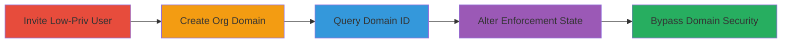

---
tags:
  - shopify
  - graphql
  - privilege-escalation
  - access-control-bypass
  - domain-enforcement
type: attack_chain
tools: []
tactics:
  - '[[Initial Access]]'
  - '[[Persistence]]'
verified: false
platforms:
  - Web
  - Cloud
submitted: true
complexity: medium
created_at: '2023-10-01T00:00:00Z'
procedures:
  - '[[procedures/Invite-Low-Privileged-User-to-Shopify-Org]]'
  - '[[procedures/Create-Organization-Domain-in-Shopify]]'
  - '[[procedures/Query-Domain-ID-as-Low-Privileged-User]]'
  - '[[procedures/Execute-Unauthorized-Domain-Enforcement-Change]]'
step_count: 4
techniques:
  - '[[Valid Accounts]]'
  - '[[Exploitation for Privilege Escalation]]'
updated_at: '2025-12-14T17:29:36.337Z'
description: >-
  Attack chain exploiting improper privilege management in Shopify Plus,
  allowing Store Management users to alter organization domain enforcement
  states via unauthorized GraphQL mutation access.
skill_level: intermediate
impact_level: high
id: fefaa500-b187-4d3f-8f7e-4e80eafb810d
validated: true
mitre_tactics:
  - '[[Initial Access]]'
  - '[[Persistence]]'
mitre_techniques:
  - '[[Valid Accounts]]'
  - '[[Exploitation for Privilege Escalation]]'
---
# Bypass Domain Enforcement in Shopify Plus via Improper Privilege Management

Multi-stage attack chain demonstrating improper privilege management in Shopify Plus, where users with only Store Management permissions can access the 'changeDomainEnforcementState' GraphQL mutation, restricted to User Management permissions. This allows low-privileged users to query organization domains and alter enforcement states from ENFORCED to NOT_ENFORCED, bypassing domain verification and potentially enabling unauthorized domain usage across the organization.

## Chain Metrics Dashboard

| Metric | Value |
|--------|-------|
| Chain Status | Unverified |
| Total Steps | 4 |
| Execution Time | ~15 minutes |
| Skill Level | Intermediate |
| Complexity | Medium |
| Impact Level | High |

## Attack Flow Visualization



## Prerequisites & Requirements

### Required Tools

- Browser for web navigation
- GraphQL client or curl for API requests

### Target Environment

- Shopify Plus organization
- Access to admin panel at https://shopify.plus/:org_id
- GraphQL endpoint /:org_id/stores/api

### Initial Access Requirements

- Admin credentials for Shopify Plus organization (to invite users and create domains)
- Network access to Shopify Plus dashboard
- Low-privileged user account with Store Management permissions

## Detailed Attack Procedures

### Step 1: Invite Low-Privileged User
procedure: [[procedures/Invite-Low-Privileged-User-to-Shopify-Org]]

**Objective**: Create a test user with only Store Management permissions to simulate low-privileged access.

**Instructions**: As an Org Plus admin, navigate to the user invitation page and invite a new user with Store Management role. This grants access to the stores API without User Management privileges.

**Expected Output**: Invitation email sent; user can log in with limited permissions.

**Success Indicators**:
- User receives invitation and logs in successfully
- User can access https://shopify.plus/:org_id/stores/api but lacks User Management UI options

### Step 2: Create Organization Domain
procedure: [[procedures/Create-Organization-Domain-in-Shopify]]

**Objective**: Set up an organization domain to target for enforcement state changes.

**Instructions**: As the Org Plus admin, go to the security settings and add a new domain to the organization.

**Expected Output**: Domain added with initial ENFORCED state.

**Success Indicators**:
- Domain appears in organization settings
- Domain ID is generated and verifiable via admin panel

### Step 3: Query Domain ID as Low-Privileged User
procedure: [[procedures/Query-Domain-ID-as-Low-Privileged-User]]

**Objective**: Retrieve the domain ID using the low-privileged user's access to the GraphQL API.

**Instructions**: Log in as the low-privileged user, then execute the GraphQL query to fetch organization domains using [[commands/shopify-graphql-query-organization-domains]]:

```bash
curl -X POST https://shopify.plus/34946971/stores/api \
  -H "Content-Type: application/json" \
  -H "Authorization: Bearer YOUR_TOKEN" \
  -d '{"query":"query{organization{domains{id}}}"}'
```

**Expected Output**: JSON response with organization.domains array containing the domain ID.

**Success Indicators**:
- Domain ID retrieved without authorization errors
- Response includes id field for the target domain

### Step 4: Execute Unauthorized Domain Enforcement Change
procedure: [[procedures/Execute-Unauthorized-Domain-Enforcement-Change]]

**Objective**: Use the retrieved domain ID to mutate the enforcement state to NOT_ENFORCED, demonstrating privilege bypass.

**Instructions**: Still as the low-privileged user, replace the domain ID in the mutation and send the request using [[commands/shopify-graphql-mutation-change-domain-enforcement]]:

```bash
curl -X POST https://shopify.plus/34946971/stores/api \
  -H "Content-Type: application/json" \
  -H "Authorization: Bearer YOUR_TOKEN" \
  -d '{"query":"mutation { changeDomainEnforcementState(domainIds: ["GID:::"],enforcementState:NOT_ENFORCED) { organization { id domains { id domainName status verified __typename } __typename } userErrors { field message __typename } __typename } }"}'
```

**Expected Output**: JSON response showing updated domains with enforcementState: NOT_ENFORCED and no userErrors.

**Success Indicators**:
- Mutation succeeds without permission denied errors
- Domain status changes to NOT_ENFORCED in the response
- Organization security settings altered

## Attack Chain Summary

### Key Achievements

1. Invited and utilized a low-privileged Store Management user to access restricted GraphQL mutations
2. Queried sensitive organization domain data without elevated permissions
3. Altered domain enforcement state, bypassing verification policies
4. Demonstrated potential for unauthorized domain usage across the organization

## Technique & Tactic Coverage

### MITRE ATT&CK Techniques

- [[Valid Accounts]] Valid Accounts
- [[Exploitation for Privilege Escalation]] Exploitation for Privilege Escalation

### MITRE ATT&CK Tactics

- [[Initial Access]] Initial Access
- [[Persistence]] Persistence

---
*Last updated: 2023-10-01T00:00:00Z*
