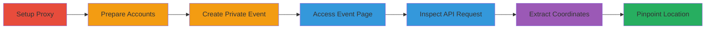

---
tags:
  - information-disclosure
  - api
  - privacy-bypass
  - web
type: attack_chain
tools:
  - '[[tools/Burp-Suite]]'
tactics:
  - '[[Initial Access]]'
  - '[[Reconnaissance]]'
verified: false
platforms:
  - Web
submitted: true
complexity: medium
created_at: '2023-10-01T00:00:00Z'
procedures:
  - '[[procedures/Configure-Burp-Suite-Proxy]]'
  - '[[procedures/Create-Test-Accounts-on-FetLife]]'
  - '[[procedures/Create-Private-Event-as-Victim]]'
  - '[[procedures/Access-Event-Page-as-Attacker]]'
  - '[[procedures/Inspect-Event-API-Request-in-Burp]]'
  - '[[procedures/Extract-Location-Coordinates-from-Response]]'
step_count: 6
techniques:
  - '[[Exploit Public-Facing Application]]'
  - '[[Gather Victim Host Information]]'
updated_at: '2025-12-14T17:30:27.181Z'
description: >-
  Multi-stage attack chain exploiting an information disclosure vulnerability in
  FetLife's event API, allowing unauthorized users to extract hidden location
  coordinates via HTTP response inspection.
skill_level: intermediate
impact_level: high
id: dabb0a9d-3658-40bc-9132-a3d72bca4af6
validated: true
mitre_tactics:
  - '[[Initial Access]]'
  - '[[Reconnaissance]]'
mitre_techniques:
  - '[[Exploit Public-Facing Application]]'
  - '[[Gather Victim Host Information]]'
---
# Bypass FetLife Event Privacy Controls to Disclose Location Coordinates

Multi-stage attack chain demonstrating how to exploit an information disclosure vulnerability in FetLife's event endpoint, where location coordinates are leaked in API responses despite privacy settings intended to hide exact addresses from non-RSVP users.

## Chain Metrics Dashboard

| Metric | Value |
|--------|-------|
| Chain Status | Unverified |
| Total Steps | 6 |
| Execution Time | ~10 minutes |
| Skill Level | Intermediate |
| Complexity | Medium |
| Impact Level | High |

## Attack Flow Visualization

## Prerequisites & Requirements

### Required Tools

- [[tools/Burp-Suite]]

### Target Environment

- Web platform
- Access to FetLife.com
- No specific ports or services required beyond standard HTTPS (443)

### Initial Access Requirements

- Valid FetLife accounts (attacker and victim/test)
- Network access to fetlife.com
- Browser configured for proxying

## Detailed Attack Procedures

### Step 1: Configure Proxy Interception
procedure: [[procedures/Configure-Burp-Suite-Proxy]]

**Objective**: Set up traffic interception to monitor HTTP requests and responses from FetLife.

**Instructions**: Launch Burp Suite and configure your browser to route all traffic through the Burp proxy (default: 127.0.0.1:8080). Enable interception if needed, but for this attack, HTTP history is sufficient.

**Expected Output**: All browser traffic proxied through Burp, visible in the Proxy > HTTP History tab.

**Success Indicators**:
- Traffic from browser appears in Burp's HTTP history
- No proxy errors in browser

### Step 2: Prepare Test Accounts
procedure: [[procedures/Create-Test-Accounts-on-FetLife]]

**Objective**: Establish attacker and victim personas to simulate the privacy bypass scenario.

**Instructions**: Create two separate FetLife accounts, such as 'Ezzra1' for the attacker and 'Ezzra2' for the victim. Log in and out as needed to switch between them.

**Expected Output**: Two functional accounts ready for testing.

**Success Indicators**:
- Both accounts can log in successfully
- No restrictions on account creation

### Step 3: Create Private Event as Victim
procedure: [[procedures/Create-Private-Event-as-Victim]]

**Objective**: Set up an event with privacy controls to hide the exact location, establishing the vulnerability conditions.

**Instructions**: Log in as the victim account, navigate to create a new event, input details including a specific address, then in privacy settings, check the 'Address & Name of Location' box to hide from non-RSVP users, and save.

**Expected Output**: Event created with ID visible in URL (e.g., https://fetlife.com/events/{event-id}), and address hidden on the public view.

**Success Indicators**:
- Event page shows approximate location but not exact address
- Privacy settings confirmed applied

### Step 4: Access Event Page as Attacker
procedure: [[procedures/Access-Event-Page-as-Attacker]]

**Objective**: Simulate an unauthorized user attempting to view the event without RSVPing.

**Instructions**: Log in as the attacker account, navigate directly to the event URL (https://fetlife.com/events/{event-id}) without interacting further.

**Expected Output**: Event page loads, triggering API requests visible in Burp.

**Success Indicators**:
- Page loads without errors or bans
- No RSVP prompt blocks access

### Step 5: Inspect Event API Request
procedure: [[procedures/Inspect-Event-API-Request-in-Burp]]

**Objective**: Locate the specific API call fetching event details in the intercepted traffic.

**Instructions**: In Burp Suite's Proxy > HTTP History, filter for GET requests to /events/{event-id} and select the relevant entry.

**Expected Output**: Selected request with full response payload available for inspection.

**Success Indicators**:
- API request found in history
- Response body accessible in the Response tab

### Step 6: Extract and Correct Coordinates
procedure: [[procedures/Extract-Location-Coordinates-from-Response]]

**Objective**: Reveal and interpret the hidden location data to bypass privacy.

**Instructions**: In the Response tab, search for 'location' to find coordinates (e.g., reversed as 131.04425, -12.496252). Correct by swapping to -12.496252, 131.04425 and plot on Google Maps.

**Expected Output**: Valid latitude/longitude pair that maps to the exact event venue.

**Success Indicators**:
- Coordinates extracted and corrected
- Google Maps pinpoints the hidden address

## Attack Chain Summary

### Key Achievements

1. Successful proxy setup to intercept FetLife traffic without detection.
2. Creation of a privacy-protected event that still leaks data.
3. Bypassing controls to obtain exact location, enabling potential stalking or safety risks.

## Technique & Tactic Coverage

### MITRE ATT&CK Techniques

- [[Exploit Public-Facing Application]] Exploit Public-Facing Application
- [[Gather Victim Host Information]] Gather Victim Host Information

### MITRE ATT&CK Tactics

- [[Initial Access]] Initial Access
- [[Reconnaissance]] Reconnaissance

---
*Last updated: 2023-10-01T00:00:00Z*
