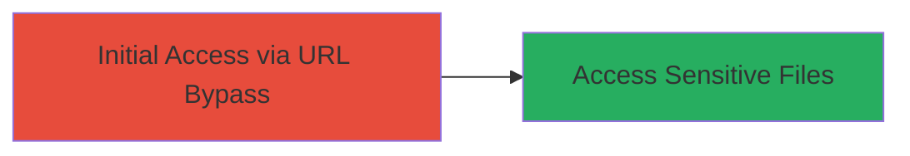

---
tags:
  - file-access-bypass
  - url-manipulation
  - web-vuln
  - improper-auth
  - dod
type: attack_chain
tools: []
tactics:
  - '[[Initial Access]]'
verified: false
platforms:
  - Web
submitted: true
complexity: low
created_at: '2023-10-01T00:00:00Z'
procedures:
  - '[[procedures/Craft-URL-to-Bypass-File-Access-Restrictions]]'
step_count: 1
techniques:
  - '[[Exploit Public-Facing Application]]'
updated_at: '2025-12-14T17:28:59.342Z'
description: >-
  A single-stage attack exploiting improper file access configuration on a DoD
  website to view sensitive system files remotely using a crafted URL.
skill_level: beginner
impact_level: high
id: fe792b2d-6c95-4113-9cbe-8a55191739c0
validated: true
mitre_tactics:
  - '[[Initial Access]]'
mitre_techniques:
  - '[[Exploit Public-Facing Application]]'
---
# Bypass File Access Controls on DoD Website via URL Manipulation

Multi-stage attack chain demonstrating a complete attack workflow.

## Chain Metrics Dashboard

| Metric | Value |
|--------|-------|
| Chain Status | Unverified |
| Total Steps | 1 |
| Execution Time | ~1 minutes |
| Skill Level | Beginner |
| Complexity | Low |
| Impact Level | High |

## Attack Flow Visualization



## Prerequisites & Requirements

### Required Tools

- None (manual URL crafting)

### Target Environment

- Target OS/Platform: Web application (DoD website)
- Required services/ports: HTTP/HTTPS (port 80/443)
- Network access requirements: Internet access to the public-facing DoD website

### Initial Access Requirements

- Credential requirements: None (anonymous remote access)
- Network position: External/remote
- Prior access needed: None

## Detailed Attack Procedures

### Step 1: Bypass File Access Controls
procedure: [[procedures/Craft-URL-to-Bypass-File-Access-Restrictions]]

**Objective**: Exploit improper configuration in the website's file access controls to access restricted sensitive system files using a specially crafted URL.

**Instructions**: Identify the file access endpoint on the DoD website, typically a URL parameter or path that handles file retrieval. Craft a URL that manipulates the path or parameter to traverse outside the intended directory, such as appending directory traversal sequences (e.g., ../) to reach system files. For example, if the normal file access URL is `https://dod-site.com/files?file=public/doc.pdf`, modify it to `https://dod-site.com/files?file=../../../../etc/passwd` to attempt accessing sensitive files like /etc/passwd or configuration files containing credentials.

Enter the crafted URL in a web browser or use a tool like curl to request it:

```bash
curl "https://dod-site.com/files?file=../../../../etc/passwd"
```

**Expected Output**: The server responds with the contents of the sensitive file, such as user account listings or system configuration data, instead of an access denied error.

**Success Indicators**:
- File contents are returned in the HTTP response body
- No authentication prompt or 403 Forbidden error occurs
- Sensitive data (e.g., usernames, paths) is visible in the output

## Attack Chain Summary

### Key Achievements

1. Successfully bypassed file access restrictions without credentials
2. Accessed potentially sensitive system files remotely
3. Demonstrated high-impact information disclosure on a DoD website

## Technique & Tactic Coverage

### MITRE ATT&CK Techniques

- [[Exploit Public-Facing Application]]

### MITRE ATT&CK Tactics

- [[Initial Access]]

---
*Last updated: 2023-10-01T00:00:00Z*
