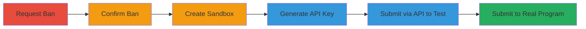

---
tags:
  - auth-bypass
  - api
  - hackerone
  - report-submission
type: attack_chain
tools:
  - '[[tools/curl]]'
tactics:
  - '[[Initial Access]]'
verified: false
platforms:
  - Web
submitted: true
complexity: medium
created_at: '2023-10-01T00:00:00Z'
procedures:
  - '[[procedures/Contact-Support-for-Account-Ban]]'
  - '[[procedures/Confirm-Report-Submission-Ban]]'
  - '[[procedures/Create-Sandbox-Program-and-Generate-API-Key]]'
  - '[[procedures/Submit-Report-via-HackerOne-API]]'
  - '[[procedures/Verify-Submission-to-Test-Program]]'
  - '[[procedures/Submit-to-Real-Program-for-Confirmation]]'
step_count: 6
techniques:
  - '[[Valid Accounts]]'
  - '[[Exploit Public-Facing Application]]'
updated_at: '2025-12-14T17:32:57.780Z'
description: >-
  Multi-stage attack chain exploiting an authentication bypass in HackerOne's
  API, allowing banned users to submit vulnerability reports to any program
  despite UI restrictions.
skill_level: intermediate
impact_level: high
id: 7003dd94-d4f8-46ee-b140-25af89e4a59b
validated: true
mitre_tactics:
  - '[[Initial Access]]'
mitre_techniques:
  - '[[Valid Accounts]]'
  - '[[Exploit Public-Facing Application]]'
---
---

# Bypass HackerOne Report Submission Ban Using Sandbox API Key

Multi-stage attack chain demonstrating a complete attack workflow to bypass HackerOne's report submission bans via API key abuse.

## Chain Metrics Dashboard

| Metric | Value |
|--------|-------|
| Chain Status | Unverified |
| Total Steps | 6 |
| Execution Time | ~15 minutes |
| Skill Level | Intermediate |
| Complexity | Medium |
| Impact Level | High |

## Attack Flow Visualization



## Prerequisites & Requirements

### Required Tools

- [[tools/curl]]

### Target Environment

- HackerOne platform (web-based bug bounty service)
- Required services/ports: HTTPS (443)
- Network access requirements: Internet access to api.hackerone.com

### Initial Access Requirements

- Valid HackerOne researcher account
- Network position: External
- Prior access needed: Account must be eligible for banning (e.g., via support request)

## Detailed Attack Procedures

### Step 1: Request Account Ban
procedure: [[procedures/Contact-Support-for-Account-Ban]]

**Objective**: Intentionally get the account banned from report submissions to set up the bypass scenario.

**Instructions**: Contact HackerOne support to request a ban on report submissions. Provide reasoning if needed, but the goal is to trigger the ban.

**Expected Output**: Confirmation from support that the account is banned, visible in UI attempts.

**Success Indicators**:
- Support response acknowledging the ban
- Subsequent UI report submission fails with 403

### Step 2: Confirm the Ban
procedure: [[procedures/Confirm-Report-Submission-Ban]]

**Objective**: Verify that the ban is active by attempting a direct UI submission.

**Instructions**: Attempt to create a report via the HackerOne web interface or a direct request.

**Expected Output**: 403 Forbidden error response.

**Success Indicators**:
- Error message indicating ban enforcement
- No report creation possible via UI

### Step 3: Create Sandbox Program
procedure: [[procedures/Create-Sandbox-Program-and-Generate-API-Key]]

**Objective**: Establish a sandbox environment to generate an unrestricted API key.

**Instructions**: Navigate to the HackerOne dashboard, create a new sandbox program, and proceed to generate an API key for it.

**Expected Output**: API key generated and displayed.

**Success Indicators**:
- Sandbox program created successfully
- API key available for use

### Step 4: Submit Report via API
procedure: [[procedures/Submit-Report-via-HackerOne-API]]

**Objective**: Use the API key to bypass the ban and submit a report to a test program.

**Instructions**: Refer to HackerOne API documentation. Execute [[commands/curl-hackerone-report-submission]] with the generated API key and JSON payload targeting a sandbox team_handle.

```bash
curl "https://api.hackerone.com/v1/hackers/reports" -X POST -u "testhackerone-creative:pYnONekvxUTvHbKF7Jp64qh9STIhhdXvKmefWOeR8YU=" -H 'Content-Type: application/json' -H 'Accept: application/json' -d @- <<EOD { "data": { "type": "report", "attributes": { "team_handle": "HackerOne-test_h1b", "title": "string", "vulnerability_information": "test tst tst", "impact": "tst tst", "severity_rating": "none", "weakness_id": 1 } } } EOD
```

**Expected Output**: 201 Created response with report ID.

**Success Indicators**:
- Report submitted successfully via API
- No 403 error encountered

### Step 5: Verify Submission to Test Program
procedure: [[procedures/Verify-Submission-to-Test-Program]]

**Objective**: Confirm the bypass works on a sandbox target.

**Instructions**: Check the test program's dashboard or API response for the submitted report.

**Expected Output**: Report visible in the sandbox program.

**Success Indicators**:
- Successful report creation confirmed via screenshot or UI
- Ban bypassed for API access

### Step 6: Submit to Real Program
procedure: [[procedures/Submit-to-Real-Program-for-Confirmation]]

**Objective**: Demonstrate the bypass extends to production programs.

**Instructions**: Modify the team_handle in the [[commands/curl-hackerone-report-submission]] payload to a real program (e.g., "sony") and resubmit.

```bash
curl "https://api.hackerone.com/v1/hackers/reports" -X POST -u "testhackerone-creative:pYnONekvxUTvHbKF7Jp64qh9STIhhdXvKmefWOeR8YU=" -H 'Content-Type: application/json' -H 'Accept: application/json' -d @- <<EOD { "data": { "type": "report", "attributes": { "team_handle": "sony", "title": "string", "vulnerability_information": "test tst tst", "impact": "tst tst", "severity_rating": "none", "weakness_id": 1 } } } EOD
```

**Expected Output**: 201 Created response for the real program.

**Success Indicators**:
- Report submitted to non-sandbox program
- Full ban circumvention validated

## Attack Chain Summary

### Key Achievements

1. Successfully banned account via support
2. Confirmed UI restrictions active
3. Generated API key from sandbox to bypass ban
4. Submitted reports to both test and real programs via API
5. Demonstrated potential for spam/abuse

## Technique & Tactic Coverage

### MITRE ATT&CK Techniques

- [[Valid Accounts]]
- [[Exploit Public-Facing Application]]

### MITRE ATT&CK Tactics

- [[Initial Access]]

---

*Last updated: 2023-10-01T00:00:00Z*
