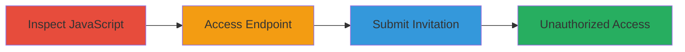

---
tags:
  - business-logic-bypass
  - rate-limit-bypass
  - hackerone
  - invitation-bypass
type: attack_chain
tools: []
tactics:
  - '[[Initial Access]]'
verified: false
platforms:
  - Web
submitted: true
complexity: medium
created_at: '2023-10-01T00:00:00Z'
procedures:
  - '[[procedures/Inspect-JavaScript-to-Discover-Hidden-Endpoint]]'
  - '[[procedures/Access-Hidden-New-Invite-Endpoint]]'
  - '[[procedures/Submit-Unauthorized-Invitation-via-Backend]]'
step_count: 3
techniques:
  - '[[Exploit Public-Facing Application]]'
updated_at: '2025-12-14T17:29:57.093Z'
description: >-
  A business logic bypass in HackerOne's sandbox organization feature allowing
  unauthorized invitations beyond UI rate limits via a hidden backend endpoint.
skill_level: intermediate
impact_level: high
id: 5b52d201-ad49-4516-8f9c-a603e18129d7
validated: true
mitre_tactics:
  - '[[Initial Access]]'
mitre_techniques:
  - '[[Exploit Public-Facing Application]]'
---
# Bypass Invitation Rate Limit in HackerOne Sandbox Organization

Multi-stage attack chain demonstrating a complete attack workflow exploiting a business logic error in HackerOne's sandbox organization feature. The UI enforces a rate limit on inviting new team members, but a hidden backend endpoint allows bypassing this restriction, enabling unauthorized invitations to other security researchers and potential addition of unintended members to the organization.

## Chain Metrics Dashboard

| Metric | Value |
|--------|-------|
| Chain Status | Unverified |
| Total Steps | 3 |
| Execution Time | ~5 minutes |
| Skill Level | Intermediate |
| Complexity | Medium |
| Impact Level | High |

## Attack Flow Visualization

## Prerequisites & Requirements

### Required Tools

- Browser with developer tools (e.g., Chrome DevTools)

### Target Environment

- Web platform
- Access to HackerOne sandbox organization (e.g., hackycorp_demo)
- No specific services/ports required beyond standard HTTPS

### Initial Access Requirements

- Valid user account in the HackerOne sandbox organization
- Ability to view organization settings in the UI
- Network access to hackerone.com

## Detailed Attack Procedures

### Step 1: Inspect JavaScript to Discover Hidden Endpoint
procedure: [[procedures/Inspect-JavaScript-to-Discover-Hidden-Endpoint]]

**Objective**: Identify the hidden backend endpoint for inviting users by inspecting client-side JavaScript files.

**Instructions**: Open the browser developer tools, navigate to the organization's user management section, and search for JavaScript files loaded on the page. Locate the chunk file containing endpoint references and extract the URL path.

**Expected Output**: Discovery of the endpoint `/organizations/hackycorp_demo/users/new_invite` in the JavaScript file.

**Success Indicators**:
- Endpoint URL identified in JS source
- Confirmation that the endpoint is not visible in the UI

### Step 2: Access Hidden New Invite Endpoint
procedure: [[procedures/Access-Hidden-New-Invite-Endpoint]]

**Objective**: Directly access the backend invite endpoint to bypass UI restrictions.

**Instructions**: In the browser, manually construct and navigate to the full URL `https://hackerone.com/organizations/hackycorp_demo/users/new_invite`. The page should load without UI rate limit enforcement.

**Expected Output**: The new invite form loads successfully, allowing input without the rate limit message.

**Success Indicators**:
- Page loads without errors
- Invite form is accessible and functional

### Step 3: Submit Unauthorized Invitation via Backend
procedure: [[procedures/Submit-Unauthorized-Invitation-via-Backend]]

**Objective**: Send an invitation to an unauthorized email, bypassing the rate limit and adding unintended members.

**Instructions**: On the loaded invite page, enter the email address of another security researcher (e.g., `0620@wearehackerone.com`) and submit the form. The backend processes the request without validation.

**Expected Output**: Invitation sent successfully, with confirmation message or email dispatched.

**Success Indicators**:
- Invitation email sent
- Recipient receives invite to join the organization
- No rate limit error encountered

## Attack Chain Summary

### Key Achievements

1. Discovered hidden endpoint via JS inspection, revealing backend bypass opportunity.
2. Accessed and utilized the endpoint to load the invite form outside UI controls.
3. Successfully invited unauthorized users, enabling potential organization compromise.

## Technique & Tactic Coverage

### MITRE ATT&CK Techniques

- [[Exploit Public-Facing Application]]

### MITRE ATT&CK Tactics

- [[Initial Access]]

---
*Last updated: 2023-10-01T00:00:00Z*
