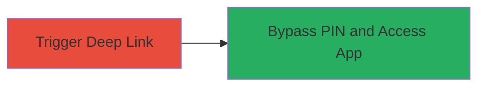

---
tags:
  - android
  - nextcloud
  - auth-bypass
  - deep-link
  - mobile
type: attack_chain
tools: []
tactics:
  - '[[Initial Access]]'
verified: false
platforms:
  - Android
submitted: true
complexity: low
created_at: '2024-01-01T00:00:00Z'
procedures:
  - '[[procedures/Bypass-Nextcloud-App-PIN-via-Deep-Links]]'
step_count: 1
techniques:
  - '[[Valid Accounts]]'
updated_at: '2025-12-14T17:24:42.467Z'
description: >-
  Attack chain exploiting improper authentication in the Nextcloud Android app
  by using deep links from third-party apps to bypass the app PIN, granting
  unauthorized access.
skill_level: low
impact_level: low
id: 1e2953dc-a4e9-49e6-8d1c-9cddd131c639
validated: true
mitre_tactics:
  - '[[Initial Access]]'
mitre_techniques:
  - '[[Valid Accounts]]'
---
# Bypass Nextcloud Android App PIN via Third-Party Deep Links

Multi-stage attack chain demonstrating a complete attack workflow.

## Chain Metrics Dashboard

| Metric | Value |
|--------|-------|
| Chain Status | Unverified |
| Total Steps | 1 |
| Execution Time | ~1 minute |
| Skill Level | Low |
| Complexity | Low |
| Impact Level | Low |

## Attack Flow Visualization

## Prerequisites & Requirements

### Required Tools

- None (relies on standard Android apps and deep link capabilities)

### Target Environment

- Target OS/Platform: Android device with Nextcloud app installed and PIN enabled
- Required services/ports: None
- Network access requirements: Local device access

### Initial Access Requirements

- Credential requirements: None (bypasses PIN)
- Network position: Physical or remote access to the device
- Prior access needed: Ability to install or use third-party apps on the device

## Detailed Attack Procedures

### Step 1: Trigger Deep Link Bypass
procedure: [[procedures/Bypass-Nextcloud-App-PIN-via-Deep-Links]]

**Objective**: Use a deep link generated by a third-party app to open the Nextcloud app without entering the PIN, gaining unauthorized access to its functionality.

**Instructions**: Identify or install a third-party app capable of generating deep links to Nextcloud (e.g., a file-sharing or automation app). Configure the third-party app to create a deep link in the format supported by Nextcloud, such as `nextcloud://open-file/...`. Trigger the deep link to launch the Nextcloud app directly, bypassing the PIN prompt.

**Expected Output**: The Nextcloud app opens immediately to the intended content or main interface without requiring PIN authentication.

**Success Indicators**:
- App launches without PIN prompt
- Access to Nextcloud files or settings is granted

## Attack Chain Summary

### Key Achievements

1. Successful bypass of app PIN using external deep links
2. Unauthorized access to Nextcloud app data
3. Demonstration of improper authentication handling in mobile apps

## Technique & Tactic Coverage

### MITRE ATT&CK Techniques

- [[Valid Accounts]]

### MITRE ATT&CK Tactics

- [[Initial Access]]

---
*Last updated: 2024-01-01T00:00:00Z*
