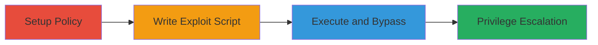

---
tags:
  - node.js
  - privilege-escalation
  - bypass
  - javascript
type: attack_chain
tools:
  - '[[tools/Node.js]]'
tactics:
  - '[[Privilege Escalation]]'
verified: false
platforms:
  - Linux
  - Node.js
submitted: true
complexity: medium
created_at: '2023-10-01T00:00:00Z'
procedures:
  - '[[procedures/Create-Restrictive-Node.js-Policy]]'
  - '[[procedures/Write-Prototype-Chain-Exploit-Script]]'
  - '[[procedures/Execute-Node.js-Script-with-Policy]]'
step_count: 3
techniques:
  - '[[JavaScript]]'
updated_at: '2025-12-14T17:28:58.913Z'
description: >-
  Demonstrates privilege escalation by bypassing Node.js v19.6.1 experimental
  permission model using __proto__ to access require() and load unauthorized
  modules like 'os'.
skill_level: intermediate
impact_level: high
id: cee4a67f-a339-45f1-81ff-39f3f362437a
validated: true
mitre_tactics:
  - '[[Privilege Escalation]]'
mitre_techniques:
  - '[[JavaScript]]'
---
# Bypass Node.js Experimental Permission System via Prototype Chain Access

Multi-stage attack chain demonstrating a complete attack workflow to escalate privileges in Node.js by circumventing the experimental permission system.

## Chain Metrics Dashboard

| Metric | Value |
|--------|-------|
| Chain Status | Unverified |
| Total Steps | 3 |
| Execution Time | ~5 minutes |
| Skill Level | Intermediate |
| Complexity | Medium |
| Impact Level | High |

## Attack Flow Visualization



## Prerequisites & Requirements

### Required Tools

- [[tools/Node.js]]

### Target Environment

- Node.js v19.6.1 on Linux
- Access to Node.js binary and file system for creating policy and script files
- No external network access required

### Initial Access Requirements

- Local execution privileges on a system running Node.js
- No prior credentials needed beyond file write access

## Detailed Attack Procedures

### Step 1: Setup Restrictive Policy
procedure: [[procedures/Create-Restrictive-Node.js-Policy]]

**Objective**: Establish a policy that restricts module loading to only a single file without dependencies, simulating a secure environment.

**Instructions**: Create a policy.json file defining permissions for './proc.js' with integrity checks to prevent dependency loading.

**Expected Output**: A valid policy.json file that enforces restrictions.

**Success Indicators**:
- Policy file created without syntax errors
- Node.js recognizes the policy when loaded

### Step 2: Craft Exploit Script
procedure: [[procedures/Write-Prototype-Chain-Exploit-Script]]

**Objective**: Write a JavaScript file that uses the prototype chain to access the require function, bypassing policy checks to load the 'os' module.

**Instructions**: In proc.js, access require via process.mainModule.__proto__.require('os') and execute os.version() to demonstrate the bypass.

**Expected Output**: Script file ready for execution that logs Node.js and OS versions.

**Success Indicators**:
- Script file created with prototype access code
- No syntax errors in the JavaScript

### Step 3: Execute Script Under Policy
procedure: [[procedures/Execute-Node.js-Script-with-Policy]]

**Objective**: Run the exploit script using Node.js with the restrictive policy enabled, confirming the bypass loads unauthorized modules.

**Instructions**: Use the [[commands/node-execute-with-experimental-policy]] to run proc.js:

```bash
../node-v19.6.1-linux-x64/bin/node --experimental-policy=policy.json proc.js
```

**Expected Output**: Outputs Node.js version, OS version (e.g., "v19.6.1\n#1 SMP PREEMPT Debian 5.16.18-1kali1 (2022-04-01)"), and experimental warning.

**Success Indicators**:
- 'os' module loads despite policy
- OS information disclosed, indicating privilege escalation

## Attack Chain Summary

### Key Achievements

1. Created a restrictive policy to simulate secure module loading
2. Bypassed permissions using __proto__ chain to access require()
3. Loaded and executed unauthorized 'os' module, disclosing system information

## Technique & Tactic Coverage

### MITRE ATT&CK Techniques

- [[JavaScript]]

### MITRE ATT&CK Tactics

- [[Privilege Escalation]]

---
*Last updated: 2023-10-01T00:00:00Z*
