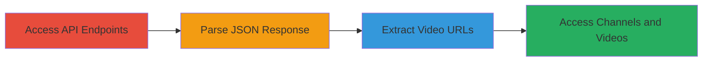

# Bypass Paywall via Unauthenticated API Access to Expose Premium Content and Financial Data on xvideos.red

Multi-stage attack chain demonstrating exploitation of unauthenticated API endpoints on xvideos.red to access premium video and channel data, including financial earnings, without a paid membership. This leads to paywall bypass, revenue loss for creators, exposure of sensitive metadata, and potential content theft.

## Chain Metrics Dashboard

| Metric | Value |
|--------|-------|
| Chain Status | Unverified |
| Total Steps | 4 |
| Execution Time | ~5 minutes |
| Skill Level | Beginner |
| Complexity | Low |
| Impact Level | High |

## Attack Flow Visualization

## Prerequisites & Requirements

### Required Tools

- Web browser (e.g., Chrome, Firefox)

### Target Environment

- Web platform
- No specific services or ports required; direct HTTP/HTTPS access to xvideos.red
- Internet connectivity

### Initial Access Requirements

- No credentials needed
- Public network access to xvideos.red
- No prior access required

## Detailed Attack Procedures

### Step 1: Access API Endpoints
procedure: [[procedures/Access-xvideos-red-API-Endpoints-Without-Authentication]]

**Objective**: Gain unauthenticated access to premium channel API endpoints to retrieve initial JSON data.

**Instructions**: Open a web browser and navigate directly to an API endpoint such as `https://www.xvideos.red/channels/bangbros-network/fan-club/rating/1` or `https://www.xvideos.red/channels/barebackstudios/fan-club/best/0`. No login or authentication is required; the server responds immediately with JSON.

**Expected Output**: Raw JSON response containing premium channel data.

**Success Indicators**:
- HTTP 200 response with JSON payload
- Presence of fields like `videos` array in the response

### Step 2: Parse JSON Response
procedure: [[procedures/Parse-JSON-Response-for-Sensitive-Premium-Data]]

**Objective**: Analyze the API response to identify sensitive metadata including video details and financial information.

**Instructions**: In the browser's developer tools (F12 > Network tab), inspect the JSON response from the API call. Look for fields such as `id`, `status`, `is_private`, `timestamp`, and the `videos` array with subfields like `u` (video URL), `tf` (title), `d` (duration), `pmp` (price/earnings), `p` (producer), `pn` (producer name), `ch` (channel flag), and `pm` (premium flag).

**Expected Output**: Structured JSON data revealing premium-only information, e.g., earnings like "$24.99" in `pmp`.

**Success Indicators**:
- Exposure of private or premium-flagged content (`is_private: true`, `pm: true`)
- Financial metrics visible without subscription

### Step 3: Extract and Access Premium Video URLs
procedure: [[procedures/Extract-and-Access-Premium-Video-URLs-from-API]]

**Objective**: Use extracted video identifiers to construct and access full premium video URLs, bypassing the paywall.

**Instructions**: From the JSON `videos` array, copy the `u` field value (e.g., `/video.umkcobd36ea/nikki_brooks_free_family_use_vol_4_backpedaling`). Prepend the base domain to form the full URL: `https://www.xvideos.red` + extracted path (e.g., `https://www.xvideos.red/video.umkcobd36ea/nikki_brooks_free_family_use_vol_4_backpedaling`). Navigate to this URL in the browser to stream the video.

**Expected Output**: Direct playback of premium video content without prompts for subscription.

**Success Indicators**:
- Video loads and plays fully
- No paywall or login redirect encountered

### Step 4: Browse Premium Channel Content
procedure: [[procedures/Browse-Premium-Channel-Content-via-Direct-URLs]]

**Objective**: Directly access premium channels and galleries to view additional content without authentication.

**Instructions**: In the browser, visit channel URLs like `https://www.xvideos.red/channels/barebackstudios/` or `https://www.xvideos.red/channels/barebackstudios/#gallery`. Scroll through or interact with the page to load thumbnails, metadata, and previews of premium videos.

**Expected Output**: Full channel page with premium video listings, galleries, and metadata visible.

**Success Indicators**:
- Premium content thumbnails and details load
- Ability to browse without membership errors

## Attack Chain Summary

### Key Achievements

1. Unauthenticated retrieval of premium API data including financial earnings.
2. Direct access to paywalled videos via extracted URLs.
3. Browsing of restricted channels and galleries.
4. Potential for content scraping and competitive intelligence.

## Technique & Tactic Coverage

### MITRE ATT&CK Techniques

- [[Exploit Public-Facing Application]]

### MITRE ATT&CK Tactics

- [[Collection]]

---
*Last updated: 2023-10-01T00:00:00Z*
