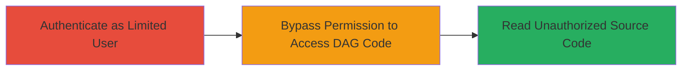

---
tags:
  - access-control-bypass
  - airflow
  - dag
  - permission-bypass
  - improper-access-control
type: attack_chain
tools: []
tactics:
  - '[[Initial Access]]'
  - '[[Discovery]]'
verified: false
platforms:
  - Web
submitted: true
complexity: low
created_at: '2023-10-01T00:00:00Z'
procedures:
  - '[[procedures/Authenticate-to-Apache-Airflow-Web-Interface]]'
  - '[[procedures/Bypass-DAG-Permission-to-Access-Source-Code]]'
step_count: 2
techniques:
  - '[[Valid Accounts]]'
  - '[[File and Directory Discovery]]'
updated_at: '2025-12-14T17:29:44.987Z'
description: >-
  Authenticated users bypass permission checks in Apache Airflow to access
  source code of restricted DAGs, exposing sensitive workflow logic.
skill_level: intermediate
impact_level: low
id: 781c46d9-f510-43b5-9526-c1e217b1770b
validated: true
mitre_tactics:
  - '[[Initial Access]]'
  - '[[Discovery]]'
mitre_techniques:
  - '[[Valid Accounts]]'
  - '[[File and Directory Discovery]]'
---
# Bypass Permission Verification to Read Unauthorized DAG Source Code in Apache Airflow

Multi-stage attack chain demonstrating how an authenticated user can bypass permission verification in Apache Airflow versions before 2.8.1 to access the source code of DAGs they are not authorized for. This vulnerability, reported via HackerOne (Report #2340833), allows exposure of sensitive workflow code but requires authentication and does not enable privilege escalation.

## Chain Metrics Dashboard

| Metric | Value |
|--------|-------|
| Chain Status | Unverified |
| Total Steps | 2 |
| Execution Time | ~2 minutes |
| Skill Level | Intermediate |
| Complexity | Low |
| Impact Level | Low |

## Attack Flow Visualization

## Prerequisites & Requirements

### Required Tools

- None (uses standard web browser)

### Target Environment

- Apache Airflow web UI/API (versions < 2.8.1)
- Python-based workflow orchestration platform
- Web interface accessible over HTTP/HTTPS

### Initial Access Requirements

- Valid authenticated credentials with limited DAG access
- Network access to the Airflow web server
- No prior elevated privileges needed

## Detailed Attack Procedures

### Step 1: Authenticate as Limited User
procedure: [[procedures/Authenticate-to-Apache-Airflow-Web-Interface]]

**Objective**: Gain authenticated access to the Airflow web interface using credentials that restrict DAG visibility.

**Instructions**: Open a web browser and navigate to the Airflow login page (typically at `/login`). Enter valid credentials for a user with limited permissions, ensuring the user cannot normally view the target DAGs. Upon successful login, the dashboard should load, showing only permitted DAGs.

**Expected Output**: Successful login redirect to the Airflow dashboard, with session established.

**Success Indicators**:
- Login successful without errors
- Dashboard displays limited DAGs (confirm by checking visible workflows)

### Step 2: Bypass Permission to Access DAG Code
procedure: [[procedures/Bypass-DAG-Permission-to-Access-Source-Code]]

**Objective**: Exploit the lack of permission verification to retrieve source code of unauthorized DAGs via the web UI or API endpoint.

**Instructions**: From the authenticated session, directly navigate to the source code view endpoint for a restricted DAG, such as by modifying the URL to `/code?dag_id=restricted_dag_name` or using the API call to `/api/v1/dags/restricted_dag_name/code`. The system will return the full source code without enforcing access controls.

**Expected Output**: The browser or API response displays the Python source code of the unauthorized DAG, including any sensitive configurations or logic.

**Success Indicators**:
- Source code retrieved and visible
- No access denied errors triggered

## Attack Chain Summary

### Key Achievements

1. Authenticated access established with limited permissions
2. Permission bypass exploited to read restricted DAG source code
3. Sensitive workflow details exposed for potential further analysis or misuse

## Technique & Tactic Coverage

### MITRE ATT&CK Techniques

- [[Valid Accounts]] Valid Accounts
- [[File and Directory Discovery]] File and Directory Discovery

### MITRE ATT&CK Tactics

- [[Initial Access]] Initial Access
- [[Discovery]] Discovery

---
*Last updated: 2023-10-01T00:00:00Z*
