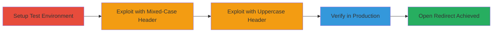

---
tags:
  - open-redirect
  - host-bypass
  - rails
  - ruby
  - x-forwarded-host
type: attack_chain
tools:
  - '[[tools/curl]]'
tactics:
  - '[[Initial Access]]'
verified: false
platforms:
  - Web
  - Ruby
  - Rails
submitted: true
complexity: medium
created_at: '2023-10-01T00:00:00Z'
procedures:
  - '[[procedures/Setup-Rails-Application-for-Host-Bypass-Testing]]'
  - '[[procedures/Exploit-Open-Redirect-with-Mixed-Case-X-Forwarded-Host]]'
  - '[[procedures/Exploit-Open-Redirect-with-Uppercase-X-Forwarded-Host]]'
  - '[[procedures/Verify-Host-Bypass-in-Production-Rails-Environment]]'
step_count: 4
techniques:
  - '[[Exploit Public-Facing Application]]'
  - '[[Drive-by Compromise]]'
updated_at: '2025-12-14T17:29:09.636Z'
description: >-
  Multi-stage attack exploiting a case-sensitivity flaw in Rails Action Pack's
  Host Authorization middleware to bypass host restrictions and enable open
  redirects to malicious sites.
skill_level: intermediate
impact_level: high
id: 12af3799-c93a-4072-aa44-24a37470c9ad
validated: true
mitre_tactics:
  - '[[Initial Access]]'
mitre_techniques:
  - '[[Exploit Public-Facing Application]]'
  - '[[Drive-by Compromise]]'
---
# Bypass Rails Host Authorization for Open Redirect via Case-Sensitive X-Forwarded-Host

Multi-stage attack chain demonstrating exploitation of a vulnerability in Rails Action Pack's Host Authorization middleware, where mixed-case or uppercase values in the X-Forwarded-Host header bypass host restrictions, leading to open redirects for phishing or malicious site redirection.

## Chain Metrics Dashboard

| Metric | Value |
|--------|-------|
| Chain Status | Unverified |
| Total Steps | 4 |
| Execution Time | ~5 minutes |
| Skill Level | Intermediate |
| Complexity | Medium |
| Impact Level | High |

## Attack Flow Visualization



## Prerequisites & Requirements

### Required Tools

- [[tools/curl]]

### Target Environment

- Ruby on Rails application (version with vulnerable Action Pack middleware)
- Local development server on port 3000
- Configured allowed hosts (e.g., .EXAMPLE.com)

### Initial Access Requirements

- Access to deploy or test a Rails application
- Network access to localhost:3000 or production endpoint
- No prior credentials needed; exploits public-facing redirect endpoint

## Detailed Attack Procedures

### Step 1: Setup Rails Application
procedure: [[procedures/Setup-Rails-Application-for-Host-Bypass-Testing]]

**Objective**: Create a vulnerable Rails application with a redirect endpoint and host authorization to test the bypass.

**Instructions**: Implement a TestsController that redirects based on the host, and configure host authorization middleware.

**Expected Output**: Rails server running on http://localhost:3000 with redirect functionality active.

**Success Indicators**:
- Server starts without errors
- Normal requests to /tests redirect to allowed host

### Step 2: Exploit with Mixed-Case Header
procedure: [[procedures/Exploit-Open-Redirect-with-Mixed-Case-X-Forwarded-Host]]

**Objective**: Bypass host authorization using a mixed-case X-Forwarded-Host header to trigger an unauthorized redirect.

**Instructions**: Use [[commands/curl-mixed-case-x-forwarded-host]] to send a crafted request:

```bash
curl 'http://localhost:3000/tests' -H 'X-Forwarded-Host: Evil.com'
```

**Expected Output**: HTML response indicating redirect to http://Evil.com/.

**Success Indicators**:
- Redirect occurs to malicious host
- No host authorization error

### Step 3: Exploit with Uppercase Header
procedure: [[procedures/Exploit-Open-Redirect-with-Uppercase-X-Forwarded-Host]]

**Objective**: Confirm the bypass works with an all-uppercase X-Forwarded-Host header, demonstrating the case-sensitivity issue.

**Instructions**: Execute [[commands/curl-uppercase-x-forwarded-host]]:

```bash
curl 'http://localhost:3000/tests' -H 'X-Forwarded-Host: EVIL.COM'
```

**Expected Output**: HTML response showing redirect to http://EVIL.COM/.

**Success Indicators**:
- Successful redirect to uppercase malicious host
- Middleware skips validation due to nil forwarded_host

### Step 4: Verify in Production
procedure: [[procedures/Verify-Host-Bypass-in-Production-Rails-Environment]]

**Objective**: Test the exploit in a production-like setup with configured allowed hosts to assess real-world impact.

**Instructions**: Configure Rails hosts and repeat exploitation steps with [[commands/curl-mixed-case-x-forwarded-host]] or [[commands/curl-uppercase-x-forwarded-host]].

**Expected Output**: Bypass confirmed, redirect to malicious site despite production host restrictions.

**Success Indicators**:
- Production config does not prevent bypass
- Open redirect leads to potential phishing

## Attack Chain Summary

### Key Achievements

1. Successful setup of vulnerable Rails environment
2. Bypassed host authorization using case manipulation in X-Forwarded-Host
3. Demonstrated open redirect to arbitrary malicious domains
4. Validated exploit across local and production configurations

## Technique & Tactic Coverage

### MITRE ATT&CK Techniques

- [[Exploit Public-Facing Application]]
- [[Drive-by Compromise]]

### MITRE ATT&CK Tactics

- [[Initial Access]]

---
*Last updated: 2023-10-01T00:00:00Z*
