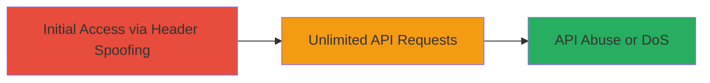

---
tags:
  - rate-limit-bypass
  - x-forwarded-for
  - business-logic
  - api-abuse
type: attack_chain
tools: []
tactics:
  - '[[Initial Access]]'
verified: false
platforms:
  - Web
submitted: true
complexity: medium
created_at: '2023-10-01T00:00:00Z'
procedures:
  - '[[procedures/Spoof-X-Forwarded-For-to-Bypass-Rate-Limiting]]'
step_count: 1
techniques:
  - '[[Exploit Public-Facing Application]]'
updated_at: '2025-12-14T17:32:28.892Z'
description: >-
  A business logic vulnerability in Snapchat's API rate limiting allows
  attackers to spoof the client IP using the X-Forwarded-For header, enabling
  unlimited requests to protected endpoints.
skill_level: intermediate
impact_level: high
id: eae13cb9-236f-48e0-8ae6-1a553c896a71
validated: true
mitre_tactics:
  - '[[Initial Access]]'
mitre_techniques:
  - '[[Exploit Public-Facing Application]]'
---
# Bypass Rate Limits on Snapchat API via X-Forwarded-For Header Spoofing

Multi-stage attack chain demonstrating a complete attack workflow exploiting a business logic error in Snapchat's rate limiting.

## Chain Metrics Dashboard

| Metric | Value |
|--------|-------|
| Chain Status | Unverified |
| Total Steps | 1 |
| Execution Time | ~1 minutes |
| Skill Level | Intermediate |
| Complexity | Medium |
| Impact Level | High |

## Attack Flow Visualization



## Prerequisites & Requirements

### Required Tools

- [[tools/curl]]

### Target Environment

- Web platform
- Access to Snapchat API endpoints like app.snapchat.com/stories_everywhere/download_sms
- No authentication required for public endpoints

### Initial Access Requirements

- Network access to the internet
- No prior credentials needed
- Ability to send custom HTTP requests

## Detailed Attack Procedures

### Step 1: Spoof Header to Bypass Rate Limiting
procedure: [[procedures/Spoof-X-Forwarded-For-to-Bypass-Rate-Limiting]]

**Objective**: Craft and send POST requests with a spoofed X-Forwarded-For header to evade IP-based rate limiting, allowing unlimited API calls.

**Instructions**: Use [[commands/curl-post-with-x-forwarded-for]] to send a POST request to the vulnerable endpoint, setting the X-Forwarded-For header to 127.0.0.1 to spoof the IP as localhost. This tricks the server into not applying rate limits.

```bash
curl -X POST https://app.snapchat.com/stories_everywhere/download_sms \
  -H "X-Forwarded-For: 127.0.0.1" \
  -d "some_payload_data"
```

Repeat the request multiple times to confirm bypass; normal requests would be throttled after a few attempts.

**Expected Output**: Successful HTTP 200 response without rate limit errors, even after dozens of requests.

**Success Indicators**:
- No rate limit error messages (e.g., 429 Too Many Requests)
- Consistent successful responses to repeated requests
- Ability to abuse the endpoint for excessive calls

## Attack Chain Summary

### Key Achievements

1. Successful spoofing of client IP via X-Forwarded-For header
2. Bypass of strict IP-based rate limiting on Snapchat API
3. Potential for API abuse, such as excessive downloads or DoS on rate-limited features

## Technique & Tactic Coverage

### MITRE ATT&CK Techniques

- [[Exploit Public-Facing Application]]

### MITRE ATT&CK Tactics

- [[Initial Access]]

---
*Last updated: 2023-10-01T00:00:00Z*
