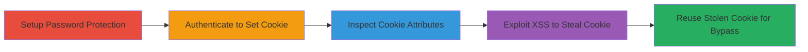

---
tags:
  - xss
  - cookie-theft
  - auth-bypass
  - shopify
  - web-security
type: attack_chain
tools: []
tactics:
  - '[[Initial Access]]'
  - '[[Collection]]'
verified: false
platforms:
  - Web
submitted: true
complexity: low
created_at: '2023-10-01T00:00:00Z'
procedures:
  - '[[procedures/Exploit-Shopify-Storefront-Digest-Cookie-Via-XSS]]'
step_count: 5
techniques:
  - '[[JavaScript]]'
  - '[[Steal Web Session Cookie]]'
updated_at: '2025-12-14T03:15:35.229Z'
description: >-
  Multi-stage demonstration of exploiting the missing HttpOnly flag on the
  Shopify storefront_digest cookie, allowing XSS-based theft and reuse to bypass
  store password authentication.
skill_level: intermediate
impact_level: high
id: 81ad34b9-21c0-4e54-ad5d-bb7a2ffa1102
validated: true
mitre_tactics:
  - '[[Initial Access]]'
  - '[[Collection]]'
mitre_techniques:
  - '[[JavaScript]]'
  - '[[Steal Web Session Cookie]]'
---
---
id: 123e4567-e89b-12d3-a456-426614174000
name: Bypass Shopify Password Protection via XSS Exploitation of Storefront Digest Cookie
type: attack_chain
description: "Multi-stage demonstration of exploiting the missing HttpOnly flag on the Shopify storefront_digest cookie, allowing XSS-based theft and reuse to bypass store password authentication."
verified: false
submitted: false
step_count: 5
created_at: 2023-10-01T00:00:00Z
updated_at: 2023-10-01T00:00:00Z
procedures: [[procedures/Exploit-Shopify-Storefront-Digest-Cookie-Via-XSS]]
techniques: [[JavaScript]], [[Steal Web Session Cookie]]
tactics: [[Initial Access]], [[Collection]]
tags: [xss, cookie-theft, auth-bypass, shopify, web-security]
platforms: [Web]
tools: []
---

# Bypass Shopify Password Protection via XSS Exploitation of Storefront Digest Cookie

Multi-stage attack chain demonstrating a complete attack workflow exploiting a cookie security misconfiguration in Shopify's password-protected 'Opening soon' stores.

## Chain Metrics Dashboard

| Metric | Value |
|--------|-------|
| Chain Status | Unverified |
| Total Steps | 5 |
| Execution Time | ~5 minutes |
| Skill Level | Intermediate |
| Complexity | Low |
| Impact Level | High |

## Attack Flow Visualization

## Prerequisites & Requirements

### Required Tools

- Browser developer tools (e.g., Chrome DevTools)
- JavaScript console for cookie inspection

### Target Environment

- Shopify-hosted web store with password protection enabled
- Presence of an XSS vulnerability elsewhere in the application
- Web browser for access and simulation

### Initial Access Requirements

- Administrative access to Shopify store for setup (for demonstration)
- Attacker requires XSS payload delivery capability (e.g., via another vuln)
- No prior credentials needed for the bypass phase

## Detailed Attack Procedures

### Step 1: Setup Password Protection

procedure: [[procedures/Exploit-Shopify-Storefront-Digest-Cookie-Via-XSS]]

**Objective**: Enable password protection on the Shopify store to trigger the vulnerable cookie mechanism.

**Instructions**: Log in to the Shopify admin panel and navigate to the 'Password protection' settings. Enable the feature and set a store password. This secures the storefront, requiring authentication for access.

**Expected Output**: Store URL now prompts for password on access.

**Success Indicators**:
- Password page appears when visiting the store URL
- Admin confirmation of protection enabled

### Step 2: Authenticate to Set Cookie

procedure: [[procedures/Exploit-Shopify-Storefront-Digest-Cookie-Via-XSS]]

**Objective**: Gain legitimate access to the store to trigger cookie creation.

**Instructions**: Navigate to the protected store URL in a web browser. Enter the configured password to authenticate. Upon success, the browser receives and sets the 'storefront_digest' cookie.

**Expected Output**: Access granted to the store; cookie visible in browser storage.

**Success Indicators**:
- Store content loads without password prompt
- 'storefront_digest' cookie present in browser's cookie storage

### Step 3: Inspect Cookie Attributes

procedure: [[procedures/Exploit-Shopify-Storefront-Digest-Cookie-Via-XSS]]

**Objective**: Verify the cookie's vulnerability by checking for the missing HttpOnly flag.

**Instructions**: Open browser developer tools (F12), go to the Application/Storage tab, and inspect cookies for the domain. Look for 'storefront_digest' and confirm it lacks the HttpOnly attribute. Test accessibility via JavaScript console: `console.log(document.cookie);` – the cookie value should appear.

**Expected Output**: Cookie details show no HttpOnly flag; JavaScript reads the value.

**Success Indicators**:
- HttpOnly flag absent in cookie attributes
- document.cookie includes 'storefront_digest' value

### Step 4: Exploit XSS to Steal Cookie

procedure: [[procedures/Exploit-Shopify-Storefront-Digest-Cookie-Via-XSS]]

**Objective**: Use an XSS vulnerability to exfiltrate the cookie value.

**Instructions**: Assuming an XSS vuln exists (e.g., via user input field), inject a payload like ``. When executed in the victim's browser after authentication, it sends the 'storefront_digest' to the attacker.

**Expected Output**: Cookie value transmitted to attacker's server.

**Success Indicators**:
- Attacker receives the cookie value via webhook or log
- Payload executes without errors in console

### Step 5: Reuse Stolen Cookie for Bypass

procedure: [[procedures/Exploit-Shopify-Storefront-Digest-Cookie-Via-XSS]]

**Objective**: Impersonate the authenticated user by setting the stolen cookie.

**Instructions**: In a new browser session or incognito window, use developer tools to manually set the cookie: `document.cookie = 'storefront_digest=STOLEN_VALUE; domain=store-domain.com; path=/';`. Then navigate to the protected store URL.

**Expected Output**: Access granted without entering the password.

**Success Indicators**:
- Store loads directly without password prompt
- Cookie validation passes server-side

## Attack Chain Summary

### Key Achievements

1. Identified and verified the HttpOnly flag omission on authentication cookie
2. Demonstrated cookie theft via hypothetical XSS payload
3. Achieved authentication bypass by reusing the stolen session representation

## Technique & Tactic Coverage

### MITRE ATT&CK Techniques

- [[JavaScript]] JavaScript (XSS execution for cookie access)
- [[Steal Web Session Cookie]] Steal Web Session Cookie (theft and reuse for bypass)

### MITRE ATT&CK Tactics

- [[Initial Access]] Initial Access (unauthorized store access via stolen creds)
- [[Collection]] Collection (gathering authentication cookie)

---
*Last updated: 2023-10-01T00:00:00Z*
