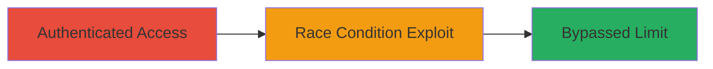

---
tags:
  - race-condition
  - toctou
  - authorization-bypass
  - web-vulnerability
type: attack_chain
tools: []
tactics:
  - '[[Execution]]'
verified: false
platforms:
  - Web
submitted: true
complexity: medium
created_at: '2023-10-01T00:00:00Z'
procedures:
  - '[[procedures/Exploit-TOCTOU-Race-Condition-to-Bypass-Subdomain-Limit]]'
step_count: 1
techniques:
  - '[[Exploit Public-Facing Application]]'
updated_at: '2025-12-14T17:24:18.843Z'
description: >-
  Exploit a Time-of-Check Time-of-Use (TOCTOU) race condition in Chaturbate's
  whitelabel subdomain addition feature to create more than the enforced limit
  of 5 subdomains per account.
skill_level: intermediate
impact_level: low
id: fa3a8bd7-2802-4f73-bead-c93e4e708e66
validated: true
mitre_tactics:
  - '[[Execution]]'
mitre_techniques:
  - '[[Exploit Public-Facing Application]]'
---
# Bypass Whitelabel Subdomain Limit via TOCTOU Race Condition in Chaturbate

Multi-stage attack chain demonstrating a complete attack workflow exploiting a TOCTOU race condition in Chaturbate's whitelabel feature.

## Chain Metrics Dashboard

| Metric | Value |
|--------|-------|
| Chain Status | Unverified |
| Total Steps | 1 |
| Execution Time | ~1 minute |
| Skill Level | Intermediate |
| Complexity | Medium |
| Impact Level | Low |

## Attack Flow Visualization



## Prerequisites & Requirements

### Required Tools

- None specific; uses standard HTTP clients like curl.

### Target Environment

- Web platform (Chaturbate whitelabel subdomain addition endpoint)
- Required services/ports: HTTPS on port 443
- Network access requirements: Internet access to Chaturbate

### Initial Access Requirements

- Valid authenticated account on Chaturbate with permission to add whitelabel subdomains
- Session cookies or API tokens for authentication
- No prior elevated access needed

## Detailed Attack Procedures

### Step 1: Exploit Race Condition
procedure: [[procedures/Exploit-TOCTOU-Race-Condition-to-Bypass-Subdomain-Limit]]

**Objective**: Bypass the soft limit of 5 whitelabel subdomains by racing multiple concurrent add requests, exploiting the TOCTOU vulnerability where the check occurs before the use phase.

**Instructions**: Authenticate to the Chaturbate account, then send 10+ concurrent POST requests to the subdomain addition endpoint (e.g., /api/add_whitelabel_subdomain) with unique subdomain names. Use curl in a loop or parallel execution to simulate the race.

First, prepare authentication (replace with actual session cookie):

```bash
curl -c cookies.txt -d "username=attacker&password=pass" https://chaturbate.com/login
```

Then, execute concurrent requests using a bash loop with xargs for parallelism:

```bash
seq 1 10 | xargs -n1 -P10 -I{} curl -b cookies.txt -X POST -d "subdomain=unique{}.example.com" https://chaturbate.com/api/add_whitelabel_subdomain
```

**Expected Output**: Multiple success responses indicating subdomain creation, exceeding the 5-limit check.

**Success Indicators**:
- More than 5 subdomains listed in the account dashboard
- API responses confirming creation without rate limiting errors

## Attack Chain Summary

### Key Achievements

1. Successfully bypassed the subdomain limit check via concurrent requests
2. Created unlimited whitelabel subdomains for potential abuse (e.g., phishing or branding)
3. Demonstrated low-severity impact resolved with a $100 bounty

## Technique & Tactic Coverage

### MITRE ATT&CK Techniques

- [[Exploit Public-Facing Application]]

### MITRE ATT&CK Tactics

- [[Execution]]

---
*Last updated: 2023-10-01T00:00:00Z*
