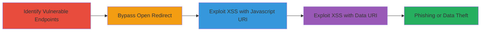

---
tags:
  - open-redirect
  - xss
  - reflected-xss
  - bypass
  - shopify
  - locksmith
type: attack_chain
tools: []
tactics:
  - '[[Initial Access]]'
  - '[[Execution]]'
verified: false
platforms:
  - Web
submitted: true
complexity: medium
created_at: '2023-10-01T00:00:00Z'
procedures:
  - '[[procedures/Identify-Vulnerable-Path-Parameter-Endpoints]]'
  - '[[procedures/Bypass-Open-Redirect-Protection-with-Double-Slashes]]'
  - '[[procedures/Exploit-Reflected-XSS-via-Javascript-URI]]'
  - '[[procedures/Exploit-Reflected-XSS-via-Data-URI]]'
step_count: 4
techniques:
  - '[[Exploit Public-Facing Application]]'
  - '[[JavaScript]]'
updated_at: '2025-12-14T17:24:31.468Z'
description: >-
  Multi-stage exploitation of open redirect and reflected XSS vulnerabilities in
  the path parameter of the Shopify Locksmith app, allowing redirection to
  malicious sites and arbitrary JavaScript execution.
skill_level: intermediate
impact_level: high
id: 40b46640-7c8c-47c4-a640-3cdc52a66d4a
validated: true
mitre_tactics:
  - '[[Initial Access]]'
  - '[[Execution]]'
mitre_techniques:
  - '[[Exploit Public-Facing Application]]'
  - '[[JavaScript]]'
---
# Bypassed Open Redirect and Reflected XSS in Shopify Locksmith App Path Parameter

Multi-stage attack chain demonstrating exploitation of vulnerabilities in the 'path' parameter on supporthiring.shopify.com, part of the third-party Locksmith app, to achieve open redirects and reflected XSS for phishing, session hijacking, or data theft.

## Chain Metrics Dashboard

| Metric | Value |
|--------|-------|
| Chain Status | Unverified |
| Total Steps | 4 |
| Execution Time | ~5 minutes |
| Skill Level | Intermediate |
| Complexity | Medium |
| Impact Level | High |

## Attack Flow Visualization

## Prerequisites & Requirements

### Required Tools

- Browser developer tools for URL manipulation
- [[tools/Burp-Suite]] (optional for intercepting requests)

### Target Environment

- Web platform
- Shopify-hosted sites with Locksmith app
- Access to public-facing URLs under /apps/locksmith/

### Initial Access Requirements

- No credentials required
- Public network access to supporthiring.shopify.com
- Ability to craft and send URLs to victims

## Detailed Attack Procedures

### Step 1: Identify Vulnerable Endpoints
procedure: [[procedures/Identify-Vulnerable-Path-Parameter-Endpoints]]

**Objective**: Locate pages using the 'path' parameter that can be manipulated for redirects or XSS.

**Instructions**: Test various URLs under /apps/locksmith/resource/pages/ by appending ?path= to observe behavior. For example, navigate to http://supporthiring.shopify.com/apps/locksmith/resource/pages/gauntlet-challenge?path= and inspect for redirect or script execution.

**Expected Output**: Confirmation of parameter acceptance without immediate blocking.

**Success Indicators**:
- Parameter is reflected or processed in responses
- No immediate validation errors

### Step 2: Bypass Open Redirect Protection
procedure: [[procedures/Bypass-Open-Redirect-Protection-with-Double-Slashes]]

**Objective**: Circumvent built-in protections to force a redirect to an external malicious domain.

**Instructions**: Append path=%2F%2Fevil.com to the vulnerable URL, such as http://supporthiring.shopify.com/apps/locksmith/resource/pages/gauntlet-challenge?path=%2F%2Fevil.com. Observe the brief 404 page before redirection.

**Expected Output**: Temporary 404 display followed by redirect to https://evil.com.

**Success Indicators**:
- Redirect occurs after 2-second delay
- Victim is sent to attacker-controlled site

### Step 3: Exploit Reflected XSS via Javascript URI
procedure: [[procedures/Exploit-Reflected-XSS-via-Javascript-URI]]

**Objective**: Inject and execute JavaScript code using a javascript: URI scheme in the path parameter.

**Instructions**: Set path=javascript:alert(document.domain) in the URL, e.g., http://supporthiring.shopify.com/apps/locksmith/resource/pages/gauntlet-challenge?path=javascript:alert(document.domain). Trigger by loading the page.

**Expected Output**: Alert popup displaying the domain name, confirming XSS execution.

**Success Indicators**:
- JavaScript alert fires in the browser
- Code executes in the context of the Shopify domain

### Step 4: Exploit Reflected XSS via Data URI
procedure: [[procedures/Exploit-Reflected-XSS-via-Data-URI]]

**Objective**: Execute arbitrary HTML and JavaScript using a base64-encoded data URI to demonstrate payload delivery.

**Instructions**: Use path=data:text/html;base64,PHNjcmlwdD5hbGVydCgvWFNTIFBvQy8pPC9zY3JpcHQ+ in the URL, such as http://supporthiring.shopify.com/apps/locksmith/resource/pages/gauntlet-challenge?path=data:text/html;base64,PHNjcmlwdD5hbGVydCgvWFNTIFBvQy8pPC9zY3JpcHQ+. Load the page to trigger.

**Expected Output**: Alert with 'XSS PoC' message, verifying script execution.

**Success Indicators**:
- Base64-decoded script runs successfully
- Arbitrary code injection confirmed

## Attack Chain Summary

### Key Achievements

1. Identified and confirmed vulnerable 'path' parameter across Locksmith app pages.
2. Bypassed redirect protections using double slash encoding for phishing setups.
3. Executed JavaScript via URI schemes, enabling session hijacking or data theft on Shopify sites.

## Technique & Tactic Coverage

### MITRE ATT&CK Techniques

- [[Exploit Public-Facing Application]]
- [[JavaScript]]

### MITRE ATT&CK Tactics

- [[Initial Access]]
- [[Execution]]

---
*Last updated: 2023-10-01T00:00:00Z*
