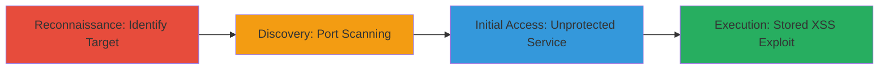

---
tags:
  - xss
  - stored-xss
  - htaccess-bypass
  - misconfiguration
  - file-upload
  - nodebb
type: attack_chain
tools:
  - '[[tools/nmap]]'
tactics:
  - '[[Reconnaissance]]'
  - '[[Initial Access]]'
  - '[[Execution]]'
commands:
  - '[[commands/nmap-port-scan-with-service-detection]]'
platforms:
  - Web
  - Node.js
complexity: medium
procedures:
  - '[[procedures/Identify-Target-from-SSL-Certificate]]'
  - '[[procedures/Port-Scan-to-Discover-Exposed-Services]]'
  - '[[procedures/Access-Unprotected-NodeBB-Instance]]'
  - '[[procedures/Exploit-Stored-XSS-via-File-Upload]]'
step_count: 4
techniques:
  - '[[Active Scanning]]'
  - '[[Exploit Public-Facing Application]]'
  - '[[JavaScript]]'
description: >-
  Multi-stage attack bypassing .htaccess authentication on a NodeBB forum via
  port scanning and exploiting stored XSS through unsanitized file uploads.
skill_level: intermediate
impact_level: high
id: 735cce45-c019-4c61-9f0e-ef53dc187470
created_at: '2025-12-14T03:16:37.272Z'
updated_at: '2025-12-14T03:16:37.272Z'
verified: false
validated: true
submitted: true
mitre_tactics:
  - '[[Reconnaissance]]'
  - '[[Initial Access]]'
  - '[[Execution]]'
mitre_techniques:
  - '[[Active Scanning]]'
  - '[[Exploit Public-Facing Application]]'
  - '[[JavaScript]]'
---
# Bypassing .htaccess Protection and Exploiting Stored XSS in NodeBB Forum

## Overview

This attack chain demonstrates how an attacker can bypass .htaccess authentication protecting a NodeBB forum on port 80 by discovering an unprotected instance on port 4567 through port scanning. Once accessed, a stored XSS vulnerability in the file upload API is exploited by injecting malicious HTML into image EXIF data and renaming files to .html, leading to persistent XSS that affects users viewing uploaded content. Potential escalation to PHP file uploads with executable code in EXIF is noted, though RCE was not achieved in this scenario. The attack originates from reviewing SSL certificate details to identify the target.

## Chain Metrics Dashboard

| Metric | Value |
|--------|-------|
| Chain Status | Unverified |
| Total Steps | 4 |
| Execution Time | ~10 minutes |
| Skill Level | Intermediate |
| Complexity | Medium |
| Impact Level | High |

## Attack Flow Visualization



## Prerequisites & Requirements

### Required Tools

- [[tools/nmap]]

### Target Environment

- Web platform with NodeBB forum
- Exposed ports 80 (protected) and 4567 (unprotected)
- SSL certificate mentioning the target domain

### Initial Access Requirements

- Public network access to the target's IP
- No credentials needed due to bypass
- Ability to review public SSL certificate details

## Detailed Attack Procedures

### Step 1: Identify Target from SSL Certificate
procedure: [[procedures/Identify-Target-from-SSL-Certificate]]

**Objective**: Discover the target NodeBB forum instance mentioned in SSL certificate details during renewal review.

**Instructions**: Review SSL certificate transparency logs or renewal details for mentions of http://nodebb.ubnt.com/, noting it is protected by .htaccess on port 80.

**Expected Output**: Identification of the target domain and IP (e.g., 104.131.159.88) with noted protection.

**Success Indicators**:
- Target domain and IP confirmed
- Awareness of .htaccess protection on standard port

### Step 2: Port Scan to Discover Exposed Services
procedure: [[procedures/Port-Scan-to-Discover-Exposed-Services]]

**Objective**: Scan the target's IP to identify open ports and bypass .htaccess by finding unprotected services.

**Instructions**: Use [[commands/nmap-port-scan-with-service-detection]] to perform a comprehensive scan:

```bash
sudo nmap -sSV -p- 104.131.159.88 -oA stage_ph -T4
```

Analyze output for open port 4567 hosting NodeBB without authentication.

**Expected Output**: Scan results showing port 4567/tcp open with NodeBB service details.

**Success Indicators**:
- Port 4567 identified as open and unprotected
- Service version detected as NodeBB

### Step 3: Access Unprotected NodeBB Instance
procedure: [[procedures/Access-Unprotected-NodeBB-Instance]]

**Objective**: Connect to the exposed NodeBB forum on port 4567, bypassing the .htaccess on port 80.

**Instructions**: Navigate to http://104.131.159.88:4567/ or http://nodebb.ubnt.com:4567/ in a browser to access the forum without authentication prompts.

**Expected Output**: Full access to the NodeBB forum interface, including upload features.

**Success Indicators**:
- Forum loads without password prompt
- Ability to interact with upload API confirmed

### Step 4: Exploit Stored XSS via File Upload
procedure: [[procedures/Exploit-Stored-XSS-via-File-Upload]]

**Objective**: Inject malicious HTML via the upload API to achieve persistent stored XSS, potentially leading to further exploits.

**Instructions**: Prepare an image file with malicious HTML in EXIF data (e.g., <script>alert('XSS')</script>), rename to .html, and upload via the NodeBB API. The API fails to sanitize, allowing execution on view.

**Expected Output**: Uploaded file renders malicious HTML, triggering XSS for viewers.

**Success Indicators**:
- Malicious payload executes in browser
- Persistent XSS confirmed on shared links

## Attack Chain Summary

### Key Achievements

1. Bypassed .htaccess authentication via port discovery
2. Gained unauthorized access to NodeBB forum
3. Exploited stored XSS for persistent payload injection
4. Demonstrated potential for PHP RCE via EXIF code

## Technique & Tactic Coverage

### MITRE ATT&CK Techniques

- [[Active Scanning]] Active Scanning
- [[Exploit Public-Facing Application]] Exploit Public-Facing Application
- [[JavaScript]] JavaScript

### MITRE ATT&CK Tactics

- [[Reconnaissance]] Reconnaissance
- [[Initial Access]] Initial Access
- [[Execution]] Execution

---
*Last updated: 2023-10-01T00:00:00Z*
