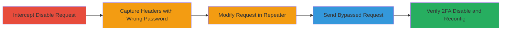

---
tags:
  - 2fa-bypass
  - auth-bypass
  - business-logic
  - api-manipulation
type: attack_chain
tools:
  - '[[tools/Burp-Suite]]'
tactics:
  - '[[Initial Access]]'
verified: false
platforms:
  - Web
submitted: true
complexity: medium
created_at: '2023-10-01T00:00:00Z'
procedures:
  - '[[procedures/Bypass-2FA-Disable-Password-with-Burp-Suite]]'
step_count: 5
techniques:
  - '[[Valid Accounts]]'
  - '[[Modify Authentication Process]]'
updated_at: '2025-12-14T17:31:52.849Z'
description: >-
  A multi-step attack exploiting a business logic flaw in the Localize
  application's 2FA disable process, allowing an attacker with stolen session
  cookies to disable 2FA and reconfigure it to their own phone number without
  password verification.
skill_level: intermediate
impact_level: high
id: 348f0b50-b69a-4059-9bab-f8b414b32b0b
validated: true
mitre_tactics:
  - '[[Initial Access]]'
mitre_techniques:
  - '[[Valid Accounts]]'
  - '[[Modify Authentication Process]]'
---
# Bypassing 2FA Disable Password Confirmation via API Manipulation in Localize

Multi-stage attack chain demonstrating a complete attack workflow exploiting a business logic error in the Localize application's 2FA management, where UI-enforced password confirmation can be bypassed by directly manipulating the API endpoint.

## Chain Metrics Dashboard

| Metric | Value |
|--------|-------|
| Chain Status | Unverified |
| Total Steps | 5 |
| Execution Time | ~5 minutes |
| Skill Level | Intermediate |
| Complexity | Medium |
| Impact Level | High |

## Attack Flow Visualization

## Prerequisites & Requirements

### Required Tools

- [[tools/Burp-Suite]]

### Target Environment

- Web application (Localize staging: https://localizestaging.com)
- Required services/ports: HTTPS (443)
- Network access requirements: Valid session cookies for the target account

### Initial Access Requirements

- Stolen or valid session cookies (e.g., via prior phishing or XSS)
- Network position: Direct access to the web app
- Prior access needed: Logged-in session to the target account

## Detailed Attack Procedures

### Step 1: Intercept the Initial Disable Request
procedure: [[procedures/Bypass-2FA-Disable-Password-with-Burp-Suite]]

**Objective**: Capture the HTTP request triggered by attempting to disable 2FA in the UI.

**Instructions**: Launch Burp Suite, enable intercept mode under the Proxy tab, navigate to the 2FA settings in the Localize app, and click the 'Disable two factor' button to trigger the request interception.

**Expected Output**: Intercepted POST request to /api/user/two-factor/set with password parameter in the body.

**Success Indicators**:
- Request appears in Burp Proxy > Intercept tab
- Headers include session cookies

### Step 2: Capture Request Headers with Wrong Password
procedure: [[procedures/Bypass-2FA-Disable-Password-with-Burp-Suite]]

**Objective**: Obtain complete request headers by submitting an invalid password to ensure full capture without successful UI processing.

**Instructions**: In the intercepted request, enter an incorrect password in the UI form to forward the request, then copy all headers (including cookies) from the Burp Intercept tab.

**Expected Output**: Full set of request headers pasted for later use.

**Success Indicators**:
- Headers copied, including Authorization or session-related cookies
- Request shows error due to wrong password

### Step 3: Modify and Prepare Request in Burp Repeater
procedure: [[procedures/Bypass-2FA-Disable-Password-with-Burp-Suite]]

**Objective**: Set up a modified POST request to the API endpoint without the password parameter.

**Instructions**: Switch to Burp Repeater tab, create a new request to https://localizestaging.com/api/user/two-factor/set (POST method), paste the captured headers, and set the body to `method=sms&phone=%2B62-hacker-phone-number` (URL-encode the phone number with + as %2B).

**Expected Output**: Prepared request ready for sending, body omits password.

**Success Indicators**:
- Request body shows only method and phone parameters
- Headers intact with session cookies

### Step 4: Send the Modified Request to Bypass Validation
procedure: [[procedures/Bypass-2FA-Disable-Password-with-Burp-Suite]]

**Objective**: Execute the API call to disable current 2FA and set up SMS on attacker's phone without password check.

**Instructions**: In Burp Repeater, click 'GO' to send the modified POST request, omitting the password parameter.

**Expected Output**: Server response indicating success (e.g., 200 OK with confirmation message).

**Success Indicators**:
- Response body confirms 2FA reconfiguration
- No password validation error

### Step 5: Verify the Bypass Success
procedure: [[procedures/Bypass-2FA-Disable-Password-with-Burp-Suite]]

**Objective**: Confirm that 2FA is disabled and SMS codes now route to the attacker's phone.

**Instructions**: Refresh the 2FA settings page in the browser or check the API response; attempt a login to receive SMS code on the new phone number.

**Expected Output**: UI shows 2FA disabled or reconfigured to SMS; SMS code arrives on attacker's phone.

**Success Indicators**:
- Account takeover possible without original 2FA
- POC video or logs show successful bypass

## Attack Chain Summary

### Key Achievements

1. Bypassed UI-enforced password confirmation for 2FA disable
2. Reconfigured 2FA to attacker's control using stolen session
3. Enabled full account takeover without password knowledge

## Technique & Tactic Coverage

### MITRE ATT&CK Techniques

- [[Valid Accounts]] Valid Accounts
- [[Modify Authentication Process]] Modify Authentication Process

### MITRE ATT&CK Tactics

- [[Initial Access]] Initial Access

---

*Last updated: 2023-10-01T00:00:00Z*
