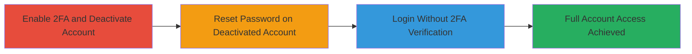

# Bypassing 2FA via Account Deactivation and Password Reset on HackerOne

Multi-stage attack chain exploiting a logical flaw in HackerOne's account deactivation and recovery processes. An attacker with email access can deactivate the victim's account, reset the password, and log in without triggering 2FA, achieving full unauthorized access to the platform.

## Chain Metrics Dashboard

| Metric | Value |
|--------|-------|
| Chain Status | Unverified |
| Total Steps | 3 |
| Execution Time | ~5 minutes |
| Skill Level | Intermediate |
| Complexity | Medium |
| Impact Level | High |

## Attack Flow Visualization

## Prerequisites & Requirements

### Required Tools

- Web browser (e.g., Chrome, Firefox)

### Target Environment

- HackerOne web platform
- Access to victim's email account
- No special services or ports required; operates over standard HTTPS

### Initial Access Requirements

- Valid credentials to the target HackerOne account (for initial 2FA enablement simulation)
- Control over the associated email address
- No prior network position needed; remote web access suffices

## Detailed Attack Procedures

### Step 1: Enable 2FA and Deactivate Account
procedure: [[procedures/Enable-2FA-and-Deactivate-Account]]

**Objective**: Prepare the account by enabling 2FA and then deactivating it, setting up the bypass condition.

**Instructions**: Log in to the HackerOne account, navigate to settings to enable two-factor authentication, and then proceed to deactivate the account. This step simulates the attacker's initial access or assumes the victim has 2FA enabled.

**Expected Output**: Account shows as deactivated in the user's email confirmation, with 2FA enabled prior to deactivation.

**Success Indicators**:
- 2FA setup complete with backup codes or authenticator app configured
- Deactivation confirmation email received

### Step 2: Reset Password on Deactivated Account
procedure: [[procedures/Reset-Password-on-Deactivated-Account]]

**Objective**: Exploit the recovery process by resetting the password on the deactivated account without reactivation.

**Instructions**: Using the email access, initiate a password reset request on the HackerOne login page. Follow the link in the reset email to set a new password. The system does not enforce account reactivation or 2FA during this step.

**Expected Output**: Password successfully changed, with confirmation in the email or on the reset page.

**Success Indicators**:
- New password set without any 2FA prompt
- Account remains deactivated but password is updated

### Step 3: Login Without 2FA Verification
procedure: [[procedures/Login-Without-2FA-Verification]]

**Objective**: Gain access to the account using the new password, bypassing the 2FA requirement due to the deactivation state.

**Instructions**: Attempt to log in using the newly reset password on the HackerOne login page. Observe that no 2FA code is requested, allowing direct access.

**Expected Output**: Successful login to the HackerOne dashboard without 2FA interruption.

**Success Indicators**:
- Full access to account features, reports, and settings
- No 2FA prompt appears during login

## Attack Chain Summary

### Key Achievements

1. Enabled 2FA setup to establish the security layer that gets bypassed
2. Deactivated account to trigger the logical flaw in recovery enforcement
3. Achieved unauthorized full access via email-controlled password reset, rendering 2FA ineffective

## Technique & Tactic Coverage

### MITRE ATT&CK Techniques

- [[Valid Accounts]] Valid Accounts
- [[Account Manipulation]] Account Manipulation

### MITRE ATT&CK Tactics

- [[Initial Access]] Initial Access

---
*Last updated: 2023-10-01T00:00:00Z*
