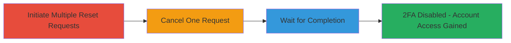

---
tags:
  - race-condition
  - 2fa-bypass
  - authentication-bypass
  - business-logic
type: attack_chain
tools: []
tactics:
  - '[[Initial Access]]'
  - '[[Defense Evasion]]'
verified: false
platforms:
  - Web
submitted: true
complexity: medium
created_at: '2023-10-01T00:00:00Z'
procedures:
  - '[[procedures/Initiate-Multiple-Parallel-2FA-Reset-Requests]]'
  - '[[procedures/Cancel-One-2FA-Reset-Request]]'
  - '[[procedures/Exploit-Race-Condition-for-Unauthorized-2FA-Removal]]'
step_count: 3
techniques:
  - '[[Valid Accounts]]'
  - '[[Modify Authentication Process]]'
updated_at: '2025-12-14T17:24:48.400Z'
description: >-
  A multi-step attack exploiting a race condition in the 2FA reset process to
  disable multi-factor authentication without proper authorization, leading to
  potential account takeover.
skill_level: intermediate
impact_level: high
id: 5e2b1258-fc36-4beb-8b03-13fc8c89bfb4
validated: true
mitre_tactics:
  - '[[Initial Access]]'
  - '[[Defense Evasion]]'
mitre_techniques:
  - '[[Valid Accounts]]'
  - '[[Modify Authentication Process]]'
---
# Bypassing 2FA via Race Condition in HackerOne Reset Process

Multi-stage attack chain demonstrating a complete attack workflow exploiting a race condition in the 2FA reset process.

## Chain Metrics Dashboard

| Metric | Value |
|--------|-------|
| Chain Status | Unverified |
| Total Steps | 3 |
| Execution Time | ~24 hours |
| Skill Level | Intermediate |
| Complexity | Medium |
| Impact Level | High |

## Attack Flow Visualization

## Prerequisites & Requirements

### Required Tools

- Browser developer tools or scripting tool for concurrent requests (e.g., browser console or simple script)

### Target Environment

- Web platform (HackerOne application)
- Access to the 2FA reset endpoint, typically requiring initial account credentials or email access for reset initiation
- No specific ports or services beyond standard HTTPS (443)

### Initial Access Requirements

- Valid account email access to initiate resets
- Ability to send HTTP requests to the reset endpoint
- No prior 2FA setup required for initiation, but target has 2FA enabled

## Detailed Attack Procedures

### Step 1: Initiate Multiple Parallel 2FA Reset Requests
procedure: [[procedures/Initiate-Multiple-Parallel-2FA-Reset-Requests]]

**Objective**: Trigger multiple concurrent 2FA reset requests to exploit the lack of synchronization, resulting in several active reset processes.

**Instructions**: Use browser developer tools or a script to send simultaneous POST requests to the 2FA reset endpoint (e.g., `/account/2fa/reset`). Aim for at least 2-3 parallel requests within milliseconds to create the race condition.

**Expected Output**: Multiple confirmation emails or notifications indicating reset requests have been queued, each with a unique ID or token.

**Success Indicators**:
- Receipt of multiple reset notification emails
- Dashboard or logs showing multiple pending resets

### Step 2: Cancel One of the Reset Requests
procedure: [[procedures/Cancel-One-2FA-Reset-Request]]

**Objective**: Cancel only one of the initiated resets to test and exploit the race condition, leaving the others unaffected and active.

**Instructions**: From the account settings or email links, select and cancel one specific reset request using its unique identifier. Do not cancel the others.

**Expected Output**: Confirmation that one reset is canceled, but notifications for the remaining resets persist without interruption.

**Success Indicators**:
- One reset canceled successfully
- Other reset notifications remain active and unchanged

### Step 3: Wait for Unauthorized 2FA Removal
procedure: [[procedures/Exploit-Race-Condition-for-Unauthorized-2FA-Removal]]

**Objective**: Allow the remaining active reset requests to complete after the 24-hour window, resulting in 2FA being disabled without further user confirmation.

**Instructions**: Monitor the account status and wait for the full 24-hour period. No further action is needed as the unsynchronized requests will auto-complete.

**Expected Output**: 2FA status changes to disabled in the account settings, allowing login without the second factor.

**Success Indicators**:
- 2FA disabled after 24 hours
- Successful login using only primary credentials

## Attack Chain Summary

### Key Achievements

1. Successfully initiated and maintained multiple parallel 2FA reset requests despite cancellation attempts
2. Exploited the race condition to bypass synchronization controls in the reset process
3. Achieved unauthorized removal of 2FA, enabling full account access and potential takeover

## Technique & Tactic Coverage

### MITRE ATT&CK Techniques

- [[Valid Accounts]] Valid Accounts
- [[Modify Authentication Process]] Modify Authentication Process

### MITRE ATT&CK Tactics

- [[Initial Access]] Initial Access
- [[Defense Evasion]] Defense Evasion

---
*Last updated: 2023-10-01T00:00:00Z*
