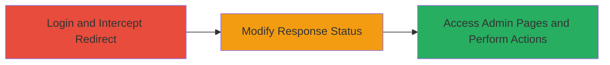

---
tags:
  - access-bypass
  - redirect-manipulation
  - web-vulnerability
  - authentication-bypass
type: attack_chain
tools:
  - '[[tools/Burp-Suite]]'
tactics:
  - '[[Initial Access]]'
verified: false
platforms:
  - Web
submitted: true
complexity: medium
procedures:
  - '[[procedures/Intercept-and-Modify-HTTP-Redirects-with-Burp-Suite]]'
step_count: 3
techniques:
  - '[[Exploit Public-Facing Application]]'
description: >-
  A multi-stage attack exploiting improper access controls in HTTP redirects to
  gain unauthorized access to administration pages on speakerkit.state.gov,
  exposing sensitive data and enabling administrative actions.
skill_level: intermediate
impact_level: high
id: afcbcc21-fcb5-4838-89c2-d0a7748e0105
created_at: '2025-12-14T17:30:07.406Z'
updated_at: '2025-12-14T17:30:07.406Z'
validated: true
mitre_tactics:
  - '[[Initial Access]]'
mitre_techniques:
  - '[[Exploit Public-Facing Application]]'
---
# Bypassing Authentication via HTTP Redirect Manipulation on speakerkit.state.gov

Multi-stage attack chain demonstrating exploitation of mishandled HTTP 302 redirects to bypass authentication and access admin functionality on the speakerkit.state.gov subdomain.

## Chain Metrics Dashboard

| Metric | Value |
|--------|-------|
| Chain Status | Unverified |
| Total Steps | 3 |
| Execution Time | ~5 minutes |
| Skill Level | Intermediate |
| Complexity | Medium |
| Impact Level | High |

## Attack Flow Visualization

## Prerequisites & Requirements

### Required Tools

- [[tools/Burp-Suite]]

### Target Environment

- Web platform
- Access to https://speakerkit.state.gov/
- No specific ports required beyond standard HTTPS (443)

### Initial Access Requirements

- Valid login credentials for a normal user account (to trigger the redirect)
- Network access to the target site
- Burp Suite proxy configured in the browser

## Detailed Attack Procedures

### Step 1: Login to the Application
procedure: [[procedures/Intercept-and-Modify-HTTP-Redirects-with-Burp-Suite]]

**Objective**: Gain initial access to the application and trigger the login redirect to set up interception.

**Instructions**: Navigate to https://speakerkit.state.gov/ in a browser configured to proxy through Burp Suite. Attempt to log in with valid credentials, which redirects to the 'spklogin' page.

**Expected Output**: Intercepted 302 Found response during login attempt.

**Success Indicators**:
- Successful login redirect intercepted in Burp Suite
- Response body contains unauthorized target content

### Step 2: Intercept and Modify HTTP Responses
procedure: [[procedures/Intercept-and-Modify-HTTP-Redirects-with-Burp-Suite]]

**Objective**: Bypass the redirect by altering the HTTP status code, revealing protected content without authentication.

**Instructions**: In Burp Suite, use the Proxy or Repeater tab to intercept the 302 response. Apply a find-and-replace rule to change the status code from 302 Found to 200 OK. Forward the modified response to access the target page (e.g., admin login endpoint).

**Expected Output**: The target page (e.g., admin dashboard) loads directly, bypassing the redirect.

**Success Indicators**:
- Status code successfully modified to 200 OK
- Unauthorized page content displayed in browser

### Step 3: Access Unauthorized Admin Functionality
procedure: [[procedures/Intercept-and-Modify-HTTP-Redirects-with-Burp-Suite]]

**Objective**: Exploit the bypass to view sensitive data and perform administrative actions.

**Instructions**: With the bypass in place, navigate to admin endpoints. View user and admin information, including passwords. Upload files or add categories using the exposed interfaces.

**Expected Output**: Access to admin pages showing credentials and ability to execute actions like file uploads.

**Success Indicators**:
- Sensitive data (e.g., passwords) visible
- Successful execution of admin actions (e.g., file upload confirmation)

## Attack Chain Summary

### Key Achievements

1. Bypassed authentication via redirect manipulation
2. Exposed admin and user credentials, including passwords
3. Performed unauthorized administrative actions like file uploads and category additions

## Technique & Tactic Coverage

### MITRE ATT&CK Techniques

- [[Exploit Public-Facing Application]]

### MITRE ATT&CK Tactics

- [[Initial Access]]

---
*Last updated: 2023-10-01*
