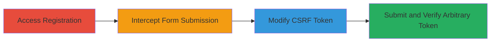

# Bypassing CSRF Protection with Arbitrary Token Acceptance in Veris Registration

Multi-stage attack chain demonstrating a complete attack workflow to bypass CSRF token verification on the Veris platform's unauthenticated registration endpoint.

## Chain Metrics Dashboard

| Metric | Value |
|--------|-------|
| Chain Status | Unverified |
| Total Steps | 4 |
| Execution Time | ~5 minutes |
| Skill Level | Intermediate |
| Complexity | Medium |
| Impact Level | Low |

## Attack Flow Visualization

## Prerequisites & Requirements

### Required Tools

- [[tools/Burp-Suite]]

### Target Environment

- Web platform
- Target URL: https://sandbox.veris.in/portal/register/
- Inferred tech stack: Django (based on csrfmiddlewaretoken usage)
- No specific ports or services required beyond standard HTTPS (443)

### Initial Access Requirements

- No credentials needed (unauthenticated endpoint)
- Direct network access to the target URL
- Browser with proxy configuration for interception

## Detailed Attack Procedures

### Step 1: Access and Prepare Registration Form
procedure: [[procedures/Access-and-Prepare-Veris-Registration-Form]]

**Objective**: Navigate to the target registration page and complete the form to prepare for interception, including solving any CAPTCHA.

**Instructions**: Open a browser and visit the registration endpoint. Fill in the required form fields such as username, email, and password. Solve the CAPTCHA if present to ensure the form is ready for submission.

**Expected Output**: Form fields populated and CAPTCHA solved, ready for submission.

**Success Indicators**:
- Registration page loaded successfully
- Form is fully filled without errors

### Step 2: Intercept Form Submission
procedure: [[procedures/Intercept-and-Modify-CSRF-Token-via-Proxy]]

**Objective**: Use a proxy tool to capture the HTTP POST request during form submission, allowing modification of CSRF-related values.

**Instructions**: Configure your browser to route traffic through Burp Suite Proxy. Attempt to submit the registration form, intercepting the request in the proxy tool.

**Expected Output**: Captured HTTP POST request to the registration endpoint, showing csrftoken in cookies and csrfmiddlewaretoken in form data.

**Success Indicators**:
- Request intercepted successfully
- CSRF token values visible in request headers and body

### Step 3: Modify and Submit CSRF Token
procedure: [[procedures/Intercept-and-Modify-CSRF-Token-via-Proxy]]

**Objective**: Alter the CSRF token values to arbitrary strings (up to 32 characters) to demonstrate lack of server-side verification, then submit the request.

**Instructions**: In the intercepted request, change the 'csrftoken' cookie value to an arbitrary string (e.g., 'arbitrary12345678901234567890'). Copy this same value and set it as the 'csrfmiddlewaretoken' form field. Forward the modified request to the server.

**Expected Output**: Server responds with 200 OK, indicating successful registration despite arbitrary token.

**Success Indicators**:
- Modified request forwarded without errors
- Registration completes successfully

### Step 4: Verify Arbitrary Token Persistence
procedure: [[procedures/Submit-Modified-Request-and-Verify-Token-Setting]]

**Objective**: Confirm that the arbitrary CSRF token has been set in the browser cookies and persists in subsequent requests.

**Instructions**: In a follow-up request (e.g., to login or another page), update the 'csrftoken' cookie to the same arbitrary value if needed. Inspect the browser's developer tools or cookie storage to verify the token.

**Expected Output**: Arbitrary token visible in browser cookies and accepted in subsequent interactions.

**Success Indicators**:
- Arbitrary token present in cookies
- No rejection in follow-up requests

## Attack Chain Summary

### Key Achievements

1. Successful interception and modification of CSRF tokens without server rejection
2. Demonstration of arbitrary token acceptance up to 32 characters
3. Weakening of CSRF protection on unauthenticated endpoints, potentially enabling forged requests

## Technique & Tactic Coverage

### MITRE ATT&CK Techniques

- [[Exploit Public-Facing Application]]

### MITRE ATT&CK Tactics

- [[Initial Access]]

---
*Last updated: 2023-10-01T00:00:00Z*
